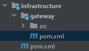
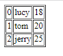
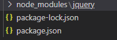
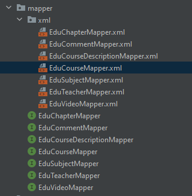
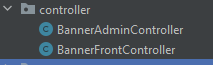
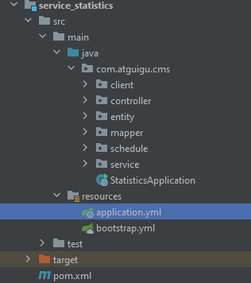
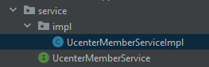

# Guli Project

This is a learning project  learnt from 尚硅谷

https://www.bilibili.com/video/BV1dQ4y1A75e?p=307&vd_source=a788bdd4d7cdd9dfe02852346d523cb9

Date start: 26 Jun 2022

Date end : 14 July 2022

It is not suitable for you to read here as it is very long notes.
Please copy paste this file to your Typora in order to get the grouping function, else this exhausting your eyes.

## Introduction

- Online Education Platform, B2C
- Used Microservice
- Front - Back Seperation
- Functions :
  - Client Based
    - Index
    - Course, Teacher
    - Payment, Order
    - Google Login, Normal Login
  - Admin Based
    - Management
    - Authorization
    - Statistic
- Technical:
  - Front-End
    - vue
    - element-ui
    - nuxt
  - Back-End
    - Spring Cloud
    - Spring Boot
    - Easy Excel
  - Other
    - Google OAuth2


## Pre Knowledge

Learnt from [尚硅谷 - 谷粒学院 - 微服务 + 全栈 - 在线教育实战项目](https://www.bilibili.com/video/BV1dQ4y1A75e?p=3&spm_id_from=pageDriver&vd_source=a788bdd4d7cdd9dfe02852346d523cb9)


>**Business Model**
>
>B2C : 
>
>- 2 roles : administrator , user
>- Administrator : `Create` `Update` `Delete`
>- User : `Read`


> **The main module:**
>
> Course


### Modules

| Back End <Admin>               | Front End <User>       |
| ------------------------------ | ---------------------- |
| Lecturer Management            | index Page             |
| Course Categories Management   | Lecturer Page          |
| Course Management<br />- Video | Course Page            |
| Statistic Study                | Login and Registration |
| Order Management               | Payment                |
| Banner Management              |                        |
| Account Type Management        |                        |


### Maven Extra Knowledge

> install third party jar to become your local maven repository

```
mvn install:install-file -DgroupId=<group-id> -DartifactId=<artifact-id> -Dversion=<version> -Dpackaging=<packaging>
```

```
eg
mvn install:install-file -DgroupId=com.aliyun -DartifactId=aliyun-sdk-vod-upload -Dversion=1.4.11 -Dpackaging=<packaging>=jar -Dfile=aliyun-java-vod-upload-1.4.11.jar
```


### Spring (& Spring Cloud) Extra Knowledge

> Default max tomcat upload size: 1024 * 1024 bytes (1mb)

```properties
#single file max (default 1mb）
spring.servlet.multipart.max-file-size=1024MB
#multi max (default 10mb)
spring.servlet.multipart.max-request-size=1024MB 
```

Nginx**

```xml
http {
    include       mime.types;
    default_type  application/octet-stream;
	client_max_body_size 100m;
```


> Why Microservice?

1. Modular, which easy to be maintained in future. Codes are lesser and easier to find problem

2. Able to use different db in different module

3. able to use different language

   

```
Consumer => Service Discovery => Circuit Breaker => Load Balancer => Http Client
```


>What is Springcloud?

1. A collection of frameworks / technologies

2. We use these frameworks to achieve microservice

3. Prior to use spirngcloud, we shall have known springboot

   > Spring boot vs spring cloud
   >
   > Spring boot: A shortcut for build a spring, which is powerful in the dependencies to develop a single microservice. A lot of default setting was done thus save time for developer to do settings.
   >
   > Spring cloud: focus on the service structure, like how to link these spring boots.


> Spring Cloud Frameworks:

1. Service Registry 
   - Netflix Eureka (no more update)
   - Zookeeper
   - Consul
   - **Nacos (China)**
2. Service Discovery
   - Netflix Feign
   - Open Feign
3. Circuit Breakers
   - Neflix Hystix
4. Gateway
   - Spring Cloud GateWay
5. Configuration
   - Spring Cloud Config
   - Nacos (China)
6. Routing and Messaging
   - Spring Cloud Bus
   - Nacos (China)


> Tips of reading version:

SNAPSHOT : prepared to be modified anytime

M: MileStone, the main function was done

SR: Service Release, normally together with GA (Generally Available), is a stable version

BETA: open for public and to test and feedback


#### Nacos

> for the module  does not use this dependency also need to register in the spring setting

> version used: 1.1.4

start: nacos\bin\startup

http://localhost:8848/nacos

username: nacos

password: nacos

```xml
<dependency>
    <groupId>org.springframework.cloud</groupId>
    <artifactId>spring-cloud-starter-alibaba-nacos-discovery</artifactId>
</dependency>
```

```yaml
spring:
  application:
    name: service-edu
  cloud:
    nacos:
      discovery:
        server-addr: 127.0.0.1:8848
```

```java
@EnableDiscoveryClient
```


#### Open Feign

```xml
<dependency>
    <groupId>org.springframework.cloud</groupId>
    <artifactId>spring-cloud-starter-openfeign</artifactId>
</dependency>
```

consumer:

```java
@EnableFeignClients
```

```java
@FeignClient("service-oss")
@Component
public interface OssClient {
    @DeleteMapping("/eduoss/fileoss/") 
    public R removeVideo(@RequestParam("url") String url); //can copy paste from service-oss
}
```

Tips: @PathVariable must write ("xx")

`to test: @RequestParam : Tested ok`

```java
...
publiv R deleteVideo(...) {
    ...
    oosClient.removeVideo(...);
    ...
}
```


#### Hystix

> Circuit-Breaker
>
> 1. Down
> 2. Time Out
> 3. Flow Limit ( volume threshold , error percentage )

```xml
<dependency>
    <groupId>org.springframework.cloud</groupId>
    <artifactId>spring-cloud-starter-netflix-hystrix</artifactId>
</dependency>
```

```yaml
#Enable circuit breaker
feign:
  hystrix:
    enabled: true

#Default 1000ms *** IDEA does not recognized this property
hystrix:
  command:
    default:
      execution:
        isolation:
          thread:
            timeoutInMilliseconds: 6000
            
ribbon:
  ReadTimeout: 60000
  ConnectTimeout: 60000

```

at feign client interface there

```java
@FeignClient(name = "service-oos", fallback = OosFileDegradeFeignClient.class)
```

the fallback class implements the above feign client

```java
@Component
public class OosFileDegradeFeignClient implements OssClient {
    @Override
    public R removeVideo(@RequestParam("url") String url) {
        return R.error().message("fallback...");
    }
}
```

test

```java
R result = ...
if (result.getCode() == 2001) {
	throw new GuliException(20001, "...");
}
```


#### Ribbon

> Load Balancer

```xml
<dependency>
    <groupId>org.springframework.cloud</groupId>
    <artifactId>spring-cloud-starter-netflix-ribbon</artifactId>
</dependency>
```


#### Gateway


> Usage :
>
> Reverse proxy
>
> authentication
>
> flow control
>
> Fuse
>
> Log monitoring
> ...

refer: https://programmer.group/spring-cloud-gateway-routing-assertion-filtering.html

> 3 Concepts:
>
> Route: route is the basic module of building gateway. It consists of  ID, target URI, a series of assertions and filters. If the assertion is  true, the route will be matched
>
> Predicate: refer to java.util.function.Predicate in Java 8.  Developers can match everything in an HTTP request (such as a request  header or a request parameter) and route if the request matches an  assertion
>
> Filter: refers to the instance of GatewayFilter in the Spring  framework. Using the filter, you can modify the request before or after  it is routed


##### Reverse proxy

1. Create module

   

2. dependencies

   `!!!Exclude spring-boot-starter-web as it cause conflict with gateway`

   ```xml
       <dependencies>
           <dependency>
               <groupId>com.atguigu</groupId>
               <artifactId>common_utils</artifactId>
               <version>0.0.1-SNAPSHOT</version>
           </dependency>
   
           <dependency>
               <groupId>org.springframework.cloud</groupId>
               <artifactId>spring-cloud-starter-alibaba-nacos-discovery</artifactId>
           </dependency>
   
           <dependency>
               <groupId>org.springframework.cloud</groupId>
               <artifactId>spring-cloud-starter-gateway</artifactId>
           </dependency>
   
           <!--gson-->
           <dependency>
               <groupId>com.google.code.gson</groupId>
               <artifactId>gson</artifactId>
           </dependency>
   
           <!--服务调用-->
           <dependency>
               <groupId>org.springframework.cloud</groupId>
               <artifactId>spring-cloud-starter-openfeign</artifactId>
           </dependency>
       </dependencies>
   
   
   ```

3. application.yml

   ```yaml
   server:
     port: 8222
   
   spring:
     application:
       name: service-gateway
   
     cloud:
       nacos:
         discovery:
           server-addr: 127.0.0.1:8848
       gateway:
         discovery:
           locator:
             enabled: true
   
         routes:
           - id: service-edu
             uri: lb://service-edu
             predicates: Path=/eduservice/**
   
           - id: service-cms
             uri: lb://service-cms
             predicates: Path=/cms/**
   ```

   .properties

   ```properties
   spring.cloud.gateway.routes[0].id=service-acl
   spring.cloud.gateway.routes[0].uri=lb://service-acl
   spring.cloud.gateway.routes[0].predicates= Path=/*/acl/**
   ```

   

4. ApiGatewayApplication

   ```java
   package com.atguigu.gateway;
   
   import org.springframework.boot.SpringApplication;
   import org.springframework.boot.autoconfigure.SpringBootApplication;
   import org.springframework.cloud.client.discovery.EnableDiscoveryClient;
   
   @SpringBootApplication
   @EnableDiscoveryClient  //服务发现
   public class ApiGatewayApplication {
       public static void main(String[] args) {
           SpringApplication.run(ApiGatewayApplication.class);
       }
   }
   ```


##### CORS

> DO NOT USE @CrossOrigin when using gateway as there will be error which double cross origin
>
> 

```java
package com.atguigu.gateway.config;

import org.springframework.context.annotation.Bean;
import org.springframework.context.annotation.Configuration;
import org.springframework.web.cors.CorsConfiguration;
import org.springframework.web.cors.reactive.CorsWebFilter;
import org.springframework.web.cors.reactive.UrlBasedCorsConfigurationSource;
import org.springframework.web.util.pattern.PathPatternParser;

@Configuration
public class CorsConfig {
    @Bean
    public CorsWebFilter corsFilter() {
        CorsConfiguration config = new CorsConfiguration();
        config.addAllowedMethod("*");
        config.addAllowedOrigin("*");
        config.addAllowedHeader("*");

        UrlBasedCorsConfigurationSource source = new UrlBasedCorsConfigurationSource(new PathPatternParser());
        source.registerCorsConfiguration("/**", config);

        return new CorsWebFilter(source);
    }
}

```


##### Example of Handler

> Handler errors

```java
package com.atguigu.gateway.handler;

import org.springframework.boot.autoconfigure.web.ErrorProperties;
import org.springframework.boot.autoconfigure.web.ResourceProperties;
import org.springframework.boot.autoconfigure.web.reactive.error.DefaultErrorWebExceptionHandler;
import org.springframework.boot.web.reactive.error.ErrorAttributes;
import org.springframework.context.ApplicationContext;
import org.springframework.http.HttpStatus;
import org.springframework.web.reactive.function.server.*;

import java.util.HashMap;
import java.util.Map;

/**
 * 自定义异常处理
 *
 * <p>异常时用JSON代替HTML异常信息<p>
 *
 */
public class JsonExceptionHandler extends DefaultErrorWebExceptionHandler {

    public JsonExceptionHandler(ErrorAttributes errorAttributes, ResourceProperties resourceProperties,
                                ErrorProperties errorProperties, ApplicationContext applicationContext) {
        super(errorAttributes, resourceProperties, errorProperties, applicationContext);
    }

    /**
     * 获取异常属性
     */
    @Override
    protected Map<String, Object> getErrorAttributes(ServerRequest request, boolean includeStackTrace) {
        Map<String, Object> map = new HashMap<>();
        map.put("success", false);
        map.put("code", 20005);
        map.put("message", "网关失败");
        map.put("data", null);
        return map;
    }

    /**
     * 指定响应处理方法为JSON处理的方法
     * @param errorAttributes
     */
    @Override
    protected RouterFunction<ServerResponse> getRoutingFunction(ErrorAttributes errorAttributes) {
        return RouterFunctions.route(RequestPredicates.all(), this::renderErrorResponse);
    }

    /**
     * 根据code获取对应的HttpStatus
     * @param errorAttributes
     */
    @Override
    protected int getHttpStatus(Map<String, Object> errorAttributes) {
        return 200;
    }
}

```

```java
package com.atguigu.gateway.handler;

import org.springframework.beans.factory.ObjectProvider;
import org.springframework.boot.autoconfigure.web.ResourceProperties;
import org.springframework.boot.autoconfigure.web.ServerProperties;
import org.springframework.boot.context.properties.EnableConfigurationProperties;
import org.springframework.boot.web.reactive.error.ErrorAttributes;
import org.springframework.boot.web.reactive.error.ErrorWebExceptionHandler;
import org.springframework.context.ApplicationContext;
import org.springframework.context.annotation.Bean;
import org.springframework.context.annotation.Configuration;
import org.springframework.core.Ordered;
import org.springframework.core.annotation.Order;
import org.springframework.http.codec.ServerCodecConfigurer;
import org.springframework.web.reactive.result.view.ViewResolver;

import java.util.Collections;
import java.util.List;

/**
 * 覆盖默认的异常处理
 *
 */
@Configuration
@EnableConfigurationProperties({ServerProperties.class, ResourceProperties.class})
public class ErrorHandlerConfig {

    private final ServerProperties serverProperties;

    private final ApplicationContext applicationContext;

    private final ResourceProperties resourceProperties;

    private final List<ViewResolver> viewResolvers;

    private final ServerCodecConfigurer serverCodecConfigurer;

    public ErrorHandlerConfig(ServerProperties serverProperties,
                              ResourceProperties resourceProperties,
                              ObjectProvider<List<ViewResolver>> viewResolversProvider,
                              ServerCodecConfigurer serverCodecConfigurer,
                              ApplicationContext applicationContext) {
        this.serverProperties = serverProperties;
        this.applicationContext = applicationContext;
        this.resourceProperties = resourceProperties;
        this.viewResolvers = viewResolversProvider.getIfAvailable(Collections::emptyList);
        this.serverCodecConfigurer = serverCodecConfigurer;
    }

    @Bean
    @Order(Ordered.HIGHEST_PRECEDENCE)
    public ErrorWebExceptionHandler errorWebExceptionHandler(ErrorAttributes errorAttributes) {
        JsonExceptionHandler exceptionHandler = new JsonExceptionHandler(
                errorAttributes,
                this.resourceProperties,
                this.serverProperties.getError(),
                this.applicationContext);
        exceptionHandler.setViewResolvers(this.viewResolvers);
        exceptionHandler.setMessageWriters(this.serverCodecConfigurer.getWriters());
        exceptionHandler.setMessageReaders(this.serverCodecConfigurer.getReaders());
        return exceptionHandler;
    }
}

```

##### Example of Filter

> Eg. authorize

```java
package com.atguigu.gateway.filter;

import com.google.gson.JsonObject;
import org.springframework.cloud.gateway.filter.GatewayFilterChain;
import org.springframework.cloud.gateway.filter.GlobalFilter;
import org.springframework.core.Ordered;
import org.springframework.core.io.buffer.DataBuffer;
import org.springframework.http.server.reactive.ServerHttpRequest;
import org.springframework.http.server.reactive.ServerHttpResponse;
import org.springframework.stereotype.Component;
import org.springframework.util.AntPathMatcher;
import org.springframework.web.server.ServerWebExchange;
import reactor.core.publisher.Mono;

import java.nio.charset.StandardCharsets;
import java.util.List;

/**
 * <p>
 * 全局Filter，统一处理会员登录与外部不允许访问的服务
 * </p>
 *
 * @author qy
 * @since 2019-11-21
 */
@Component
public class AuthGlobalFilter implements GlobalFilter, Ordered {

    private AntPathMatcher antPathMatcher = new AntPathMatcher();

    @Override
    public Mono<Void> filter(ServerWebExchange exchange, GatewayFilterChain chain) {
        ServerHttpRequest request = exchange.getRequest();
        String path = request.getURI().getPath();
        //谷粒学院api接口，校验用户必须登录
        if(antPathMatcher.match("/api/**/auth/**", path)) {
            List<String> tokenList = request.getHeaders().get("token");
            if(null == tokenList) {
                ServerHttpResponse response = exchange.getResponse();
                return out(response);
            } else {
//                Boolean isCheck = JwtUtils.checkToken(tokenList.get(0));
//                if(!isCheck) {
                ServerHttpResponse response = exchange.getResponse();
                return out(response);
//                }
            }
        }
        //内部服务接口，不允许外部访问
        if(antPathMatcher.match("/**/inner/**", path)) {
            ServerHttpResponse response = exchange.getResponse();
            return out(response);
        }
        return chain.filter(exchange);
    }

    @Override
    public int getOrder() {
        return 0;
    }

    private Mono<Void> out(ServerHttpResponse response) {
        JsonObject message = new JsonObject();
        message.addProperty("success", false);
        message.addProperty("code", 28004);
        message.addProperty("data", "鉴权失败");
        byte[] bits = message.toString().getBytes(StandardCharsets.UTF_8);
        DataBuffer buffer = response.bufferFactory().wrap(bits);
        //response.setStatusCode(HttpStatus.UNAUTHORIZED);
        //指定编码，否则在浏览器中会中文乱码
        response.getHeaders().add("Content-Type", "application/json;charset=UTF-8");
        return response.writeWith(Mono.just(buffer));
    }
}

```


##### How Gateway's Load Balancing works


> Track the registry application name.


#### Config (Nacos)


1. in nacos, set config

   `${prefix服务名字}-${spring.profiles.active}.${file-extension}`

   `service-statistic.properties` <=this case spring.profiles.active not available

   eg

   ```java
   server:
   	port: 8999
           
   
   ```

   

> In Spring boot  boot procedure
>
> 1. bootstrap.properties / yml
> 2. application.properties / yml
> 3. application-dev.properties (if spring.profiles.active=dev)

2. Create and write bootstrap.yml ***file-extension: yaml !!!! MUST WRITE IF NOT PROPERTIES**

   ```yml
   spring:
   	cloud:
   		nacos:
   			config:
   				server-addr: 127.0.0.1:8848
   				file-extension: yaml #!!!! MUST WRITE IF NOT PROPERTIES
   	profiles:
   		active: dev
   		
   	application:
   		name: service-statistics # suit the prefix in config
   		
   #spring:
   #	cloud:
   #		nacos: 
   #			config:
   #				namespace: XXXXXXX-XXXX-XXXX-XXXX-XXXXXXXXXXXX
   ```

3. Dependency

   ```xml
   <groupId>org.springframework.cloud</groupId>
   <artifactId>spring-cloud-starter-alibaba-nacos-config</artifactId>
   ```

#####  Namespace

> dev, test, prod

1. create in nacos

   

2. create / clone config in different namespace

3. In bootstrap.yml add name soace

   ```yml
   spring:
   	cloud:
   		nacos: 
   			config:
   				namespace: XXXXXXX-XXXX-XXXX-XXXX-XXXXXXXXXXXX
   ```


##### Multi Config Files

> eg server port save in one properties, datasource save in one properties

```yml
spring: 
	cloud:
		nacos:
			config:
				ext-config:
					- data-id: xxx.yaml
					  refresh: true ## know that if config file changed
					- data-id: xxx.yaml
					  refresh: true
```


#### Scheduling / Cron

> website to generate: http://cron.qqe2.com/

Application Class

```java
@EnableScheduling
```

Schedule Class

```java
@Component
public class ScheduledTask {
    
    @Autowired
    private StatisticsDailyService statisticsService;
    //every 5 s
    @Scheduled(cron = "0/5 * * * * ?") // second min hour day month dayOfWeek *** different with linux which does not provide seconds
    public void task1() {
        System.out.println("********* task 1 executed"); 
    }
    
    @Scheduled(cron = "0 0 1 * * ?")
    public void task2() {
        statisticsService.saveOrUpdateDailyRecord(DateUtil.formatDate(DateUtil.addDays(new Date(), -1)));
    }
}
```


### Spring Security

> Authentication => login
>
> Authorization => users' operation authorization

> Is a filter, do filter to request
>
> - Example 1: if session => spring security found session using cookie's session id => check if request can proceed
> - Example 2: if token => get token and get user's authorization => save key: user value: authorization  into redis => next time request, get token and look from redis to verify if hold authorization to go on.

#### Dependencies

```java
<dependencies>
        <dependency>
            <groupId>com.atguigu</groupId>
            <artifactId>spring_security</artifactId>
            <version>0.0.1-SNAPSHOT</version>
        </dependency>
        <dependency>
            <groupId>com.alibaba</groupId>
            <artifactId>fastjson</artifactId>
        </dependency>
</dependencies>
```


#### Configuration

> @Configuration
>
> @EnableWebSecurity
>
> @EnableGlobalMethodSecurity(prePostEnabled = true)
>
> extends WebSecurityConfigurerAdapter

`@Override configure(HttpSecurity http) `

`@Override  configure(AuthenticalManagerBuilder auth) => password handler`

`@Override configure(WebSecurity web) => do not filter which uri`

```java
package com.atguigu.security.config;

import com.atguigu.security.filter.TokenAuthenticationFilter;
import com.atguigu.security.filter.TokenLoginFilter;
import com.atguigu.security.security.DefaultPasswordEncoder;
import com.atguigu.security.security.TokenLogoutHandler;
import com.atguigu.security.security.TokenManager;
import com.atguigu.security.security.UnauthorizedEntryPoint;
import org.springframework.beans.factory.annotation.Autowired;
import org.springframework.context.annotation.Configuration;
import org.springframework.data.redis.core.RedisTemplate;
import org.springframework.security.config.annotation.authentication.builders.AuthenticationManagerBuilder;
import org.springframework.security.config.annotation.method.configuration.EnableGlobalMethodSecurity;
import org.springframework.security.config.annotation.web.builders.HttpSecurity;
import org.springframework.security.config.annotation.web.builders.WebSecurity;
import org.springframework.security.config.annotation.web.configuration.EnableWebSecurity;
import org.springframework.security.config.annotation.web.configuration.WebSecurityConfigurerAdapter;
import org.springframework.security.core.userdetails.UserDetailsService;

/**
 * Security配置类
 */
@Configuration
@EnableWebSecurity
@EnableGlobalMethodSecurity(prePostEnabled = true)
public class TokenWebSecurityConfig extends WebSecurityConfigurerAdapter {

    private UserDetailsService userDetailsService;
    private TokenManager tokenManager;
    private DefaultPasswordEncoder defaultPasswordEncoder;
    private RedisTemplate redisTemplate;

    @Autowired
    public TokenWebSecurityConfig(UserDetailsService userDetailsService, DefaultPasswordEncoder defaultPasswordEncoder,
                                  TokenManager tokenManager, RedisTemplate redisTemplate) {
        this.userDetailsService = userDetailsService;
        this.defaultPasswordEncoder = defaultPasswordEncoder;
        this.tokenManager = tokenManager;
        this.redisTemplate = redisTemplate;
    }

    /**
     * 配置设置
     * @param http
     * @throws Exception
     */
    @Override
    protected void configure(HttpSecurity http) throws Exception {
        http.exceptionHandling()
                .authenticationEntryPoint(new UnauthorizedEntryPoint())
                .and().csrf().disable()
                .authorizeRequests()
                .anyRequest().authenticated()
                .and().logout().logoutUrl("/admin/acl/index/logout")
                .addLogoutHandler(new TokenLogoutHandler(tokenManager,redisTemplate)).and()
                .addFilter(new TokenLoginFilter(authenticationManager(), tokenManager, redisTemplate))
                .addFilter(new TokenAuthenticationFilter(authenticationManager(), tokenManager, redisTemplate)).httpBasic();
    }

    /**
     * 密码处理
     * @param auth
     * @throws Exception
     */
    @Override
    public void configure(AuthenticationManagerBuilder auth) throws Exception {
        auth.userDetailsService(userDetailsService).passwordEncoder(defaultPasswordEncoder);
    }

    /**
     * 配置哪些请求不拦截
     * @param web
     * @throws Exception
     */
    @Override
    public void configure(WebSecurity web) throws Exception {
        web.ignoring().antMatchers("/api/**",
                "/swagger-resources/**", "/webjars/**", "/v2/**", "/swagger-ui.html/**"
               );
    }
}
```


#### Entity

##### 1.  X implements UserDetails

> UserDetails is a Class by Spring Security
>
> A class to get the detail from user such as password, authorization, username, and decide whether the acount is non expired ...

```java
package com.atguigu.security.entity;

import lombok.Data;
import lombok.extern.slf4j.Slf4j;
import org.springframework.security.core.GrantedAuthority;
import org.springframework.security.core.authority.SimpleGrantedAuthority;
import org.springframework.security.core.userdetails.UserDetails;
import org.springframework.util.StringUtils;

import java.util.ArrayList;
import java.util.Collection;
import java.util.List;

/**
 * 安全认证用户详情信息
 */
@Data
@Slf4j
public class SecurityUser implements UserDetails {

    //当前登录用户
    private transient User currentUserInfo;

    //当前权限
    private List<String> permissionValueList;

    public SecurityUser() {
    }

    public SecurityUser(User user) {
        if (user != null) {
            this.currentUserInfo = user;
        }
    }

    @Override
    public Collection<? extends GrantedAuthority> getAuthorities() {
        Collection<GrantedAuthority> authorities = new ArrayList<>();
        for(String permissionValue : permissionValueList) {
            if(StringUtils.isEmpty(permissionValue)) continue;
            SimpleGrantedAuthority authority = new SimpleGrantedAuthority(permissionValue);
            authorities.add(authority);
        }

        return authorities;
    }

    @Override
    public String getPassword() {
        return currentUserInfo.getPassword();
    }

    @Override
    public String getUsername() {
        return currentUserInfo.getUsername();
    }

    @Override
    public boolean isAccountNonExpired() {
        return true;
    }

    @Override
    public boolean isAccountNonLocked() {
        return true;
    }

    @Override
    public boolean isCredentialsNonExpired() {
        return true;
    }

    @Override
    public boolean isEnabled() {
        return true;
    }
}

```


##### 2. User

> Custom user created by us which includes the crucial data of user

```java
package com.atguigu.security.entity;

import io.swagger.annotations.ApiModel;
import io.swagger.annotations.ApiModelProperty;
import lombok.Data;

import java.io.Serializable;

/**
 * 用户实体类
 */
@Data
@ApiModel(description = "用户实体类")
public class User implements Serializable {

	private static final long serialVersionUID = 1L;

	@ApiModelProperty(value = "微信openid")
	private String username;

	@ApiModelProperty(value = "密码")
	private String password;

	@ApiModelProperty(value = "昵称")
	private String nickName;

	@ApiModelProperty(value = "用户头像")
	private String salt;

	@ApiModelProperty(value = "用户签名")
	private String token;

}


```


#### Service

> X impletments UserDetailsService (by Spring Security)
>
> `@Override loadUserByUsername(String username)`
>
> - get User (Entity from MySQL) by username
> - Copy Bean Property from User (MySQL Entity) to User (Customized for Spring Security)
> - Setup SecurityUser (Implemented UserDetail) for Spring Security to function
> - return securityUser


#### Filter : Authentication

> x extends UsernamePasswordAuthenticationFilter
>
> `@Override attemptAuthentication(HttpServletRequest req, HttpServletResponse res) => get user from front end and attemptAuthentication`
>
> - get user from req
> - authenticate
>
> `@Override successfulAuthentication(HttpServletRequest req, HttpServletResponse res, FilterChain chain, Authentication auth) => enter this if successful `
>
> - get user details
> - create token
> - put user and permission into redis
> - return token
>
> `@Override unsuccessfulAuthentication(HttpServletRequest request, HttpServletResponse response, AuthenticationException e) => enter this if unsuccessful`
>
> - return error

```java
package com.atguigu.security.filter;

import com.atguigu.commonutils.R;
import com.atguigu.commonutils.ResponseUtil;
import com.atguigu.security.entity.SecurityUser;
import com.atguigu.security.entity.User;
import com.atguigu.security.security.TokenManager;
import com.fasterxml.jackson.databind.ObjectMapper;
import org.springframework.data.redis.core.RedisTemplate;
import org.springframework.security.authentication.AuthenticationManager;
import org.springframework.security.authentication.UsernamePasswordAuthenticationToken;
import org.springframework.security.core.Authentication;
import org.springframework.security.core.AuthenticationException;
import org.springframework.security.web.authentication.UsernamePasswordAuthenticationFilter;
import org.springframework.security.web.util.matcher.AntPathRequestMatcher;

import javax.servlet.FilterChain;
import javax.servlet.ServletException;
import javax.servlet.http.HttpServletRequest;
import javax.servlet.http.HttpServletResponse;
import java.io.IOException;
import java.util.ArrayList;

/**
 * 登录过滤器，继承UsernamePasswordAuthenticationFilter，对用户名密码进行登录校验
 */
public class TokenLoginFilter extends UsernamePasswordAuthenticationFilter {

    private AuthenticationManager authenticationManager;
    private TokenManager tokenManager;
    private RedisTemplate redisTemplate;

    public TokenLoginFilter(AuthenticationManager authenticationManager, TokenManager tokenManager, RedisTemplate redisTemplate) {
        this.authenticationManager = authenticationManager;
        this.tokenManager = tokenManager;
        this.redisTemplate = redisTemplate;
        this.setPostOnly(false);
        this.setRequiresAuthenticationRequestMatcher(new AntPathRequestMatcher("/admin/acl/login","POST"));
    }

    @Override
    public Authentication attemptAuthentication(HttpServletRequest req, HttpServletResponse res)
            throws AuthenticationException {
        try {
            User user = new ObjectMapper().readValue(req.getInputStream(), User.class);

            return authenticationManager.authenticate(new UsernamePasswordAuthenticationToken(user.getUsername(), user.getPassword(), new ArrayList<>()));
        } catch (IOException e) {
            throw new RuntimeException(e);
        }

    }

    /**
     * 登录成功
     * @param req
     * @param res
     * @param chain
     * @param auth
     * @throws IOException
     * @throws ServletException
     */
    @Override
    protected void successfulAuthentication(HttpServletRequest req, HttpServletResponse res, FilterChain chain,
                                            Authentication auth) throws IOException, ServletException {
        SecurityUser user = (SecurityUser) auth.getPrincipal();
        String token = tokenManager.createToken(user.getCurrentUserInfo().getUsername());
        redisTemplate.opsForValue().set(user.getCurrentUserInfo().getUsername(), user.getPermissionValueList());

        ResponseUtil.out(res, R.ok().data("token", token));
    }

    /**
     * 登录失败
     * @param request
     * @param response
     * @param e
     * @throws IOException
     * @throws ServletException
     */
    @Override
    protected void unsuccessfulAuthentication(HttpServletRequest request, HttpServletResponse response,
                                              AuthenticationException e) throws IOException, ServletException {
        ResponseUtil.out(response, R.error());
    }
}

```


#### Filter : Authorization

>  extends BasicAuthenticationFilter
>
> `@Override doFilterInternal(HttpServletRequest req, HttpServletResponse res, FilterChain chain)`
>
> - check req.getRequestURI() if have some rule
> - getAuthentication from redis (from req)
> - if above mentioned is not null, then check one by one by using SecurityContextHolder

```java
package com.atguigu.security.filter;

import com.atguigu.commonutils.R;
import com.atguigu.commonutils.ResponseUtil;
import com.atguigu.security.security.TokenManager;
import org.springframework.data.redis.core.RedisTemplate;
import org.springframework.security.authentication.AuthenticationManager;
import org.springframework.security.authentication.UsernamePasswordAuthenticationToken;
import org.springframework.security.core.GrantedAuthority;
import org.springframework.security.core.authority.SimpleGrantedAuthority;
import org.springframework.security.core.context.SecurityContextHolder;
import org.springframework.security.web.authentication.www.BasicAuthenticationFilter;
import org.springframework.util.StringUtils;

import javax.servlet.FilterChain;
import javax.servlet.ServletException;
import javax.servlet.http.HttpServletRequest;
import javax.servlet.http.HttpServletResponse;
import java.io.IOException;
import java.util.ArrayList;
import java.util.Collection;
import java.util.List;

/**
 * 访问过滤器
 */
public class TokenAuthenticationFilter extends BasicAuthenticationFilter {
    private TokenManager tokenManager;
    private RedisTemplate redisTemplate;

    public TokenAuthenticationFilter(AuthenticationManager authManager, TokenManager tokenManager,RedisTemplate redisTemplate) {
        super(authManager);
        this.tokenManager = tokenManager;
        this.redisTemplate = redisTemplate;
    }

    @Override
    protected void doFilterInternal(HttpServletRequest req, HttpServletResponse res, FilterChain chain)
            throws IOException, ServletException {
        logger.info("================="+req.getRequestURI());
        if(req.getRequestURI().indexOf("admin") == -1) {
            chain.doFilter(req, res);
            return;
        }

        UsernamePasswordAuthenticationToken authentication = null;
        try {
            authentication = getAuthentication(req);
        } catch (Exception e) {
            ResponseUtil.out(res, R.error());
        }

        if (authentication != null) {
            SecurityContextHolder.getContext().setAuthentication(authentication);
        } else {
            ResponseUtil.out(res, R.error());
        }
        chain.doFilter(req, res);
    }

    private UsernamePasswordAuthenticationToken getAuthentication(HttpServletRequest request) {
        // token置于header里
        String token = request.getHeader("token");
        if (token != null && !"".equals(token.trim())) {
            String userName = tokenManager.getUserFromToken(token);

            List<String> permissionValueList = (List<String>) redisTemplate.opsForValue().get(userName);
            Collection<GrantedAuthority> authorities = new ArrayList<>();
            for(String permissionValue : permissionValueList) {
                if(StringUtils.isEmpty(permissionValue)) continue;
                SimpleGrantedAuthority authority = new SimpleGrantedAuthority(permissionValue);
                authorities.add(authority);
            }

            if (!StringUtils.isEmpty(userName)) {
                return new UsernamePasswordAuthenticationToken(userName, token, authorities);
            }
            return null;
        }
        return null;
    }
}
```


#### Utilities

##### 1. DefaultPasswordEncoder implements PasswordEncoder

```java
package com.atguigu.security.security;

import com.atguigu.commonutils.MD5;
import org.springframework.security.crypto.password.PasswordEncoder;
import org.springframework.stereotype.Component;

/**
 * 密码的处理方法类型
 */
@Component
public class DefaultPasswordEncoder implements PasswordEncoder {

    public DefaultPasswordEncoder() {
        this(-1);
    }

    /**
     * @param strength
     *            the log rounds to use, between 4 and 31
     */
    public DefaultPasswordEncoder(int strength) {

    }

    public String encode(CharSequence rawPassword) {
        return MD5.encrypt(rawPassword.toString());
    }

    public boolean matches(CharSequence rawPassword, String encodedPassword) {
        return encodedPassword.equals(MD5.encrypt(rawPassword.toString()));
    }
}
```

##### 2.  TokenLogoutHandler implements LogoutHandler

> `@Override logout(HttpServletRequest request, HttpServletResponse response, Authentication authentication)`
>
> - delete user from redis before logout

```java
package com.atguigu.security.security;

import com.atguigu.commonutils.R;
import com.atguigu.commonutils.ResponseUtil;
import org.springframework.data.redis.core.RedisTemplate;
import org.springframework.security.core.Authentication;
import org.springframework.security.web.authentication.logout.LogoutHandler;

import javax.servlet.http.HttpServletRequest;
import javax.servlet.http.HttpServletResponse;

/**
 * 登出业务逻辑类
 */
public class TokenLogoutHandler implements LogoutHandler {

    private TokenManager tokenManager;
    private RedisTemplate redisTemplate;

    public TokenLogoutHandler(TokenManager tokenManager, RedisTemplate redisTemplate) {
        this.tokenManager = tokenManager;
        this.redisTemplate = redisTemplate;
    }

    @Override
    public void logout(HttpServletRequest request, HttpServletResponse response, Authentication authentication) {
        String token = request.getHeader("token");
        if (token != null) {
            tokenManager.removeToken(token);

            //清空当前用户缓存中的权限数据
            String userName = tokenManager.getUserFromToken(token);
            redisTemplate.delete(userName);
        }
        ResponseUtil.out(response, R.ok());
    }

}
```


##### 3. TokenManager

```java
package com.atguigu.security.security;

import io.jsonwebtoken.CompressionCodecs;
import io.jsonwebtoken.Jwts;
import io.jsonwebtoken.SignatureAlgorithm;
import org.springframework.stereotype.Component;

import java.util.Date;

/**
 * token管理
 */
@Component
public class TokenManager {

    private long tokenExpiration = 24*60*60*1000;
    private String tokenSignKey = "123456";

    public String createToken(String username) {
        String token = Jwts.builder().setSubject(username)
                .setExpiration(new Date(System.currentTimeMillis() + tokenExpiration))
                .signWith(SignatureAlgorithm.HS512, tokenSignKey).compressWith(CompressionCodecs.GZIP).compact();
        return token;
    }

    public String getUserFromToken(String token) {
        String user = Jwts.parser().setSigningKey(tokenSignKey).parseClaimsJws(token).getBody().getSubject();
        return user;
    }

    public void removeToken(String token) {
        //jwttoken无需删除，客户端扔掉即可。
    }

}

```


##### 4. UnauthorizedEntryPoint implements AuthenticationEntryPoint

> 未授权的统一处理方式
>
> `@Override commence(HttpServletRequest request, HttpServletResponse response, AuthenticationException authException)`

```java
package com.atguigu.serurity.security;

import com.atguigu.commonutils.R;
import com.atguigu.commonutils.ResponseUtil;
import org.springframework.security.core.AuthenticationException;
import org.springframework.security.web.AuthenticationEntryPoint;

import javax.servlet.ServletException;
import javax.servlet.http.HttpServletRequest;
import javax.servlet.http.HttpServletResponse;
import java.io.IOException;

/**
 * 未授权的统一处理方式
 */
public class UnauthorizedEntryPoint implements AuthenticationEntryPoint {

    @Override
    public void commence(HttpServletRequest request, HttpServletResponse response,
                         AuthenticationException authException) throws IOException, ServletException {

        ResponseUtil.out(response, R.error());
    }
}

```


#### Typical Management Structure --> 3 main function : menu, role, user

> Menu management
>
> - Menu List
> - Menu Insert, Modify
> - Menu recursively delete
>
> Role Management
>
> - CRUD
> - Role - Menu Control
>
> User Management
>
> - CRUD
> - User - Role Control

> **5 sql table**
>
> acl_permission
>
> acl_role
>
> acl_role_permission
>
> acl_user
>
> acl_user_role
>
> Tips: More to More => 1 relation table, Single to More => foreign Key


1. Module

   

2. Dependencies

   ```java
   <dependencies>
           <dependency>
               <groupId>com.atguigu</groupId>
               <artifactId>spring_security</artifactId>
               <version>0.0.1-SNAPSHOT</version>
           </dependency>
           <dependency>
               <groupId>com.alibaba</groupId>
               <artifactId>fastjson</artifactId>
           </dependency>
   </dependencies>
   ```

   

   ```java
   <dependencies>
       <dependency>
           <groupId>com.atguigu</groupId>
           <artifactId>comment_utils</artifactId>
           <version>0.0.1-SNAPSHOT</version>
       </dependency>
   
       <!-- Spring Security依赖 -->
       <dependency>
           <groupId>org.springframework.boot</groupId>
           <artifactId>spring-boot-starter-security</artifactId>
       </dependency>
   
       <dependency>
           <groupId>io.jsonwebtoken</groupId>
           <artifactId>jjwt</artifactId>
       </dependency>
   </dependencies>
   ```

3. Copy paste 

   > Normally do not change so much, so advise to cp paste.
>
   > Please look into package, here only attach one example

   - Recursive Helper - Permission
   
     ```java
     package com.atguigu.aclservice.helper;
     
     import com.atguigu.aclservice.entity.Permission;
     
     import java.util.ArrayList;
     import java.util.List;
     
     public class PermissionHelper {
     
         public static List<Permission> build(List<Permission> permissions) {
             List<Permission> result = new ArrayList<>();
             for (Permission permission : permissions) {
                 if ("0".equals(permission.getPid())) {
                     permission.setLevel(1);
                     result.add(buildChildren(permission, permissions));
                 }
             }
     
             return result;
         }
     
         public static Permission buildChildren(Permission permission, List<Permission> permissions) {
             List<Permission> children = new ArrayList<>();
             for (Permission it : permissions) {
                 if (it.getPid().equals(permission.getId())) {
                     it.setLevel(permission.getLevel() + 1);
                     children.add(buildChildren(it, permissions));
                 }
             }
             permission.setChildren(children);
             
             return permission;
         }

    }
     ```

4. Copy paste Common Utils Module


### Front And Back End Separation

> This project is full stack project

#### Back End

springboot

springcloud

MyBatisPlus

spring security

redis

maven

easyExcel

jwt

OAuth2


#### Front End

vue

element-ui

axois

nodejs


#### Other

aliyun oss <object storage service>

aliyun video 

aliyun message service

wechat payment

wechat login

docker

git

jenkins


### Front End Knowledge

####  `ES6`

> Visual Studio Code
>
> 1. Live Server - Launch a development local Server with live reload feature for static & dynamic pages `port: 5500`
> 2. vetur - Vue tooling for VS Code 
> 3. vue-helper -vue enhance

> Use:
>
> 1. Open `Folder` to your folder
> 2. Save Workspace as - in that folder


------------------------------


> ECMAScript is a set of rules. javascript follow these rules.

ES6 vs ES5

- ES6 much cleaner
- ES6 face compatible problem with old version browser


##### var, let, const

> var : global scope, can be declared multi times
>
> let : block-scoped local variable, **cannot** be declared multi times
>
> const : cannot be changed, must be initialized 

```html
<script>
    {
        var a = 10
        let b = 20 
    }
    console.log(a)
    console.log(b)
</script>
```

 

```html
 <script>
     var a = 10
     var a = 20
     let b = 20
     let b = 20
 </script>
```

 

```html
 <script>
     const PI = "3.142"
     PI = "12345"
 </script>
```


```html
<script>
    const PI
</script>
```

	 


##### Deconstructing

Array

```html
<script>
    let a = 1, b = 2, c = 3
    let [d,e,f] = [1,2,3]
</script>
```

Object

```html
<script>
    let user = {name: "Helen", age: 18}

    //conventional
    let name1 = user.name
    let age1 = user.age
    console.log(name1 + "==" + age1)

    //es6
    let {name, age} = user
    console.log(name + "**" +  age)
</script>
```

Template Literals

> ``

1. multi strings

```html
<script>
    let str1 = `
        hello
        my friend
        I am
        Hello`
    console.log(str1)
</script>
```


2. get variable's value within them eg: \`  ${a + b}\`  `" " cannot`

```html
<script>
    let name = "mile"
    let age = 27
    let info = `my name is ${name} and aged ${age}`
    console.log(info)
</script>
```

3. use function eg: let str3 = \`demo, ${f1()}\`

```html
<script>
    function f1() {
        return "hello f1"
    }
    let str3 = `demo ${f1()}`
    console.log(str3)
</script>
```


##### Declare Object

```html
<script>
    const age = 12
    const name = "Amy"

    //conventional
    const person1 = {age: age, name: name}
    console.log(person1)

    //es6
    const person2 = {age, name}
    console.log(person2)
</script>
```


##### Function

```html
<script>

    //conventional 
    const person1 = {
        sayHi:function() {
            console.log("Hi")
        }
    }

    person1.sayHi()

    //es6
    const person2 ={
        sayHi() {
            console.log("Hi")
        },
        sayBye() {
            console.log("Hi")
        }
    }

    person2.sayHi()

</script>
```


##### Object Extension

> ...

Clone (soft)

 ```html
<script>
    let person1 = {name: "Amy", age: 15}
    let someone = {...person1}
    console.log(someone)
</script>
 ```

Merge object

```html
<script>
    let age = {age: 15}
    let name = {name : "Amy"}
    let someone = {...age, ...name}
    console.log(someone)
</script>
```


##### Arrow Function

> cleaner in create function

```html
<script>
    //conventional
    var f1 = function(a) {
        return a
    }
    console.log(f1(1))

    //es6
    var f2 = a => a
    console.log(f2(2))
</script>
```

multi variable

```html
<script>
    var f3 = (a,b) => {
        let result = a+b
        return result   
    }

    // equal to
    var f4 = (a,b) => a+b

    console.log(f3(3,6))
    console.log(f4(3,6))
</script>
```


#### `VUE`

> el
>
> data
>
> method**s** !!!!!!!!!!!!! NOT method
>
> component**s**

<Tips> shortcut to create html template in vsCode --- `!`


<Tips> customize shortcut to input auto template like above mentioned

> 1. File -> Preferences -> Configure User Snippets
>
> 2. new Global Snippets file...
>
> 3. name it eg. vue-html.code-snippets
>
>    ```html
>    {
>    	"vue htm":{
>    		"scope": "html",
>    		"prefix": "vh", //this is the shortcut
>    		"body": [
>    			"<!DOCTYPE html>",
>    			"<html lang=\"en\">",
>    			"",
>    			"<head>",
>    			"    <meta charset=\"UTF-8\">",
>    			"    <meta name=\"viewport\" content=\"width=device-width, initial-scale=1.0\">",
>    			"    <meta http-equiv=\"X-UA-Compatible\" content=\"ie=edge\">",
>    			"    <title>Document</title>",
>    			"    <script src=\"./lib/vue.js\"></script>",
>    			"</head>",
>    			"",
>    			"<body>",
>    			"    <div id=\"app\">",
>    			"",
>    			"    </div>",
>    			"",
>    			"    <script>",
>    			"        new Vue({",
>    			"            el: '#app',",
>    			"            data: {",
>    			"                $1",
>    			"            },",
>    			"        })",
>    			"    </script>",
>    			"</body>",
>    			"",
>    			"</html>"			
>    		],
>    		"description": "my vue template in html"
>    	}
>    }
>    ```
>
> 


1. copy vue.js (or vue-min.js) to your html folder

   ```html
   <body>
       <script src="vue.min.js"></script>
   </body>
   ```

   <Tips> `{{}}` to call data

   ```html
   <body>
       <div id="app">
           {{message}}
       </div>
       <script src="vue.min.js"></script>
       <script>
           new Vue({
               el: '#app',		//el = element
               data: {
                   message: 'Hello Vue!'
               }
           })
       </script>
   </body>
   ```

   Result

		

##### v-

###### 1. **v-bind** 

==> `one way binding -- display text` (shortcut :) eg :title="message"

**IF NO :, then it is "message " instead of script data**

```html
<div id="app">
    <h1 v-bind:title="message"> 
        {{content}}
    </h1>
</div>
<script src="vue.min.js"></script>
<script>
    new Vue({
        el: '#app',
        data: {
            content: 'im title',
            message: 'page loded on ' + new Date().toLocaleString()
        }
    })
</script>
```


###### 2. **v-model** 

==> `two ways binding -- when input will reflect to other v-bind `

```html
<div id="app">
    <input type="text" v-bind:value="searchMap.keyWord"/>
    <input type="text" v-model="searchMap.keyWord"/>
    <input type="text" v-model="searchMap.keyWord"/>
    <h1>{{searchMap.keyWord}}</h1>
</div>
<script src="vue.min.js"></script>
<script>
    new Vue({
        el: '#app',
        data: {
            searchMap: {
                keyWord: '尚硅谷'
            }
        }
    })
</script>
```

_below example: change in middle affected all_


###### 3. **v-on:click **/ @click

 ==> `bind event` .... @submit ...

```html
<div id="app">
    <button v-on:click="search()">search</button> #"search" also can but will crash with data if have same name
    <button @click="f1()">f1</button>
</div>
<script src="vue.min.js"></script>
<script>
    new Vue({
        el: '#app',
        methods: {
            search() {
                console.log('search...')
            },
            f1() {
                console.log("f1...")
            }
        }
    })
</script>
```


###### 4. v-if ***

heavy when switch (lazy)

```html
<div id="app">
    <input type="checkbox" v-model="ok">test</input>
<h1 v-if="ok">Yes</h1>
<h1 v-else>No</h1>
</div>
<script src="vue.min.js"></script>
<script>
    new Vue({
        el: '#app',
        data: {
            ok: true
        }
    })
</script>
```


###### 5. v-show

heavy when load (hungry)

```html
<h1 v-show="ok">Yes</h1>
<h1 v-show="!ok">No</h1>
```


###### 6. v-for ***

```html
<ul>
    <li v-for="n in 5">{{n}}</li>
</ul>
<ol>
    <li v-for="(n, index) in 5">{{n}} -- {{index}}</li>
</ol>
```


```html
<div id="app">
    <table border="1">
        <tr v-for="(user, index) in userlist">
            <td>{{index}}</td>
            <td>{{user.id}}</td>
            <td>{{user.username}}</td>
            <td>{{user.age}}</td>
        </tr>
    </table>
</div>
<script src="vue.min.js"></script>
<script>
    new Vue({
        el: '#app',
        data: {
            userlist: [
                {id: 1, username: 'helen', age: 18},
                {id: 2, username: 'ben', age: 19},
                {id: 3, username: 'tom', age: 20}
            ]
        }
    })
</script>
```


##### Event Modifiers 

`.prevent`

```html
<div id="app">
    <form action="save" v-on:submit.prevent="onSubmit()">
        <input type="text" v-model="user.name"></input>
    <button type="submit">submit</button>
    </form>
</div>
<script src="vue.min.js"></script>
<script>
    new Vue({
        el: '#app',
        data: {
            user: {}
        },
        methods: {
            onSubmit() {
                if (this.user.name) {
                    console.log("submit")
                } else {
                    alert("please fill in username")
                }
            }
        }
    })
</script>
```


##### Components

> user tag to call components

```html
<div id="app">
    <Navbar></Navbar>
</div>
<script src="vue.min.js"></script>
<script>
    new Vue({
        el: '#app',
        components: {
            'Navbar': {
                template: '<ul><li>首页</li><li>学员管理</li></ul>'
            }
        }
    })
</script>
```


> Global: ** use component (NO s)

#in other file : component/Navbar.js

```js
Vue.component('Navbar', {
    template: '<ul><li>首页</li><li>学员管理</li></ul>'
})
```

To use it

```html
<div id="app">
    <Navbar></Navbar>
</div>
<script src="vue.min.js"></script>
<script src="components/Navbar.js"></script>
```


##### Lifecycle


_from https://v2.vuejs.org/v2/guide/instance.html_

> *** created ** ! please be noted that if visit same page (by hidden routing counted too), this method only executed at the first time ONLY. (use watch to solve)
>
> *** mounted 

```html
<div id="app">
    hello
</div>
<script src="vue.min.js"></script>
<script src="components/Navbar.js"></script>
<script>
    new Vue({
        el: '#app',
        created() {
            debugger
            console.log("created")
        },
        mounted() {
            debugger
            console.log("mounted")
        }
    })
</script>
```

*When test: refresh browser then only see the debug mode


##### Router

 ```vue
<div id="app">
    <p>
        <router-link to="/">index</router-link>
        <router-link to="/student">student</router-link>
        <router-link to="/teacher">teacher</router-link>
    </p>
    <router-view></router-view>
</div>
<script src="vue.min.js"></script>
<script src="vue-router.js"></script>
<script>
    const Welcome = { template: '<div>Welcome</div>' }
    const Student = { template: '<div>Student</div>' }
    const Teacher = { template: '<div>Teacher</div>' }

    const routes = [
        { path: '/', redirect: '/welcome' },
        { path: '/welcome', component: Welcome },
        { path: '/student', component: Student },
        { path: '/teacher', component: Teacher }
    ]

    const router = new VueRouter({
        routes //eq to routes: routes
    })

    const app = new Vue({
        el: '#app',
        router
    })
</script>
 ```


-------------------------------

#### `AXIOS`

> Independent, not a part of vue.
>
> But we always use Axios with vue to achieve ajax
>
> Remember: import axios.js


data.json (for test)

```json
{
    "success": true,
    "code": 20000,
    "message": "成功",
    "data": [
        {"name": "lucy", "age": 18},
        {"name": "tom", "age": 20},
        {"name": "jerry", "age": 25}
    ]
}
```

```html
<div id="app">
        <table border="1">
            <tr v-for="(user, index) in userList">
                <td>{{index}}</td>
                <td>{{user.name}}</td>
                <td>{{user.age}}</td>
            </tr>
        </table>
    </div>
    <script src="vue.min.js"></script>
    <script src="vue-router.js"></script>
    <script src="axios.js"></script>
    <script>
        
        new Vue({
            el: '#app',
            data: {
                userList: []
            },
            created() {
                this.getList()
            },
            methods: {
                getList() {
                    axios.get("data.json")
                    .then(response => {
                        this.userList = response.data.data.items
                        console.log(this.userList)
                    })
                    .catch(error => {
                        console.log(error)
                    })
                }
            }
        })
    </script>
```




#### `Element-ui`

> A desktop ui toolkit for web
>
> https://element.eleme.io/#/en-US/component/layout


#### `Node.js`

> A runtime environment for JavaScript
>
> Able to run js without a browser (as it use google V8 machine)
>
> for this project: used v10.14.2

1. Download from https://nodejs.org/en/download/
2. Suggested install on C as other might be facing some problem
3. Check ==> cmd ==> `node -v`


01.js

```js
console.log("hello node.")
```

in 01.js folder => cmd => `node 01.js`


```js
const http = require('http')
http.createServer(function (request, response) {
    response.writeHead(200, {'Content-Type': 'text/plain'})
    response.end('Hello Server')
}).listen(8888)

console.log('server running at http://127.0.0.1:8888')
```


> Open terminal in vs code
>
> 


##### NPM - Node Package Manager

> like maven, manage `js` dependency, eg jquery
>
> npm folder can be found inside nodejs installed file. (instaled when installed nodejs)
>
> check : `npm -v`


`npm config set registry <https://..>` // set download mirror

`npm init` => enter enter... => package.json (like maven - pom.xml)

`npm init -y` // default


`npm install <dependency>`// <jquery>

`npm install <dependency@v>`// <jquery@2.1.x

> -lock ==> lock a version of .js


`npm install` //create .js follow listed dependencies



`npm install --save-dev <plugin>`  // add plugin (like vetus) (this workspace only)

`npm install -D eslint` //ditto

`npm install -g webpack` //global (--global)


`npm run dev`


#### `Babel`

> compiler for es6 to es5 : as es6 face some compatible problem with some browser

`npm install -g babel-cli`

`babel --version`


1. create 01.js

```js
let input =[1,2,3]
input = input.map(item => item + 1)
console.log(input)
```

2. create .babelrc (must follow name )

```js
{
    "presets": ["es2015"],
    "plugins": []
}
```

3. `npm install --save-dev babel-preset-es2015`

   

4. compile (make new dir first, else : `Error: ENOENT: no such file or directory, open 'dist/001.js'`) 

   1.  By folder `babel <folder,eg: es> -o <folder, eg: dist2>` // --out-file
   2.  By File `babel <file, eg: src/example.js> -d <file, eg: dist1/compiled.js>` // --out-dir

from 


to


#### `Module`

> js call js 
>
> function line `controller` call `service` call `mapper`, in back-end

##### ES5

01.js (to export)

```js
const sum = function(a,b) {
    return parseInt(a) + parseInt(b)
}

const substract = function(a,b) {
    return parseInt(a) - parseInt(b)
}

module.exports = {
    sum,
    substract
}
```

02.js (to import by function require) ***must put ./ for curr dir, ../ for previous dir, cannot directly use 01.js** (error)

```js
const m = require('./01.js')

console.log(m.sum(1,2))
console.log(m.substract(10,9))
```

Result

```shell
PS E:\vsCodeProjects\1010\moduledemo\es5> node .\02.js       
3
1
```


##### ES6 

> Important! Nodejs environment cannot run es6, must use babel convert it to es5.
>
> SyntaxError: Unexpected token

01.js (to export)

```js
export function getList() {
    console.log('getlist.......')
}

export function save() {
    console.log('save.......')
}
```

	or

```js
export default {
    getList() {
        console.log('getlist.......')
    },
    save() {
        console.log('save.......')
    }
}
```


02.js (to import)

```js
import { getList,save } from "./01.js";

getList()
save()
```

	or

```js
import m from "./01.js";

m.getList()
m.save()
```


After babel (of first method):

01.js

```js
'use strict';

Object.defineProperty(exports, "__esModule", {
    value: true
});
exports.getList = getList;
exports.save = save;
function getList() {
    console.log('getlist.......');
}

function save() {
    console.log('save.......');
}
```

02.js

```js
"use strict";

var _ = require("./01.js");

(0, _.getList)();
(0, _.save)();
```


#### `WebPack`

> To package multi js(s) into one js


1. `npm install -g webpack webpack-cli`
2. `webpack -v`
3. create js(s)

common.js

```js
exports.info = function( msg ) {
    document.write(msg)
}
```

utils.js

```js
exports.add = function(a,b) {
    return parseInt(a) + parseInt(b)
}
```

main.js

```js
const common = require('./common')
const utils = require('./utils')

common.info("hello common " + utils.add(1,2))
```

	4. create webpack.config.js

```js
const path = require("path") //node.js built-in module
module.exports = {
    entry: './src/main.js',
    output: {
        path: path.resolve(__dirname, './dist'), //__dirname = current file path
        filename: 'bundle.js'
    }
}
```


	5. `webpack <--mode=development>` //default --mode=production (compressed into one line), development => readable format.

	6. in html, import

```html
<script src="./dist/bundle.js"></script>
```


##### pack css

1. new file (others remain as example above)

   ```js
   body {
       background-color: red;
   }
   ```

2. insert `require('./my.css')` inside main.js

   ```js
   const common = require('./common')
   const utils = require('./utils')
   
   require('./my.css')
   
   common.info("hello common " + utils.add(1,2))
   ```

3. install style-loader and css-loader : `npm install --save-dev style-loader css-loader`

4. change webpack.config.js

   ```js
   const path = require("path") //node.js built-in module
   module.exports = {
       entry: './src/main.js',
       output: {
           path: path.resolve(__dirname, './dist'), //__dirname = current file path
           filename: 'bundle.js'
       },
       module: {
           rules: [
               {
                   test: /\.css$/, //all with .css
                   use: ['style-loader','css-loader']
               }
           ]
       }
   }
   ```

5. webpack --mode=development

6. run html


#### `NUXT`

> https://nuxtjs.org/docs/get-started/installation

> Ajax has badside which it is not good for SEO (for example, when we google 'hello' and google will sort descending from page contained more 'hello' to less 'hello')

> Nuxt is a framework from Node.js, which send a web page to client instead of some information only, which benifits for SEO


> File
>
> - assets - static file eg css, js, image
> - components
> - layouts - layout pattern
>   - default
> - middleware
> - node_modules - dependencies
> - pages - pages
>   - index.vue
> - plugins
> - static
> - store
> - nuxt.config.js - configuration


##### Nuxt router

> Static
>
> pages => course.d => index.vue

```vue
<router-link to "/course" ....>课程</router-link>
```

> Dynamic eg .../1
>
> _xx.vue
>
> pages => course.d => _id.vue

 

##### Nuxt - Axios

`npm install axios`

> encapsulates:

new folder

> utils => request.js
>
> ```js
> import axios from 'axios'
> import cookie from 'js-cookie'
> import { MessageBox, Message } from 'element-ui'
> 
> // 创建axios实例
> const service = axios.create({
>   baseURL: `http://localhost:9001`, // api的base_url
>   timeout: 20000 // 请求超时时间
> })
> // 第三步http request 拦截器
> service.interceptors.request.use(
>   config => {
>   //debugger
>   //判断cookie里面guli_token是否有值
>   if (cookie.get('guli_token')) {
>     //吧获取的token放在头部headers中
>     config.headers['token'] = cookie.get('guli_token');
>   }
>     return config
>   },
>   err => {
>   return Promise.reject(err);
> })
> 
> service.interceptors.response.use(
>   response => {
>     if (response.data.code == 28004) {
>       console.log("response.data.resultCode is 28004")
>       window.location.href="/login"
>       return
>     } else {
>       if (response.data.code !== 20000) {
>         if (response.data.code != 25000) {
>           Message({
>             message: response.data.message || 'error',
>             type: 'error',
>             duration: 5*1000
>           })
>         } 
>       } else {
>         return response;
>       }
>     }
>   }
> )
> 
> export default service
> ```
>
> 

##### Nuxt - Api

> new folder
>
> api => xx.js

```js
import request from '@/utils/request'

export default {
    method(..., ...) {
        return request({
            url: `...`,
            method: 'get'
            data: ...,
        })
    }
}
```


#### Useful npm

- vue-awesome-swiper 

  - a banner swiper

  - in plugins

    - create nux-swiper-plugin.js

    - ```js
      import Vue from 'vue'
      import VueAwesomeSwiper from 'vue-awesome-swiper'
      
      Vue.use(VueAwesomeSwiper)
      ```

  - in nuxt.config.js

    - in module.exports

      - plugins and css nodes 

      - ```js
        module.exports = {
          plugins: [
            { src: '~/plugins/nuxt-swiper-plugin.js', ssr: false }
          ],
        
          css: [
            'swiper/dist/css/swiper.css'
          ],
        ```

    

- vue-qriously (qr code for sms)

```js
import VueQriously from 'vue-qriously'

Vue.use(VueQriously)
```


- Element-ui

```js
import ElementUI from 'element-ui' //element-ui的全部组件
import 'element-ui/lib/theme-chalk/index.css'//element-ui的css

Vue.use(ElementUI) //使用elementUI
```


### EasyExcel Knowledge

> write or read excel data row by row, which increase the efficiency
>
> developed by Alibaba which do ammendment on Apache POI. 

dependency

```xml
<dependency>
    <groupId>com.alibaba</groupId>
    <artifactId>easyexcel</artifactId>
    <version>2.1.1</version>
</dependency>

<!--xls-->
<dependency>
    <groupId>org.apache.poi</groupId>
    <artifactId>poi</artifactId>
</dependency>

<dependency>
    <groupId>org.apache.poi</groupId>
    <artifactId>poi-ooxml</artifactId>
</dependency>
```


rowData (******* MUST HAVE NO ARGS FOR READ PURPOSE ==> otherwise exception)

```java
@Data
@AllArgsConstructor
@NoArgsConstructor
public class DemoData {
    @ExcelProperty("Student Id")
    private Integer id;

    @ExcelProperty("Student name")
    private String name;
}
```

Write:

```java
public class EasyExcelTestWrite {
    public static void main(String[] args) {
        String filePath = "E:\\student.xlsx";

        EasyExcel.write(filePath, DemoData.class).sheet("students").doWrite(list());
    }

    public static List<DemoData> list() {
        ArrayList<DemoData> list = new ArrayList<>();

        for (int i = 0; i < 10; i++) {
            list.add(new DemoData(i,"Lucy" + i));
        }

        return list;
    }
}
```

Result:


Read: 

1) ReadListener

```java
public class myEasyExcelListener extends AnalysisEventListener<DemoData> {
    private int count = 1;
    //reading row by row
    @Override
    public void invoke(DemoData demoData, AnalysisContext analysisContext) {
        System.out.println("data " + count + " - " + demoData);
        count++;
    }

    //read title (first row)
    @Override
    public void invokeHeadMap(Map<Integer, String> headMap, AnalysisContext context) {
        System.out.println("title: " + headMap);
    }

    @Override
    public void doAfterAllAnalysed(AnalysisContext analysisContext) {

    }
}
```

2. Read

```java
public class EasyExcelTestRead {
    public static void main(String[] args) {
        String filePath = "E:\\student.xlsx";

        EasyExcel.read(filePath, DemoData.class, new myEasyExcelListener()).sheet().doRead();
    }
}
```

Result:

>title: {0=Student Id, 1=Student name}
>data 1 - DemoData(id=0, name=Lucy0)
>data 2 - DemoData(id=1, name=Lucy1)
>data 3 - DemoData(id=2, name=Lucy2)
>data 4 - DemoData(id=3, name=Lucy3)
>data 5 - DemoData(id=4, name=Lucy4)
>data 6 - DemoData(id=5, name=Lucy5)
>data 7 - DemoData(id=6, name=Lucy6)
>data 8 - DemoData(id=7, name=Lucy7)
>data 9 - DemoData(id=8, name=Lucy8)
>data 10 - DemoData(id=9, name=Lucy9)


### MybatisPlus recap

#### Building a MybatisPlus java and Test it

mySQL

```mysql
create database mybatisrecatch

create table user (
	id BIGINT(20) NOT NULL,
	`name` VARCHAR(30) NULL DEFAULT NULL,
	`age` INT(11) NULL DEFAULT NULL,
	email VARCHAR(50) NULL DEFAULT NULL,
	PRIMARY KEY (id)
)
	
INSERT INTO user (id, name, age, email) VALUES
(1, 'Jone', 18, 'test1@baomidou.com'),
(2, 'Jack', 20, 'test2@baomidou.com'),
(3, 'Tom', 28, 'test3@baomidou.com'),
(4, 'Sandy', 21, 'test4@baomidou.com'),
(5, 'Billie', 24, 'test5@baomidou.com');	

```

------------------------------

Java springboot:

```java
<dependency>
            <groupId>com.baomidou</groupId>
            <artifactId>mybatis-plus-boot-starter</artifactId>
            <version>3.0.5</version>
</dependency>
...
```

```java
@Repository
@Mapper
public interface UserMapper extends BaseMapper<User> {
}
```

```java
@Data
public class User {
    private Long id;
    private String name;
    private Integer age;
    private String email;
}

```

```
@RestController
public class Test {
    @Autowired
    private UserMapper userMapper;

    @GetMapping("/hello")
    public String test01() {
        return userMapper.selectList(null).toString();
    }
}
```

```yaml
spring:
  datasource:
    driver-class-name: com.mysql.cj.jdbc.Driver
    url: jdbc:mysql://localhost:3306/mybatisrecatch?serverTimezone=GMT%2B8
    username: root
    password: 123456
```

Result:

> localhost:8080/hello
>
> 


----------------------------

#### MyBatis-Plus code generator

> put it in test file - com.xxx.xx.CodeGenerator (as it is used only one time to generate code)

```java
import com.baomidou.mybatisplus.annotation.DbType;
import com.baomidou.mybatisplus.annotation.IdType;
import com.baomidou.mybatisplus.generator.AutoGenerator;
import com.baomidou.mybatisplus.generator.config.DataSourceConfig;
import com.baomidou.mybatisplus.generator.config.GlobalConfig;
import com.baomidou.mybatisplus.generator.config.PackageConfig;
import com.baomidou.mybatisplus.generator.config.StrategyConfig;
import com.baomidou.mybatisplus.generator.config.rules.DateType;
import com.baomidou.mybatisplus.generator.config.rules.NamingStrategy;
import org.junit.Test;

public class CodeGenerator {
    @Test
    public void main1() {

        // 1、创建代码生成器
        AutoGenerator mpg = new AutoGenerator();

        // 2、全局配置
        GlobalConfig gc = new GlobalConfig();
        String projectPath = System.getProperty("user.dir");
        System.out.println(projectPath);
        gc.setOutputDir("E:\\IdeaProjects\\guli\\service\\service_edu" + "/src/main/java");
        gc.setAuthor("atguigu");
        gc.setOpen(false); //生成后是否打开资源管理器
        gc.setFileOverride(false); //重新生成时文件是否覆盖
        /*
         * mp生成service层代码，默认接口名称第一个字母有 I
         * UcenterService
         * */
        gc.setServiceName("%sService");    //去掉Service接口的首字母I
        gc.setIdType(IdType.ID_WORKER_STR); //主键策略
        gc.setDateType(DateType.ONLY_DATE);//定义生成的实体类中日期类型
        gc.setSwagger2(true);//开启Swagger2模式

        mpg.setGlobalConfig(gc);

        // 3、数据源配置
        DataSourceConfig dsc = new DataSourceConfig();
        dsc.setUrl("jdbc:mysql://localhost:3306/guli?serverTimezone=GMT%2B8");
        dsc.setDriverName("com.mysql.cj.jdbc.Driver");
        dsc.setUsername("root");
        dsc.setPassword("123456");
        dsc.setDbType(DbType.MYSQL);
        
        mpg.setDataSource(dsc);

        // 4、包配置
        PackageConfig pc = new PackageConfig();
        pc.setParent("com.atguigu");
        pc.setModuleName("eduservice"); //模块名
        pc.setController("controller"); //com.atguigu.edu.service.controller
        pc.setEntity("entity");
        pc.setService("service");
        pc.setMapper("mapper");
        mpg.setPackageInfo(pc);

        // 5、策略配置
        StrategyConfig strategy = new StrategyConfig();
        strategy.setInclude("edu_teacher"); //mysql表名, 多表: ("edu..", "edu...")
        strategy.setNaming(NamingStrategy.underline_to_camel);//数据库表映射到实体的命名策略
        strategy.setTablePrefix(pc.getModuleName() + "_"); //生成实体时去掉表前缀

        strategy.setColumnNaming(NamingStrategy.underline_to_camel);//数据库表字段映射到实体的命名策略
        strategy.setEntityLombokModel(true); // lombok 模型 @Accessors(chain = true) setter链式操作

        strategy.setRestControllerStyle(true); //restful api风格控制器
        strategy.setControllerMappingHyphenStyle(true); //url中驼峰转连字符

        mpg.setStrategy(strategy);

        // 6、执行
        mpg.execute();
    }
}

```

and Run


-------------------------------------------

#### Who do the sql? 

**mybatisPlus!**

```yml
#in application.yml
mybatis-plus:
  configuration:
    log-impl: org.apache.ibatis.logging.stdout.StdOutImpl
```

Run:

```java
Creating a new SqlSession
SqlSession [org.apache.ibatis.session.defaults.DefaultSqlSession@5e570515] was not registered for synchronization because synchronization is not active
JDBC Connection [HikariProxyConnection@1351671983 wrapping com.mysql.cj.jdbc.ConnectionImpl@46655a9e] will not be managed by Spring
==>  Preparing: SELECT id,name,age,email FROM user 
==> Parameters: 
<==    Columns: id, name, age, email
<==        Row: 1, Jone, 18, test1@baomidou.com
<==        Row: 2, Jack, 20, test2@baomidou.com
<==        Row: 3, Tom, 28, test3@baomidou.com
<==        Row: 4, Sandy, 21, test4@baomidou.com
<==        Row: 5, Billie, 24, test5@baomidou.com
<==      Total: 5
Closing non transactional SqlSession [org.apache.ibatis.session.defaults.DefaultSqlSession@5e570515]
```


------------------------------------------

#### Id auto-generated

> mybatisPlus generates id (snowflake) also (2^64 - half (negative ) = 19 digits)

```java
@Test
void contextLoads() {
    User user = new User();
    user.setName("test");
    user.setAge(30);
    user.setEmail("test@gg.com");
    userMapper.insert(user);
}
```

Result:

```java
JDBC Connection [HikariProxyConnection@1514778448 wrapping com.mysql.cj.jdbc.ConnectionImpl@3b1dc579] will not be managed by Spring
==>  Preparing: INSERT INTO user ( id, name, age, email ) VALUES ( ?, ?, ?, ? ) 
==> Parameters: 1541016445377425410(Long), test(String), 30(Integer), test@gg.com(String)
<==    Updates: 1
Closing non transactional SqlSession [org.apache.ibatis.session.defaults.DefaultSqlSession@40f35e52]
```

- we can select other type by:
- 
  - AUTO == AUTO_INCREMENT
  - INPUT / NONE == self input
  - UUID
  - ID_WORKER == snowflake (default when using number type)
  - ID_WORKER_STR == snowflake (default when using string)


#### Auto Fill-in field

mysql:

```mysql
alter table user add create_time datetime
alter table user add update_time datetime
```

java pojo: 

> note: in Mybatis-Plus, map-**underscore**-to-**camel**-case default = true 

```java
...
@TableField(fill = FieldFill.INSERT)
private Date createTime;

@TableField(fill = FieldFill.INSERT_UPDATE)
private Date updateTime;
```

java myMetaObjectHandler:

```java
@Component
public class myMetaObjectHandler implements MetaObjectHandler {
    @Override
    public void insertFill(MetaObject metaObject) {
        this.setFieldValByName("createTime", new Date(), metaObject);
        this.setFieldValByName("updateTime", new Date(), metaObject);
    }

    @Override
    public void updateFill(MetaObject metaObject) {
        this.setFieldValByName("updateTime", new Date(), metaObject);
    }
}
```

test update:

```java
@Test
void contextLoads() {
    User user = new User();
    user.setId(2L);
    user.setName("testing_update");
    userMapper.updateById(user);
}
```

Result: 

>JDBC Connection [HikariProxyConnection@1177903557 wrapping com.mysql.cj.jdbc.ConnectionImpl@659feb22] will not be managed by Spring
>==>  Preparing: UPDATE user SET name=?, update_time=? WHERE id=? 
>==> Parameters: testing_update(String), 2022-06-26 20:21:34.224(Timestamp), 2(Long)
><==    Updates: 1
>
>

test create:

```java
    @Test
    void contextLoads() {
        User user = new User();
        user.setName("testcreate");
        user.setAge(111);
        user.setEmail("testcreate@gg.com");
        userMapper.insert(user);
    }
```

Result:

>JDBC Connection [HikariProxyConnection@2143559864 wrapping com.mysql.cj.jdbc.ConnectionImpl@31142d58] will not be managed by Spring
>==>  Preparing: INSERT INTO user ( id, name, age, email, create_time, update_time ) VALUES ( ?, ?, ?, ?, ?, ? ) 
>==> Parameters: 1541034366124273666(Long), testcreate(String), 111(Integer), testcreate@gg.com(String), 2022-06-26 20:23:18.576(Timestamp), 2022-06-26 20:23:18.576(Timestamp)
><==    Updates: 1
>
>


> In real poject, it depends your team prefer auto fill-in or do it manually.


#### Achieving Optimistic Lock

> Famous situation: 10k people wants to buy the unique item in world online, only one will succeed in making payment other will be failed.

> **Version** plays the main role over here
>
> - get version
> - update the data with attached version
> - set version = newVersion where version = oldVersion
> - failed when version incorrect

mysql:

```mysql
alter table user add `version` int(11)
```

java pojo:

```java
...
@Version
@TableField(fill =  FieldFill.INSERT)
private Integer version;
```

java mybatisPlusConfig:

```java
@Configuration
public class mybatisPlusConfig {

    @Bean
    public OptimisticLockerInterceptor optimisticLockerInterceptor() {
        return new OptimisticLockerInterceptor();
    }
}
```

update handler:

```java
@Override
public void insertFill(MetaObject metaObject) {
    ...
    this.setFieldValByName("version",1,metaObject);
}
```

test create:

```java
@Test
void test() {
    User user = new User();
    user.setName("testcreate2");
    user.setAge(123);
    user.setEmail("testcreate2@gg.com");
    userMapper.insert(user);
}
```

Result:

> ==>  Preparing: INSERT INTO user ( id, name, age, email, create_time, update_time, version ) VALUES ( ?, ?, ?, ?, ?, ?, ? ) 
> ==> Parameters: 1541041186565820418(Long), testcreate2(String), 123(Integer), testcreate2@gg.com(String), 2022-06-26 20:50:24.696(Timestamp), 2022-06-26 20:50:24.696(Timestamp), 1(Integer)
> <==    Updates: 1
>
> 

test update:

```
@Test
void contextLoads() {
        User user = userMapper.selectById(1541041186565820418L);
        user.setName("versionTest");
        userMapper.updateById(user);
}
```

Result:

>==>  Preparing: SELECT id,name,age,email,create_time,update_time,version FROM user WHERE id=? 
>==> Parameters: 1541041186565820418(Long)
><==    Columns: id, name, age, email, create_time, update_time, version
><==        Row: 1541041186565820418, testcreate2, 123, testcreate2@gg.com, 2022-06-26 20:50:25, 2022-06-26 20:50:25, 1
><==      Total: 1
>....................
>==>  Preparing: UPDATE user SET name=?, age=?, email=?, create_time=?, update_time=?, version=? WHERE id=? AND version=? 
>==> Parameters: versionTest(String), 123(Integer), testcreate2@gg.com(String), 2022-06-26 20:50:25.0(Timestamp), 2022-06-26 20:54:00.98(Timestamp), 2(Integer), 1541041186565820418(Long), 1(Integer)
><==    Updates: 1
>
>


#### Select(s) and Pagination

> Please be noted that whenever to use @RequestBody there should not be using @GetMapping!

`userMapper.selectById(Serializable)`

`userMapper.selectBatchIds(Collection<? extends Serializable>)` //WHERE id in (?, ?, ?)

java config

```java
@Configuration
public class mybatisPlusConfig {
	...
    @Bean
    public PaginationInterceptor paginationInterceptor() {
        return new PaginationInterceptor();
    }
}
```

java Test Pagination

```java
@Test
void contextLoads() {

    Page<User> page = new Page<>(1,3);
    userMapper.selectPage(page, null);

    System.out.println(page.getCurrent()); //current page
    System.out.println(page.getRecords()); //list of current page
    System.out.println(page.getPages()); //total pages
    System.out.println(page.getSize()); //page size
    System.out.println(page.getTotal()); //total row

    System.out.println(page.hasNext());
    System.out.println(page.hasPrevious());
}
```

Result:

>==>  Preparing: SELECT COUNT(1) FROM user 
>==> Parameters: 
><==    Columns: COUNT(1)
><==        Row: 8
>==>  Preparing: SELECT id,name,age,email,create_time,update_time,version FROM user LIMIT 0,3 
>==> Parameters: 
><==    Columns: id, name, age, email, create_time, update_time, version
><==        Row: 1, Jone, 18, test1@baomidou.com, null, null, null
><==        Row: 2, testing_update, 20, test2@baomidou.com, null, 2022-06-26 20:21:34, null
><==        Row: 3, versionTest, 28, test3@baomidou.com, null, 2022-06-26 20:52:24, null
><==      Total: 3
>Closing non transactional SqlSession [org.apache.ibatis.session.defaults.DefaultSqlSession@1e60b459]
>1
>[User(id=1, name=Jone, age=18, email=test1@baomidou.com, createTime=null, updateTime=null, version=null), User(id=2, name=testing_update, age=20, email=test2@baomidou.com, createTime=null, updateTime=Sun Jun 26 20:21:34 SGT 2022, version=null), User(id=3, name=versionTest, age=28, email=test3@baomidou.com, createTime=null, updateTime=Sun Jun 26 20:52:24 SGT 2022, version=null)]
>3
>3
>8
>true
>false
>
>


#### Delete and Logical Delete

`userMapper.deleteById(Serializable)`

`userMapper.deleteBatchIds(Collection<? extends Serializable>)`


**_Logical Delete_**

> Deleted row can be track back by:
>
> - add delete column
> - 1 indicate deleted
> - 0 indicate alive


mysql

```mysql
alter table user add `deleted` tinyint default 0
```

java pojo

```java
@TableLogic
@TableField(fill = FieldFill.INSERT)
private Integer deleted;
```

java fill handler

```java
@Override
public void insertFill(MetaObject metaObject) {
    this.setFieldValByName("createTime", new Date(), metaObject);
    this.setFieldValByName("updateTime", new Date(), metaObject);
    this.setFieldValByName("version",1,metaObject);
    this.setFieldValByName("deleted",0,metaObject);
}
```

java config

```java
@Bean
public ISqlInjector iSqlInjector() {
    return new LogicSqlInjector();
}
```

application.yml (default, can ignore)

```yml
mybatis-plus:
  global-config:
    db-config:
      logic-delete-value: 1
      logic-not-delete-value: 0
```

test:

```java
@Test
void test() {
    userMapper.deleteById(2L);
}
```

Result:

>==>  Preparing: UPDATE user SET deleted=1 WHERE id=? AND deleted=0 
>==> Parameters: 2(Long)
><==    Updates: 1
>
>

> Q: how to query the deleted items?

- manually compile the mapper.xml


#### Performance Analysis

> Extra knowledge  -- environment :
>
> - dev : develop
> - test : test
> - prod : production
>
> Set : spring.profiles.active=x
>
> Set on Method : @Profile({"dev","test}) // to allow only with dev test profile

java config

```java
@Bean
@Profile({"dev", "test"})
public PerformanceInterceptor performanceInterceptor() {
    PerformanceInterceptor performanceInterceptor = new PerformanceInterceptor();
    performanceInterceptor.setMaxTime(100); //ms
    performanceInterceptor.setFormat(true);
    return performanceInterceptor;
}
```

test -- exceed max


#### Wrapper


> Always use : **QueryWrapper**

**Important ! :**

`ge` `gt` `le` `lt`

`eq` `ne`

 `isNull` `isNotNull`

`between`

`like` //% x % <== % is auto compiled with your request eg like("name","abc") --> sql: %abc%

`orderByDesc/Asc`

`last ` //concatenate to last of the sql eg: .last("limit 1")

 `select` //select the columns to extract (function like select name, age where ...) 


#### Customize Sql

> Important! java skipped .xml scanning other than resource file. if you choose to use the xml file in mapper/xml/.xml, please do the following pom setting <PLEASE REMEMBER REFRESH POM WHEN CHANGING POM> and also spring's application setting
>
> ```xml
> <!-- pom -->
> <build>
>     <resources>
>         <resource>
>             <directory>src/main/java</directory>
>             <includes>
>                 <include>**/*.xml</include>
>             </includes>
>             <filtering>false</filtering>
>         </resource>
>     </resources>
> </build>
> ```
>
> ```yaml
> mybatis-plus:
>   mapper-locations: classpath:com/atguigu/edu_service/mapper/xml/*.xml
>   
> ### if resource: 
> #mybatis-plus:
> #  mapper-locations: mapper/*xml
> ```
>
> 

in xml file :  `there is much knowledge on it, but not here`

```xml
<?xml version="1.0" encoding="UTF-8"?>
<!DOCTYPE mapper PUBLIC "-//mybatis.org//DTD Mapper 3.0//EN" "http://mybatis.org/dtd/mybatis-3-mapper.dtd">
<mapper namespace="com.atguigu.edu_service.mapper.EduCourseMapper">

    <select id="getFinalCourseResult" resultType="com.atguigu.edu_service.entity.vo.CourseFinalVo">
        SELECT ec.id, ec.title, ec.price, ec.lesson_num,
               ecd.description,
               et.name teacher_name,
               es1.title subject_category,
               es2.title subject
        FROM edu_course ec
                 LEFT OUTER JOIN edu_course_description ecd ON ec.id=ecd.id
                 LEFT OUTER JOIN edu_teacher et ON ec.teacher_id=et.id
                 LEFT OUTER JOIN edu_subject es1 ON ec.subject_parent_id=es1.id
                 LEFT OUTER JOIN edu_subject es2 ON ec.subject_id=es2.id
        WHERE ec.id=#{id}
    </select>
</mapper>
```

another example

```mysql
SELECT ec.id, ec.title, ec.price, ec.lesson_num AS lessonNum, ec.cover, ec.buy_count AS buyCount, ec.view_count AS viewCount,
	ecd.description,
	et.id AS teacherId, et.name AS teacherName, et.intro, et.avatar,
	es1.id AS subjectCatId, es1.title AS subjectCat,
	es2.id AS subjectId, es2.title AS `subject`
FROM edu_course ec
LEFT OUTER JOIN edu_course_description ecd ON ec.id=ecd.id
LEFT OUTER JOIN edu_teacher et ON ec.teacher_id=et.id
LEFT OUTER JOIN edu_subject es1 ON ec.subject_parent_id=es1.id
LEFT OUTER JOIN edu_subject es2 ON ec.subject_id=es2.id
WHERE ec.id = 11
```


### Nginx

> Not for newbie. Must acquired knowledge of nginx in advance to read this

> Tips: nginx -s stop (linux) / nginx.exe -s stop (windows) to stop. click 'x' does not shut down nginx

```xml
server {
	listen       9001;
	server_name  localhost;
	
	
	location ~ /eduservice/ {
		proxy-pass http://localhost:8001;
	}
	location ~ /eduuser/ {
		proxy-pass http://localhost:8001;
	}
	location ~ /eduoss/ {
		proxy-pass http://localhost:8002;
	}
	location ~ /eduvod/ {
		proxy-pass http://localhost:8003;
	}
	location ~ /cmsservice/ {
		proxy_pass http://localhost:8004;
	}
	location ~ /educenter/ {
		proxy_pass http://localhost:8006;
	}
	location ~ /edumsm/ {
		proxy_pass http://localhost:8005;
	}
	location ~ /orderservice/ {
		proxy_pass http://localhost:8007;
	}
	location ~ /staservice/ {
		proxy_pass http://localhost:8008;
	}
	location ~ /admin/ {
		proxy_pass http://localhost:8009;
	}

}
```


### Redis Recap

>key - value
>
>support : string, list, hash, set, zset (before 6), after version 6 have new structure
>
>support persist data
>
>support expire and transaction

>When to use?
>
>- Always read
>- Seldom update
>- Not a important data

dependencies

```xml
<dependency>
    <groupId>org.springframework.boot</groupId>
	<artifactId>spring-boot-starter-data-redis</artifactId>
</dependency>
<!--spring2.x need common pool 2 for redis-->
<dependency>
	<groupId>org.apache.commons</groupId>
    <artifactId>commons-pool2</artifactId>
    <version>2.6.0</version>
</dependency>
```

RedisConfig

@EnableCaching

@Configuration

extends CachingConfigurerSupport


@Bean RedisTemplate

@Bean CacheManager  **Duration.ofSecond(600) ==> expiration

```java
import com.fasterxml.jackson.annotation.JsonAutoDetect;
import com.fasterxml.jackson.annotation.PropertyAccessor;
import com.fasterxml.jackson.databind.ObjectMapper;
import org.springframework.cache.CacheManager;
import org.springframework.cache.annotation.CachingConfigurerSupport;
import org.springframework.cache.annotation.EnableCaching;
import org.springframework.context.annotation.Bean;
import org.springframework.context.annotation.Configuration;
import org.springframework.data.redis.cache.RedisCacheConfiguration;
import org.springframework.data.redis.cache.RedisCacheManager;
import org.springframework.data.redis.connection.RedisConnectionFactory;
import org.springframework.data.redis.core.RedisTemplate;
import org.springframework.data.redis.serializer.Jackson2JsonRedisSerializer;
import org.springframework.data.redis.serializer.RedisSerializationContext;
import org.springframework.data.redis.serializer.RedisSerializer;
import org.springframework.data.redis.serializer.StringRedisSerializer;

import java.time.Duration;

@EnableCaching
@Configuration
public class RedisConfig extends CachingConfigurerSupport {

    @Bean
    public RedisTemplate<String, Object> redisTemplate(RedisConnectionFactory factory) {
        RedisTemplate<String, Object> template = new RedisTemplate<>();
        RedisSerializer<String> redisSerializer = new StringRedisSerializer();
        Jackson2JsonRedisSerializer jackson2JsonRedisSerializer = new Jackson2JsonRedisSerializer(Object.class);
        ObjectMapper om = new ObjectMapper();
        om.setVisibility(PropertyAccessor.ALL, JsonAutoDetect.Visibility.ANY);
        om.enableDefaultTyping(ObjectMapper.DefaultTyping.NON_FINAL);
        jackson2JsonRedisSerializer.setObjectMapper(om);
        template.setConnectionFactory(factory);
        //key序列化方式
        template.setKeySerializer(redisSerializer);
        //value序列化
        template.setValueSerializer(jackson2JsonRedisSerializer);
        //value hashmap序列化
        template.setHashValueSerializer(jackson2JsonRedisSerializer);
        return template;
    }

    @Bean
    public CacheManager cacheManager(RedisConnectionFactory factory) {
        RedisSerializer<String> redisSerializer = new StringRedisSerializer();
        Jackson2JsonRedisSerializer jackson2JsonRedisSerializer = new Jackson2JsonRedisSerializer(Object.class);
        //解决查询缓存转换异常的问题
        ObjectMapper om = new ObjectMapper();
        om.setVisibility(PropertyAccessor.ALL, JsonAutoDetect.Visibility.ANY);
        om.enableDefaultTyping(ObjectMapper.DefaultTyping.NON_FINAL);
        jackson2JsonRedisSerializer.setObjectMapper(om);
        // 配置序列化（解决乱码的问题）,过期时间600秒
        RedisCacheConfiguration config = RedisCacheConfiguration.defaultCacheConfig()
                .entryTtl(Duration.ofSeconds(600))
                .serializeKeysWith(RedisSerializationContext.SerializationPair.fromSerializer(redisSerializer))
                .serializeValuesWith(RedisSerializationContext.SerializationPair.fromSerializer(jackson2JsonRedisSerializer))
                .disableCachingNullValues();
        RedisCacheManager cacheManager = RedisCacheManager.builder(factory)
                .cacheDefaults(config)
                .build();
        return cacheManager;
    }
}

```

----------------

#### <u>**Annotation in Java**</u>

`@Cacheable `

> Cache the return data
>
> If cache exist when next request, direct read the cache, else only call this method to access database and save this return result. 
>
> Normally use in @Get (select data)
>
> | Method    | Description                                                  |
> | --------- | ------------------------------------------------------------ |
> | **value** | required. cache name, is the direction of storing your cache |
> | cacheName | same with value, choose either one will do                   |
> | **key**   | optional. Customize key                                      |


`@CachePut`

> Use in @Post (create)
>
> | Method    | Description                                                  |
> | --------- | ------------------------------------------------------------ |
> | value     | required. cache name, is the direction of storing your cache |
> | cacheName | same with value, choose either one will do                   |
> | key       | optional. Customize key                                      |


`@CacheEvict`

> Clear selected cache,
>
> Use in @Put @Delete (Update and delete)
>
> | Method           | Description                                                  |
> | ---------------- | ------------------------------------------------------------ |
> | value            | required. cache name, is the direction of storing your cache |
> | cacheName        | same with value, choose either one will do                   |
> | key              | optional. Customize key                                      |
> | allEntries       | true / false (default). whether clear all cache after call   |
> | beforeInvocation | true / false (default). whether clear all cache before call  |

eg.

```java
@CacheEvict(value = "banner", allEntries=true)
```


Example:

```java
@Override
@Cacheable(value = "banner", key = "'selectIndexList'")
public List<Banner> selectAll() {
    QueryWrapper<Banner> wrapper = new QueryWrapper<>();
    wrapper.orderByDesc("id");
    wrapper.last("limit 2");

    List<Banner> list = baseMapper.selectList(wrapper);
    return list;
}
```

*** CAREFUL


----------------

#### Start Redis (in Linux)

> /usr/local/bin/redis-server (my)
>
> /usr/local/bin/redis-cli (my)
>
> /etc/redis.conf (my)
>
> > port: 6379

`keys *`

`get key`

... refer redis6 notes

##### Tips : problem solution

1. linux firewall

2. #bind 127.0.0.1 in conf

   > which only allow local visit

3. 

   > protected-mode no

--------------

#### Spring setting

```yaml
spring:
  redis:
    host: xx.xx.xx.xx
    port: 6379
    database: 0
    timeout: 1800000
  	lettuce:
    	pool:
      		max-active: 8
      		max-wait: -1 (default -1 => no limit) ==> max blocking waiting time  redis
      		max-idle: 5 (default 8)
      		min-idle: 0
```

remember to scan the package if the config is not in your module

```
@ComponentScan("com.atguigu") / @ComponentScan(basePackages = {"com.atguigu"})
```


### Login, Register and Logout

> Single Server

- use session.setAttribute and session.getAttribute

> Cluster (Microservice)

- it is impossible for user to experience login again for visitting different service in same project.

- SSO - single sign on -- 单点登录

  1. Session Broadcast

     - copy and paste to other service
     - weakness: space consuming +  load of copy paste
     - Not recommended
     - Session default expire => **30 min**

  2. Cookie + Redis

     - Redis : unique value (eg ip, userId, uuid): user data
     - Cookie: redis key
     - when request (visit other module), get cookie and search in redis. if exist then login automatically
     - can set redis expiration

  3. Token

     - encode the user data into a token eg (ip#userId#username#...)

       1. return cookie

       2. return in url eg (?accounttraceid=bahsidufho8q37o198279hla)

     - when visitting other module / service, get this token to decode and get the data

     - if  get => login

     - can set expiration


#### JWT (JsonWebToken)

> Token
>
> JWT set the rule to generate token, thus developer has no need to set the rule


> Red: jwt header
>
> Purple: major data
>
> Blue: Signature Hash => prevent fake data
>
> - algorithm(base64UrlEncode(header) + "." + base64UrlEncode(claims), secret)
> - secret is only saved in server which do not expose to user 


##### Dependencies

```xml
<dependency>
	<groupId>io.jsonwebtoken</groupId>
    <artifactId>jjwt</artifactId>
</dependency>
```


##### JwtUtils.java

```java
import io.jsonwebtoken.Claims;
import io.jsonwebtoken.Jws;
import io.jsonwebtoken.Jwts;
import io.jsonwebtoken.SignatureAlgorithm;
import org.springframework.http.server.reactive.ServerHttpRequest;
import org.springframework.util.StringUtils;

import javax.servlet.http.HttpServletRequest;
import java.util.Date;

public class JwtUtils {

    public static final long EXPIRE = 1000 * 60 * 60 * 24;
    public static final String APP_SECRET = "abc123";

    public static String getJwtToken(String id, String nickname){

        String JwtToken = Jwts.builder()
                .setHeaderParam("typ", "JWT")
                .setHeaderParam("alg", "HS256")
                .setSubject("guli-user")
                .setIssuedAt(new Date())
                .setExpiration(new Date(System.currentTimeMillis() + EXPIRE))
                .claim("id", id)
                .claim("nickname", nickname)
                .signWith(SignatureAlgorithm.HS256, APP_SECRET)
                .compact();

        return JwtToken;
    }

    /**
     * 判断token是否存在与有效
     * @param jwtToken
     * @return
     */
    public static boolean checkToken(String jwtToken) {
        if(StringUtils.isEmpty(jwtToken)) return false;
        try {
            Jwts.parser().setSigningKey(APP_SECRET).parseClaimsJws(jwtToken);
        } catch (Exception e) {
            e.printStackTrace();
            return false;
        }
        return true;
    }

    /**
     * 判断token是否存在与有效
     * @param request
     * @return
     */
    public static boolean checkToken(HttpServletRequest request) {
        try {
            String jwtToken = request.getHeader("token");
            if(StringUtils.isEmpty(jwtToken)) return false;
            Jwts.parser().setSigningKey(APP_SECRET).parseClaimsJws(jwtToken);
        } catch (Exception e) {
            e.printStackTrace();
            return false;
        }
        return true;
    }

    /**
     * 根据token获取会员id
     * @param request
     * @return
     */
    public static String getMemberIdByJwtToken(HttpServletRequest request) {
        String jwtToken = request.getHeader("token");
        if(StringUtils.isEmpty(jwtToken))
            return "";
        Jws<Claims> claimsJws = Jwts.parser().setSigningKey(APP_SECRET).parseClaimsJws(jwtToken);
        Claims claims = claimsJws.getBody();
        return (String)claims.get("id");
    }
}

```


- got the token from back-end
- put the token into cookie 'guli_token'
- interceptor => if cookie have token => put the token into header
- get User Info using token for the display at header layout.

##### vue

```vue
import cookie from 'js-cookie'
submitLogin() {
    //第一步 调用接口进行登录，返回token字符串
    loginApi.submitLoginUser(this.user) 
    .then(response => {
        //第二步 获取token字符串放到cookie里面
        //第一个参数cookie名称，第二个参数值，第三个参数作用范围 (if the ip is http://192.168.x.x then this cookie will not transfer)
        cookie.set('guli_token',response.data.data.token,{domain: 'localhost'})

        //第四步 调用接口 根据token获取用户信息，为了首页面显示
        loginApi.getLoginUserInfo()
        .then(response => {
            this.loginInfo = response.data.data.userInfo
            //获取返回用户信息，放到cookie里面
            cookie.set('guli_ucenter',this.loginInfo,{domain: 'localhost'})

            //跳转页面 (javascript method, can choose to use router.push)
            window.location.href = "/";
    	})
    })
},
```

##### utils/request.js

```js
import axios from 'axios'
import cookie from 'js-cookie' //********
import { MessageBox, Message } from 'element-ui'

// 创建axios实例
const service = axios.create({
  baseURL: `http://localhost:9001`, // api的base_url
  timeout: 20000 // 请求超时时间
})

//every request will go through this interceptor
service.interceptors.request.use(
  config => {
  //debugger
  //判断cookie里面guli_token是否有值
  if (cookie.get('guli_token')) {
    //吧获取的token放在头部headers中
    config.headers['token'] = cookie.get('guli_token');
  }
    return config
  },
  err => {
  return Promise.reject(err);
})
```


##### layouts/default.vue

```js
import cookie from 'js-cookie'

export default {
  created() {
    //获取路径里面token值
    this.token = this.$route.query.token
    this.showInfo()
  },
  methods:{
    //创建方法，从cookie获取用户信息
    showInfo() {
      //从cookie获取用户信息
      var userStr = cookie.get('guli_ucenter')
      // 把字符串转换json对象(js对象)
      // trim the "" from userStr
      if(userStr) {
        this.loginInfo = JSON.parse(userStr)
      }
    },     
```


#### MD5 encoder

```java
package com.atguigu.commonutils;

import java.security.MessageDigest;
import java.security.NoSuchAlgorithmException;


public final class MD5 {

    public static String encrypt(String strSrc) {
        try {
            char hexChars[] = { '0', '1', '2', '3', '4', '5', '6', '7', '8',
                    '9', 'a', 'b', 'c', 'd', 'e', 'f' };
            byte[] bytes = strSrc.getBytes();
            MessageDigest md = MessageDigest.getInstance("MD5");
            md.update(bytes);
            bytes = md.digest();
            int j = bytes.length;
            char[] chars = new char[j * 2];
            int k = 0;
            for (int i = 0; i < bytes.length; i++) {
                byte b = bytes[i];
                chars[k++] = hexChars[b >>> 4 & 0xf];
                chars[k++] = hexChars[b & 0xf];
            }
            return new String(chars);
        } catch (NoSuchAlgorithmException e) {
            e.printStackTrace();
            throw new RuntimeException("MD5加密出错！！+" + e);
        }
    }

    public static void main(String[] args) {
        System.out.println(MD5.encrypt("111111"));
    }

}

```


#### Logout

```js
logout() {
    //清空cookie值
    cookie.set('guli_token','',{domain: 'localhost'})
    cookie.set('guli_ucenter','',{domain: 'localhost'})
    //回到首页面
    window.location.href = "/";
}
```


### Echarts

`npm install --save echarts@4.1.0`

 

### Canal

> Database synchronized
>
> By Alibaba
>
> Only support MySQL


**Both Server must have database name, table name , and table structure **

eg

```mysql
create table member(
	id int primary key,
    username varchar(100),
    age int
)
```


#### Setting Up Mysql In Remote

> Linux mysql:

1. Check bin log

   `mysql> show variables like 'log_bin';`

   

2. Off => change mysql config (in my Linux : /etc/mysql/conf.d/my.cnf)

   ```bash
   [mysqld]
   log-bin=mysql-bin #binlog file name
   binlog_format=ROW #choose rom model
   server_id=1 #mysql id, cannot be same with slaveId
   ```

3. create a user for remote user (If do not have %)

   

   `CREATE USER'canal'@'%' IDENTIFIED BY 'canal';`

   `GRANT SHOW VIEW, SELECT, REPLICATION SLAVE, REPLICATION CLIENT ON *.* TO 'canal'@'%';`

   `FLUSH PRIVILEGES;`

   Tips! remember firewall will block the port

4. Restart mysql

   

5. Install Canal Service (used 1.1.4 here) => canal.deployer-1.1.4.tar.gz

   > In this example : in /usr/local/test/
   >
   > **Tips: if using docker, can cp file using `docker cp destPath containerId:path`
   >
   > `tar -zxvf ...`

5. Change properties : => `vim conf/examples/instance.properties`

   ```shell
   canal.instance.master.address=XXX.XXX.XXX.XXX:3306 #your current mysql addr (Linux)
   
   canal.instance.dbUsername=root
   canal.instance.dbPassword=123456
   
   #The table need to be synchronized
   #canal.instance.filter.regex=.*\\..* # all database all table
   canel.instance.filter.regex=guli.ucenter_member
   ```

   

6. `sh bin/startup.sh`


#### Java

1. Dependencies

   ```xml
   <dependencies>
       <dependency>
           <groupId>org.springframework.boot</groupId>
           <artifactId>spring-boot-starter-web</artifactId>
       </dependency>
   
       <!--mysql-->
       <dependency>
           <groupId>mysql</groupId>
           <artifactId>mysql-connector-java</artifactId>
       </dependency>
   
       <dependency>
           <groupId>commons-dbutils</groupId>
           <artifactId>commons-dbutils</artifactId>
       </dependency>
   
       <dependency>
           <groupId>org.springframework.boot</groupId>
           <artifactId>spring-boot-starter-jdbc</artifactId>
       </dependency>
   
       <dependency>
           <groupId>com.alibaba.otter</groupId>
           <artifactId>canal.client</artifactId>
       </dependency>
   </dependencies>
   
   ```

2. application.properties

   ```yml
   server:
     port: 10000
   
   spring:
     application:
       name: canal-client
     profiles:
       active: dev
     datasource:
       driver-class-name: com.mysql.cj.jdbc.Driver
       url: jdbc:mysql://localhost:3306/guli?serverTimezone=GMT%2B8
       username: root
       password: xxxxxxxx
   
   ```

3. Application class

   > implements CommandLineRunner (A listener to synchronize mysql)

   ```JAVA
   package com.atguigu.canal;
   
   import com.atguigu.canal.client.CanalClient;
   import org.springframework.boot.CommandLineRunner;
   import org.springframework.boot.SpringApplication;
   import org.springframework.boot.autoconfigure.SpringBootApplication;
   
   import javax.annotation.Resource;
   
   @SpringBootApplication
   public class CanalApplication implements CommandLineRunner {
       @Resource
       private CanalClient canalClient;
   
       public static void main(String[] args) {
           SpringApplication.run(CanalApplication.class, args);
       }
   
       @Override
       public void run(String... strings) throws Exception {
           //项目启动，执行canal客户端监听
           canalClient.run();
       }
   }
   
   ```

4. client Class

   > port : 11111 <=canal's port
   >
   > example <= instance.properties location
   >
   > Tips!! remember to close the firewall for port 11111 in Linux

   ```java
   package com.atguigu.canal.client;
   
   import com.alibaba.otter.canal.client.CanalConnector;
   import com.alibaba.otter.canal.client.CanalConnectors;
   import com.alibaba.otter.canal.protocol.CanalEntry.*;
   import com.alibaba.otter.canal.protocol.Message;
   import com.google.protobuf.InvalidProtocolBufferException;
   import org.apache.commons.dbutils.DbUtils;
   import org.apache.commons.dbutils.QueryRunner;
   import org.springframework.stereotype.Component;
   
   import javax.annotation.Resource;
   import javax.sql.DataSource;
   import java.net.InetSocketAddress;
   import java.sql.Connection;
   import java.sql.SQLException;
   import java.util.Iterator;
   import java.util.List;
   import java.util.Queue;
   import java.util.concurrent.ConcurrentLinkedQueue;
   
   @Component
   public class CanalClient {
   
       //sql队列
       private Queue<String> SQL_QUEUE = new ConcurrentLinkedQueue<>();
   
       @Resource
       private DataSource dataSource;
   
       /**
        * canal入库方法
        */
       public void run() {
   // your linux addr
           CanalConnector connector = CanalConnectors.newSingleConnector(new InetSocketAddress("xxx.Xxx.xxx.xxx",
                   11111), "example", "", "");
           int batchSize = 1000;
           try {
               connector.connect();
               connector.subscribe(".*\\..*");
               connector.rollback();
               try {
                   while (true) {
                       //尝试从master那边拉去数据batchSize条记录，有多少取多少
                       Message message = connector.getWithoutAck(batchSize);
                       long batchId = message.getId();
                       int size = message.getEntries().size();
                       if (batchId == -1 || size == 0) {
                           Thread.sleep(1000);
                       } else {
                           dataHandle(message.getEntries());
                       }
                       connector.ack(batchId);
   
                       //当队列里面堆积的sql大于一定数值的时候就模拟执行
                       if (SQL_QUEUE.size() >= 1) {
                           executeQueueSql();
                       }
                   }
               } catch (InterruptedException e) {
                   e.printStackTrace();
               } catch (InvalidProtocolBufferException e) {
                   e.printStackTrace();
               }
           } finally {
               connector.disconnect();
           }
       }
   
       /**
        * 模拟执行队列里面的sql语句
        */
       public void executeQueueSql() {
           int size = SQL_QUEUE.size();
           for (int i = 0; i < size; i++) {
               String sql = SQL_QUEUE.poll();
               System.out.println("[sql]----> " + sql);
   
               this.execute(sql.toString());
           }
       }
   
       /**
        * 数据处理
        *
        * @param entrys
        */
       private void dataHandle(List<Entry> entrys) throws InvalidProtocolBufferException {
           for (Entry entry : entrys) {
               if (EntryType.ROWDATA == entry.getEntryType()) {
                   RowChange rowChange = RowChange.parseFrom(entry.getStoreValue());
                   EventType eventType = rowChange.getEventType();
                   if (eventType == EventType.DELETE) {
                       saveDeleteSql(entry);
                   } else if (eventType == EventType.UPDATE) {
                       saveUpdateSql(entry);
                   } else if (eventType == EventType.INSERT) {
                       saveInsertSql(entry);
                   }
               }
           }
       }
   
       /**
        * 保存更新语句
        *
        * @param entry
        */
       private void saveUpdateSql(Entry entry) {
           try {
               RowChange rowChange = RowChange.parseFrom(entry.getStoreValue());
               List<RowData> rowDatasList = rowChange.getRowDatasList();
               for (RowData rowData : rowDatasList) {
                   List<Column> newColumnList = rowData.getAfterColumnsList();
                   StringBuffer sql = new StringBuffer("update " + entry.getHeader().getTableName() + " set ");
                   for (int i = 0; i < newColumnList.size(); i++) {
                       sql.append(" " + newColumnList.get(i).getName()
                               + " = '" + newColumnList.get(i).getValue() + "'");
                       if (i != newColumnList.size() - 1) {
                           sql.append(",");
                       }
                   }
                   sql.append(" where ");
                   List<Column> oldColumnList = rowData.getBeforeColumnsList();
                   for (Column column : oldColumnList) {
                       if (column.getIsKey()) {
                           //暂时只支持单一主键
                           sql.append(column.getName() + "=" + column.getValue());
                           break;
                       }
                   }
                   SQL_QUEUE.add(sql.toString());
               }
           } catch (InvalidProtocolBufferException e) {
               e.printStackTrace();
           }
       }
   
       /**
        * 保存删除语句
        *
        * @param entry
        */
       private void saveDeleteSql(Entry entry) {
           try {
               RowChange rowChange = RowChange.parseFrom(entry.getStoreValue());
               List<RowData> rowDatasList = rowChange.getRowDatasList();
               for (RowData rowData : rowDatasList) {
                   List<Column> columnList = rowData.getBeforeColumnsList();
                   StringBuffer sql = new StringBuffer("delete from " + entry.getHeader().getTableName() + " where ");
                   for (Column column : columnList) {
                       if (column.getIsKey()) {
                           //暂时只支持单一主键
                           sql.append(column.getName() + "=" + column.getValue());
                           break;
                       }
                   }
                   SQL_QUEUE.add(sql.toString());
               }
           } catch (InvalidProtocolBufferException e) {
               e.printStackTrace();
           }
       }
   
       /**
        * 保存插入语句
        *
        * @param entry
        */
       private void saveInsertSql(Entry entry) {
           try {
               RowChange rowChange = RowChange.parseFrom(entry.getStoreValue());
               List<RowData> rowDatasList = rowChange.getRowDatasList();
               for (RowData rowData : rowDatasList) {
                   List<Column> columnList = rowData.getAfterColumnsList();
                   StringBuffer sql = new StringBuffer("insert into " + entry.getHeader().getTableName() + " (");
                   for (int i = 0; i < columnList.size(); i++) {
                       sql.append(columnList.get(i).getName());
                       if (i != columnList.size() - 1) {
                           sql.append(",");
                       }
                   }
                   sql.append(") VALUES (");
                   for (int i = 0; i < columnList.size(); i++) {
                       sql.append("'" + columnList.get(i).getValue() + "'");
                       if (i != columnList.size() - 1) {
                           sql.append(",");
                       }
                   }
                   sql.append(")");
                   SQL_QUEUE.add(sql.toString());
               }
           } catch (InvalidProtocolBufferException e) {
               e.printStackTrace();
           }
       }
   
       /**
        * 入库
        * @param sql
        */
       public void execute(String sql) {
           Connection con = null;
           try {
               if(null == sql) return;
               con = dataSource.getConnection();
               QueryRunner qr = new QueryRunner();
               int row = qr.execute(con, sql);
               System.out.println("update: "+ row);
           } catch (SQLException e) {
               e.printStackTrace();
           } finally {
               DbUtils.closeQuietly(con);
           }
       }
   }
   
   ```

   > Normal :
   >
   > 


### mySQL Alibaba Rules

[阿里巴巴开发手册](https://www.w3cschool.cn/alibaba_java/alibaba_java-mjfd3fg9.html)

- 【强制】表达是与否概念的字段，必须使用 is_xxx 的方式命名，数据类型是 unsigned tinyint

  （1 表示是，0 表示否）

- 【强制】表名不使用复数名词 

- 【强制】小数类型为 decimal，禁止使用 float 和 double。

- 【强制】表必备三字段：id, create_time, update_time。

- 【推荐】表的命名最好是遵循“业务名称_表的作用”。

  > 正例：alipay_task / force_project / trade_config

- 【强制】在表查询中，一律不要使用 * 作为查询的字段列表，需要哪些字段必须明确写明。

  

### OAuth2

> A solution for getting thrid-party information. It is just the way how to solve it
>
> - NOT a protocol


refer: develope


#### Google Outh2

vue

```vue
<div id="g_id_onload"
     data-client_id="YOUR_CLIENT_ID"
     data-context="signin"
     data-ux_mode="popup"
     data-login_uri="http://localhost:8006/test"
     data-auto_prompt="false">
</div>
<!-- button start here-->
<div class="g_id_signin"
     data-type="icon"
     data-shape="square"
     data-theme="outline"
     data-text="signin_with"
     data-size="large">
</div>
....
export default {
    data() {
        return {
        }
    },
    mounted() {
        this.googleSignInLoad()
    },
    methods: {
        async googleSignInLoad() {
            const signInScript = document.createElement("script");
            signInScript.setAttribute(
            "src",
            "https://accounts.google.com/gsi/client"
            );
            document.head.appendChild(signInScript)
        }
    }
}
```


Server : java

```java
@PostMapping("/login")
public String loginGoogle(@RequestBody String credential) throws Exception{
    GoogleIdTokenVerifier verifier = new GoogleIdTokenVerifier.Builder(new NetHttpTransport(), new GsonFactory())
            // Specify the CLIENT_ID of the app that accesses the backend:
            .setAudience(Collections.singletonList("YOUR_CLIENT_ID"))
            // Or, if multiple clients access the backend:
            //.setAudience(Arrays.asList(CLIENT_ID_1, CLIENT_ID_2, CLIENT_ID_3))
            .build();

    String idTokenString = credential.substring(credential.indexOf('=') + 1, credential.lastIndexOf('&'));
    String csrfToken = credential.substring(credential.lastIndexOf('=') + 1);
    System.out.println(csrfToken);
    GoogleIdToken idToken = verifier.verify(idTokenString);

    if (idToken != null) {
        Payload payload = idToken.getPayload();

        // Print user identifier
        String openId = payload.getSubject();
        //System.out.println("User ID: " + userId);

        // Get profile information from payload
        //System.out.println(payload);
        //String email = payload.getEmail();
        //boolean emailVerified = Boolean.valueOf(payload.getEmailVerified());
        //String name = (String) payload.get("name");
        //String pictureUrl = (String) payload.get("picture");
        //String locale = (String) payload.get("locale");
        //String familyName = (String) payload.get("family_name");
        //String givenName = (String) payload.get("given_name");
        //...
        Member member = ucenterMemberService.getOpenIdMember(openId);
        if (member == null) {
            member = new Member();
            member.setOpenid(openId);
            member.setNickname((String) payload.get("name"));
            member.setAvatar((String) payload.get("picture"));

            ucenterMemberService.save(member);
        }

        String jwtToken = JwtUtils.getJwtToken(member.getId(), member.getNickname());
        return "redirect:http://localhost:3000?tracingId=" + jwtToken + "&csrfToken=" + csrfToken;
    } else {
        throw new GuliException(20001,"Invalid ID token");
    }
}
```

The example of  GoogleIdToken: 


refer from google: https://developers.google.com/identity/gsi/web/reference/js-reference#CredentialResponse


Home Page.vue

```vue
  created() {
    //获取路径里面token值
    this.tracingId = this.$route.query.tracingId
    //console.log(this.token)
    if(this.tracingId) {//判断路径是否有token值
       this.googleLogin()
    }

    this.showInfo()
  },
  methods:{
    //Google Login
    googleLogin() {
      let csrfToken = cookie.get("g_csrf_token")
      if (csrfToken && this.$route.query.csrfToken && this.$route.query.csrfToken === csrfToken) {
        cookie.set('guli_token', this.tracingId,{domain: 'localhost'})
        cookie.set('guli_ucenter','',{domain: 'localhost'})
        loginApi.getLoginUserInfo()
        .then(response => {
          this.loginInfo = response.data.data.member
          cookie.set('guli_ucenter',this.loginInfo,{domain: 'localhost'})
        })
      }
```


### Jenkins

> Manual:
>
> 1. install maven and set env variable 
>
>    
>
> 2. in your project => cmd => `mvn clean package`
>
> 3. the jar is in your target
>
> 4. in jar location => cmd => java -jar name.jar 


> Jenkins
>
> Automatic done packaging by shell script

1. In linux:

   1. Install jdk

      - cd /usr/local

      - tar -zxvf jdk-8u121-linux-x64.tar.gz

      - ln -s /usr/local/....121 /usr/local/jdk  <==soft link

      - change environment variable

        - vim /etc/profile

        ```shell
        export JAVA_HOME=/usr/local/jdk
        export JRE_HOME=$JAVA_HOME/jre
        export CLASSPATH=.:$CLASSPATH:$JAVA_HOME/lib:$JRE_HOME/lib
        export PATH=$PATH:$JAVA_HOME/bin:$JRE_HOME/bin
        ```

      - source /etc/profile <= effective immediately
      - java -version <= to test

   2. Install maven

      - cd /usr/local

      - tar -zxvf apache-maven-3.6.1.tar.gz

      - ln -s /usr/local/....3.6.1/usr/local/maven  <==soft link OR rename to maven

      - change environment variable

        - vim /etc/profile

        ```shell
        export MAVEN_HOME=/usr/local/maven
        export PATH=$PATH:$MAVEN_HOME/bin
        ```

      - source /etc/profile <= effective immediately
      - mvn -v <= to test

   3. Install Git

      `yum -y install git`

   4. Install Docker

      - System utils

        `yum install -y yum-utils device-mapper-persisent-data lvm2`

      - update and install docker-ce

        `yum makecache fast`

        `yum -y install docker-ce`

      - service docker start

      - docker -v

   5. Install Jenkins 

      > stop? kill pid

      1.  jenkins.war (to put in tomcat to run)

      2. cd /usr/local/jenkins

      3. jenkins.war

      4. nohup java -jar /usr/local/jenkins/jenkins.war > /usr/local/jenkins/jenkins.out &

         > start background (without showing the log)
         >
         > 
         >
         > - enter

      5. ps -ef | grep jenkins

      6. http://ip:8080

         

         7. get password : cat /root/.jenkins/secrets/initialAdminPassword

            

            > Tips: download is slow in China, please set country mirror site
            >
            > my case: 
            >
            > cd /root/.jenkins/updates
            >
            > sed -i 's/http:\/\/updates.jenkins-ci.org\/download/https:\/\/mirrors.tuna.tsinghua.edu.cn\/jenkins/g' default.json && sed -i 's/https:\/\/www.google.com/https:\/\/www.baidu.com/g' default.json

            

         8. create user eg mysql

         9. 

         10. 

#### Settings

- Global Tool Configuration
  - JDK - uncheck install automatically
    - which jdk
    - 
  - Maven
    - which maven
    - 
  - Git
    - which git
    - 

#### Start Automation

1. Create a 'Dockerfile' in your project

   ```dockerfile
   FROM openjdk:8-jdk-alpine
   VOLUME /tmp
   COPY ./target/demoJenkins.jar demoJenkins.jar
   ENTRYPOINT ["java","-jar","/demoJenkins.jar","&"]
   ```

2. In your pom, add

   ```xml
   <packaging>jar</packaging>
   ...
   <build>
   	<finalName>demojenkins</finalName>
       <plugins>
       	<plugin>
           	<groupId>org.springframework.boot</groupId>
               <artifactId>spring-boot-maven-plugin</artifactId>
           </plugin>
       </plugins>
   </build>

3. In jenkin dashboard => new item => choose freesyle project

   

   

4. Choose Build => shell

   

   ```shell
   #!/bin/bash
   #maven package
   mvn clean package
   echo 'package ok!'
   echo 'build start'
   cd ./ #project path (this case is at project there)#**********
   service_name="demojenkins" #**********
   service_port=8111 #***********
   #check image id
   IID=$(docker images | grep "$service_name" | awk '{print $3}')
   echo "IID $IID"
   if [ -n "$IID" ]
   then
   	echo "exist $SERVER_NAME image, IID=$IID"
   	#delete image
   	docker rmi -f $service_name
   	echo "delete $SERVER_NAME image"
   	#build image
   	docker build -t $service_name .
   	echo "build $SERVER_NAME image"
   else
   	echo "no exist $SERVER_NAME image, build docker"
   	#build image
   	docker build -t $service_name . #REMEMBER DOT
   	echo "build $SERVER_NAME image"
   fi
   #check container id
   CID=$(docker ps | grep "$SERVER_NAME" | awk '{print $1}')
   echo "CID $CID"
   if [ -n "$CID" ]
   then 
   	echo "exist $SERVER_NAME container, CID=$CID"
   	#Stop container
   	docker stop $service_name
   	#Delete container
   	docker rm $service_name
   else
   	echo "no exist $SERVER_NAME container"
   fi
   #Start container
   docker run -d --name $service_name --net=host -p $service_port:$service_port $service_name
   #show docker log
   #docker logs -f $service_name
   ```

   

   Another example ((detail))

   ```shell
   #!bin/bash
   #maven package
   mvn clean package
   echo 'package ok!'
   echo 'build start'
   cd ./infrastructure/eureka_server
   service_name="eureka-server"
   service_port=8761
   #check image id
   IID=$(docker images | grep "$service_name" | awk '{print $3}')
   echo "IID $IID"
   if [ -n "$IID"]
   then
   	echo "exist $SERVER_NAME image, IID=$IID"
   	#delete image
   	docker rmi -f $service_name
   	echo "delete $SERVER_NAME image"
   	#build image
   	docker build -t $service_name
   	echo "build $SERVER_NAME image"
   else
   	echo "no exist $SERVER_NAME image, build docker"
   	#build image
   	docker build -t $service_name
   	echo "build $SERVER_NAME image"
   fi
   #check container id
   CID=$(docker ps | grep "$SERVER_NAME" | awk '{print $1}')
   echo "CID $CID"
   if [ -n "$CID"]
   then 
   	echo "exist $SERVER_NAME container, CID=$CID"
   	#Stop container
   	docker stop $service_name
   	#Delete container
   	docker rm $service_name
   else
   	echo "no exist $SERVER_NAME container"
   fi
   #Start container
   docker run -d --name $service_name --net=host -p $service_port:$service_port $service_name
   #show docker log
   #docker logs -f $service_name
   ```

   

5. save

6. dashboard:

   

7. `service docker start` and Build to work now

   


### Utils

#### DateUtil

```java
package com.atguigu.commonutils;

import org.slf4j.Logger;
import org.slf4j.LoggerFactory;

import java.text.DateFormat;
import java.text.ParseException;
import java.text.SimpleDateFormat;
import java.util.ArrayList;
import java.util.Calendar;
import java.util.Date;
import java.util.List;

public class DateUtil {

    private static final String dateFormat = "yyyy-MM-dd";

    /**
     * 格式化日期
     *
     * @param date
     * @return
     */
    public static String formatDate(Date date) {
        SimpleDateFormat sdf = new SimpleDateFormat(dateFormat);
        return sdf.format(date);

    }

    /**
     * 在日期date上增加amount天 。
     *
     * @param date   处理的日期，非null
     * @param amount 要加的天数，可能为负数
     */
    public static Date addDays(Date date, int amount) {
        Calendar now =Calendar.getInstance();
        now.setTime(date);
        now.set(Calendar.DATE,now.get(Calendar.DATE)+amount);
        return now.getTime();
    }

    public static void main(String[] args) {
        System.out.println(DateUtil.formatDate(new Date()));
        System.out.println(DateUtil.formatDate(DateUtil.addDays(new Date(), -1)));
    }
}

```


#### JwtUtil

```java
package com.atguigu.commonutils;

import io.jsonwebtoken.Claims;
import io.jsonwebtoken.Jws;
import io.jsonwebtoken.Jwts;
import io.jsonwebtoken.SignatureAlgorithm;
import org.springframework.http.server.reactive.ServerHttpRequest;
import org.springframework.util.StringUtils;

import javax.servlet.http.HttpServletRequest;
import java.util.Date;

public class JwtUtils {

    public static final long EXPIRE = 1000 * 60 * 60 * 24;
    public static final String APP_SECRET = "yourpassword123321";

    public static String getJwtToken(String id, String nickname){

        String JwtToken = Jwts.builder()
                .setHeaderParam("typ", "JWT")
                .setHeaderParam("alg", "HS256")
                .setSubject("guli-user")
                .setIssuedAt(new Date())
                .setExpiration(new Date(System.currentTimeMillis() + EXPIRE))
                .claim("id", id)
                .claim("nickname", nickname)
                .signWith(SignatureAlgorithm.HS256, APP_SECRET)
                .compact();

        return JwtToken;
    }

    /**
     * 判断token是否存在与有效
     * @param jwtToken
     * @return
     */
    public static boolean checkToken(String jwtToken) {
        if(StringUtils.isEmpty(jwtToken)) return false;
        try {
            Jwts.parser().setSigningKey(APP_SECRET).parseClaimsJws(jwtToken);
        } catch (Exception e) {
            e.printStackTrace();
            return false;
        }
        return true;
    }

    /**
     * 判断token是否存在与有效
     * @param request
     * @return
     */
    public static boolean checkToken(HttpServletRequest request) {
        try {
            String jwtToken = request.getHeader("token");
            if(StringUtils.isEmpty(jwtToken)) return false;
            Jwts.parser().setSigningKey(APP_SECRET).parseClaimsJws(jwtToken);
        } catch (Exception e) {
            e.printStackTrace();
            return false;
        }
        return true;
    }

    /**
     * 根据token获取会员id
     * @param request
     * @return
     */
    public static String getMemberIdByJwtToken(HttpServletRequest request) {
        String jwtToken = request.getHeader("token");
        if(StringUtils.isEmpty(jwtToken))
            return "";
        Jws<Claims> claimsJws = Jwts.parser().setSigningKey(APP_SECRET).parseClaimsJws(jwtToken);
        Claims claims = claimsJws.getBody();
        return (String)claims.get("id");
    }
}

```


#### MD5

```java
package com.atguigu.commonutils;

import java.security.MessageDigest;
import java.security.NoSuchAlgorithmException;


public final class MD5 {

    public static String encrypt(String strSrc) {
        try {
            char hexChars[] = { '0', '1', '2', '3', '4', '5', '6', '7', '8',
                    '9', 'a', 'b', 'c', 'd', 'e', 'f' };
            byte[] bytes = strSrc.getBytes();
            MessageDigest md = MessageDigest.getInstance("MD5");
            md.update(bytes);
            bytes = md.digest();
            int j = bytes.length;
            char[] chars = new char[j * 2];
            int k = 0;
            for (int i = 0; i < bytes.length; i++) {
                byte b = bytes[i];
                chars[k++] = hexChars[b >>> 4 & 0xf];
                chars[k++] = hexChars[b & 0xf];
            }
            return new String(chars);
        } catch (NoSuchAlgorithmException e) {
            e.printStackTrace();
            throw new RuntimeException("MD5加密出错！！+" + e);
        }
    }

    public static void main(String[] args) {
        System.out.println(MD5.encrypt("111111"));
    }

}

```


#### Common Result

```java
package com.atguigu.commonutils;

import io.swagger.annotations.ApiModelProperty;
import lombok.Data;

import java.util.HashMap;
import java.util.Map;

@Data
public class R<T> {
    @ApiModelProperty(value = "是否成功")
    private Boolean success;

    @ApiModelProperty(value = "返回码")
    private Integer code;

    @ApiModelProperty(value = "返回消息")
    private String message;

    @ApiModelProperty(value = "返回数据")
    private Map<String, Object> data = new HashMap<>();

    private R() {
    }

    public static R ok() {
        R r = new R();
        r.setSuccess(true);
        r.setCode(ResultCode.SUCCESS);
        r.setMessage("Success");
        return r;
    }

    public static R error() {
        R r = new R();
        r.setSuccess(false);
        r.setCode(ResultCode.EROOR);
        r.setMessage("Error");
        return r;
    }

    public R success(Boolean success) {
        this.setSuccess(true);
        return this;
    }

    public R message(String message) {
        this.setMessage(message);
        return this;
    }


    public R code(Integer code) {
        this.setCode(code);
        return this;
    }


    public R data(String key, Object value) {
        data.put(key, value);
        return this;
    }

    public R data(Map<String, Object> map) {
        this.setData(map);
        return this;
    }
}

```

##### ResultCode

```java
package com.atguigu.commonutils;

public interface ResultCode {
    public static Integer SUCCESS = 20000;
    public static Integer EROOR = 20001;
}

```


#### RandomUtil => for 4 code / 6 codes

```java
package com.atguigu.commonutils;

import java.text.DecimalFormat;
import java.util.ArrayList;
import java.util.HashMap;
import java.util.List;
import java.util.Random;

/**
 * 获取随机数
 *
 * @author qianyi
 *
 */
public class RandomUtil {

    private static final Random random = new Random();

    private static final DecimalFormat fourdf = new DecimalFormat("0000");

    private static final DecimalFormat sixdf = new DecimalFormat("000000");

    public static String getFourBitRandom() {
        return fourdf.format(random.nextInt(10000));
    }

    public static String getSixBitRandom() {
        return sixdf.format(random.nextInt(1000000));
    }

    /**
     * 给定数组，抽取n个数据
     * @param list
     * @param n
     * @return
     */
    public static ArrayList getRandom(List list, int n) {

        Random random = new Random();

        HashMap<Object, Object> hashMap = new HashMap<Object, Object>();

        // 生成随机数字并存入HashMap
        for (int i = 0; i < list.size(); i++) {

            int number = random.nextInt(100) + 1;

            hashMap.put(number, i);
        }

        // 从HashMap导入数组
        Object[] robjs = hashMap.values().toArray();

        ArrayList r = new ArrayList();

        // 遍历数组并打印数据
        for (int i = 0; i < n; i++) {
            r.add(list.get((int) robjs[i]));
            System.out.print(list.get((int) robjs[i]) + "\t");
        }
        System.out.print("\n");
        return r;
    }
}

```


#### OrderNoUtil

```java
package com.atguigu.order.utils;

import java.text.SimpleDateFormat;
import java.util.Date;
import java.util.Random;

public class OrderNoUtil {

    /**
     * 获取订单号
     * @return
     */
    public static String getOrderNo() {
        SimpleDateFormat sdf = new SimpleDateFormat("yyyyMMddHHmmss");
        String newDate = sdf.format(new Date());
        String result = "";
        Random random = new Random();
        for (int i = 0; i < 3; i++) {
            result += random.nextInt(10);
        }
        return newDate + result;
    }

}

```


#### HttpClient

```java
package com.atguigu.order.utils;
import org.apache.http.Consts;
import org.apache.http.HttpEntity;
import org.apache.http.NameValuePair;
import org.apache.http.client.ClientProtocolException;
import org.apache.http.client.entity.UrlEncodedFormEntity;
import org.apache.http.client.methods.*;
import org.apache.http.conn.ssl.SSLConnectionSocketFactory;
import org.apache.http.conn.ssl.SSLContextBuilder;
import org.apache.http.conn.ssl.TrustStrategy;
import org.apache.http.entity.StringEntity;
import org.apache.http.impl.client.CloseableHttpClient;
import org.apache.http.impl.client.HttpClients;
import org.apache.http.message.BasicNameValuePair;
import org.apache.http.util.EntityUtils;

import javax.net.ssl.SSLContext;
import java.io.IOException;
import java.security.cert.CertificateException;
import java.security.cert.X509Certificate;
import java.text.ParseException;
import java.util.HashMap;
import java.util.LinkedList;
import java.util.List;
import java.util.Map;

/**
 * http请求客户端
 */
public class HttpClient {
    private String url;
    private Map<String, String> param;
    private int statusCode;
    private String content;
    private String xmlParam;
    private boolean isHttps;

    public boolean isHttps() {
        return isHttps;
    }

    public void setHttps(boolean isHttps) {
        this.isHttps = isHttps;
    }

    public String getXmlParam() {
        return xmlParam;
    }

    public void setXmlParam(String xmlParam) {
        this.xmlParam = xmlParam;
    }

    public HttpClient(String url, Map<String, String> param) {
        this.url = url;
        this.param = param;
    }

    public HttpClient(String url) {
        this.url = url;
    }

    public void setParameter(Map<String, String> map) {
        param = map;
    }

    public void addParameter(String key, String value) {
        if (param == null)
            param = new HashMap<String, String>();
        param.put(key, value);
    }

    public void post() throws ClientProtocolException, IOException {
        HttpPost http = new HttpPost(url);
        setEntity(http);
        execute(http);
    }

    public void put() throws ClientProtocolException, IOException {
        HttpPut http = new HttpPut(url);
        setEntity(http);
        execute(http);
    }

    public void get() throws ClientProtocolException, IOException {
        if (param != null) {
            StringBuilder url = new StringBuilder(this.url);
            boolean isFirst = true;
            for (String key : param.keySet()) {
                if (isFirst)
                    url.append("?");
                else
                    url.append("&");
                url.append(key).append("=").append(param.get(key));
            }
            this.url = url.toString();
        }
        HttpGet http = new HttpGet(url);
        execute(http);
    }

    /**
     * set http post,put param
     */
    private void setEntity(HttpEntityEnclosingRequestBase http) {
        if (param != null) {
            List<NameValuePair> nvps = new LinkedList<NameValuePair>();
            for (String key : param.keySet())
                nvps.add(new BasicNameValuePair(key, param.get(key))); // 参数
            http.setEntity(new UrlEncodedFormEntity(nvps, Consts.UTF_8)); // 设置参数
        }
        if (xmlParam != null) {
            http.setEntity(new StringEntity(xmlParam, Consts.UTF_8));
        }
    }

    private void execute(HttpUriRequest http) throws ClientProtocolException,
            IOException {
        CloseableHttpClient httpClient = null;
        try {
            if (isHttps) {
                SSLContext sslContext = new SSLContextBuilder()
                        .loadTrustMaterial(null, new TrustStrategy() {
                            // 信任所有
                            public boolean isTrusted(X509Certificate[] chain,
                                                     String authType)
                                    throws CertificateException {
                                return true;
                            }
                        }).build();
                SSLConnectionSocketFactory sslsf = new SSLConnectionSocketFactory(
                        sslContext);
                httpClient = HttpClients.custom().setSSLSocketFactory(sslsf)
                        .build();
            } else {
                httpClient = HttpClients.createDefault();
            }
            CloseableHttpResponse response = httpClient.execute(http);
            try {
                if (response != null) {
                    if (response.getStatusLine() != null)
                        statusCode = response.getStatusLine().getStatusCode();
                    HttpEntity entity = response.getEntity();
                    // 响应内容
                    content = EntityUtils.toString(entity, Consts.UTF_8);
                }
            } finally {
                response.close();
            }
        } catch (Exception e) {
            e.printStackTrace();
        } finally {
            httpClient.close();
        }
    }

    public int getStatusCode() {
        return statusCode;
    }

    public String getContent() throws ParseException, IOException {
        return content;
    }

}

```


#### ResponseUtil

> Response

```java
package com.atguigu.commonutils;

import com.atguigu.commonutils.R;
import com.fasterxml.jackson.databind.ObjectMapper;
import org.springframework.http.HttpStatus;
import org.springframework.http.MediaType;

import javax.servlet.http.HttpServletResponse;
import java.io.IOException;

public class ResponseUtil {

    public static void out(HttpServletResponse response, R r) {
        ObjectMapper mapper = new ObjectMapper();
        response.setStatus(HttpStatus.OK.value());
        response.setContentType(MediaType.APPLICATION_JSON_UTF8_VALUE);
        try {
            mapper.writeValue(response.getWriter(), r);
        } catch (IOException e) {
            e.printStackTrace();
        }
    }
}

```


## SQL

mySQL [龙达达](https://gitee.com/longdada888/online-Education.git)

```mysql

```

## Back-End

- Project 									====> dependencies management <springboot project>
  - Module 1
    - Child Module 1		====> lecturer management <maven project>
    - Child Module 2		====> statistic ... <maven project>
  - Module 2
  - ....


------------------------

- 

---------------

#### Building a project

`spring initializer`

Name: guli

Group: com.atguigu

Artifact: guli_parent

```xml
<parent>
    <groupId>org.springframework.boot</groupId>
    <artifactId>spring-boot-starter-parent</artifactId>
    <version>2.2.13.RELEASE</version>
    <relativePath/> <!-- lookup parent from repository -->
</parent>

<groupId>com.atguigu</groupId>
<artifactId>guli_parent</artifactId>
<packaging>pom</packaging>
```

##### version control:

```xml
<properties>
    <java.version>1.8</java.version>
    <guli.version>0.0.1-SNAPSHOT</guli.version>
    <mybatis-plus.version>3.0.5</mybatis-plus.version>
    <velocity.version>2.0</velocity.version>
    <swagger.version>2.7.0</swagger.version>
    <aliyun.oss.version>2.8.3</aliyun.oss.version>
    <jodatime.version>2.10.1</jodatime.version>
    <poi.version>3.17</poi.version>
    <commons-fileupload.version>1.3.1</commons-fileupload.version>
    <commons-io.version>2.6</commons-io.version>
    <httpclient.version>4.5.1</httpclient.version>
    <jwt.version>0.7.0</jwt.version>
    <aliyun-java-sdk-core.version>4.3.3</aliyun-java-sdk-core.version>
    <aliyun-sdk-oss.version>3.1.0</aliyun-sdk-oss.version>
    <aliyun-java-sdk-vod.version>2.15.2</aliyun-java-sdk-vod.version>
    <aliyun-java-vod-upload.version>1.4.11</aliyun-java-vod-upload.version>
    <aliyun-sdk-vod-upload.version>1.4.11</aliyun-sdk-vod-upload.version>
    <fastjson.version>1.2.28</fastjson.version>
    <gson.version>2.8.2</gson.version>
    <json.version>20170516</json.version>
    <commons-dbutils.version>1.7</commons-dbutils.version>
    <canal.client.version>1.1.0</canal.client.version>
    <docker.image.prefix>zx</docker.image.prefix>
    <cloud-alibaba.version>0.2.2.RELEASE</cloud-alibaba.version>
</properties>
```

##### Dependency Management:

```xml
<dependencyManagement>
    <dependencies>
        <!--Spring Cloud-->
        <dependency>
        <groupId>org.springframework.cloud</groupId>
        <artifactId>spring-cloud-dependencies</artifactId>
        <version>Hoxton.RELEASE</version>
        <type>pom</type>
        <scope>import</scope>
        </dependency>

        <dependency>
        <groupId>org.springframework.cloud</groupId>
        <artifactId>spring-cloud-alibaba-dependencies</artifactId>
        <version>${cloud-alibaba.version}</version>
        <type>pom</type>
        <scope>import</scope>
        </dependency>
        <!--mybatis-plus 持久层-->
        <dependency>
        <groupId>com.baomidou</groupId>
        <artifactId>mybatis-plus-boot-starter</artifactId>
        <version>${mybatis-plus.version}</version>
        </dependency>

        <!-- velocity 模板引擎, Mybatis Plus 代码生成器需要 -->
        <dependency>
        <groupId>org.apache.velocity</groupId>
        <artifactId>velocity-engine-core</artifactId>
        <version>${velocity.version}</version>
        </dependency>

        <!--swagger-->
        <dependency>
        <groupId>io.springfox</groupId>
        <artifactId>springfox-swagger2</artifactId>
        <version>${swagger.version}</version>
        </dependency>
        <!--swagger ui-->
        <dependency>
        <groupId>io.springfox</groupId>
        <artifactId>springfox-swagger-ui</artifactId>
        <version>${swagger.version}</version>
        </dependency>

        <!--aliyunOSS-->
        <dependency>
        <groupId>com.aliyun.oss</groupId>
        <artifactId>aliyun-sdk-oss</artifactId>
        <version>${aliyun.oss.version}</version>
        </dependency>

        <!--日期时间工具-->
        <dependency>
        <groupId>joda-time</groupId>
        <artifactId>joda-time</artifactId>
        <version>${jodatime.version}</version>
        </dependency>

        <!--xls-->
        <dependency>
        <groupId>org.apache.poi</groupId>
        <artifactId>poi</artifactId>
        <version>${poi.version}</version>
        </dependency>
        <!--xlsx-->
        <dependency>
        <groupId>org.apache.poi</groupId>
        <artifactId>poi-ooxml</artifactId>
        <version>${poi.version}</version>
        </dependency>

        <!--文件上传-->
        <dependency>
        <groupId>commons-fileupload</groupId>
        <artifactId>commons-fileupload</artifactId>
        <version>${commons-fileupload.version}</version>
        </dependency>

        <!--commons-io-->
        <dependency>
        <groupId>commons-io</groupId>
        <artifactId>commons-io</artifactId>
        <version>${commons-io.version}</version>
        </dependency>

        <!--httpclient-->
        <dependency>
        <groupId>org.apache.httpcomponents</groupId>
        <artifactId>httpclient</artifactId>
        <version>${httpclient.version}</version>
        </dependency>

        <dependency>
        <groupId>com.google.code.gson</groupId>
        <artifactId>gson</artifactId>
        <version>${gson.version}</version>
        </dependency>

        <!-- JWT -->
        <dependency>
        <groupId>io.jsonwebtoken</groupId>
        <artifactId>jjwt</artifactId>
        <version>${jwt.version}</version>
        </dependency>

        <!--aliyun-->
        <dependency>
        <groupId>com.aliyun</groupId>
        <artifactId>aliyun-java-sdk-core</artifactId>
        <version>${aliyun-java-sdk-core.version}</version>
        </dependency>
        <dependency>
        <groupId>com.aliyun.oss</groupId>
        <artifactId>aliyun-sdk-oss</artifactId>
        <version>${aliyun-sdk-oss.version}</version>
        </dependency>
        <dependency>
        <groupId>com.aliyun</groupId>
        <artifactId>aliyun-java-sdk-vod</artifactId>
        <version>${aliyun-java-sdk-vod.version}</version>
        </dependency>
        <dependency>
        <groupId>com.aliyun</groupId>
        <artifactId>aliyun-java-vod-upload</artifactId>
        <version>${aliyun-java-vod-upload.version}</version>
        </dependency>
        <dependency>
        <groupId>com.aliyun</groupId>
        <artifactId>aliyun-sdk-vod-upload</artifactId>
        <version>${aliyun-sdk-vod-upload.version}</version>
        </dependency>
        <dependency>
        <groupId>com.alibaba</groupId>
        <artifactId>fastjson</artifactId>
        <version>${fastjson.version}</version>
        </dependency>
        <dependency>
        <groupId>org.json</groupId>
        <artifactId>json</artifactId>
        <version>${json.version}</version>
        </dependency>

        <dependency>
        <groupId>commons-dbutils</groupId>
        <artifactId>commons-dbutils</artifactId>
        <version>${commons-dbutils.version}</version>
        </dependency>

        <dependency>
        <groupId>com.alibaba.otter</groupId>
        <artifactId>canal.client</artifactId>
        <version>${canal.client.version}</version>
        </dependency>

    </dependencies>
</dependencyManagement>
```

##### delete src

-----------------------

#### Module `Infrastructure`

> Gateway


POM

```xml
<?xml version="1.0" encoding="UTF-8"?>
<project xmlns="http://maven.apache.org/POM/4.0.0"
         xmlns:xsi="http://www.w3.org/2001/XMLSchema-instance"
         xsi:schemaLocation="http://maven.apache.org/POM/4.0.0 http://maven.apache.org/xsd/maven-4.0.0.xsd">
    <parent>
        <artifactId>guli_parent</artifactId>
        <groupId>com.atguigu</groupId>
        <version>0.0.1-SNAPSHOT</version>
    </parent>
    <packaging>pom</packaging>
    <modules>
        <module>gateway</module>
    </modules>
    <modelVersion>4.0.0</modelVersion>

    <artifactId>Infrastructure</artifactId>

    <properties>
        <maven.compiler.source>8</maven.compiler.source>
        <maven.compiler.target>8</maven.compiler.target>
    </properties>

</project>
```

##### Gateway


###### POM

```xml
<?xml version="1.0" encoding="UTF-8"?>
<project xmlns="http://maven.apache.org/POM/4.0.0"
         xmlns:xsi="http://www.w3.org/2001/XMLSchema-instance"
         xsi:schemaLocation="http://maven.apache.org/POM/4.0.0 http://maven.apache.org/xsd/maven-4.0.0.xsd">
    <parent>
        <artifactId>Infrastructure</artifactId>
        <groupId>com.atguigu</groupId>
        <version>0.0.1-SNAPSHOT</version>
    </parent>
    <modelVersion>4.0.0</modelVersion>

    <artifactId>gateway</artifactId>

    <properties>
        <maven.compiler.source>8</maven.compiler.source>
        <maven.compiler.target>8</maven.compiler.target>
    </properties>

    <dependencies>
        <dependency>
            <groupId>com.atguigu</groupId>
            <artifactId>common_utils</artifactId>
            <version>0.0.1-SNAPSHOT</version>
            <exclusions>
                <exclusion>
                    <groupId>org.springframework.boot</groupId>
                    <artifactId>spring-boot-starter-web</artifactId>
                </exclusion>
            </exclusions>
        </dependency>

        <dependency>
            <groupId>org.springframework.cloud</groupId>
            <artifactId>spring-cloud-starter-alibaba-nacos-discovery</artifactId>
        </dependency>

        <dependency>
            <groupId>org.springframework.cloud</groupId>
            <artifactId>spring-cloud-starter-gateway</artifactId>
        </dependency>

        <!--gson-->
        <dependency>
            <groupId>com.google.code.gson</groupId>
            <artifactId>gson</artifactId>
        </dependency>

        <!--服务调用-->
        <dependency>
            <groupId>org.springframework.cloud</groupId>
            <artifactId>spring-cloud-starter-openfeign</artifactId>
        </dependency>
    </dependencies>
</project>
```

###### application.yaml

```yaml
server:
  port: 8222

spring:
  application:
    name: service-gateway

  cloud:
    nacos:
      discovery:
        server-addr: 127.0.0.1:8848
    gateway:
      discovery:
        locator:
          enabled: true

      routes:
        - id: service-edu
          uri: lb://service-edu
          predicates: Path=/eduservice/**

        - id: service-cms
          uri: lb://service-cms
          predicates: Path=/cms/**

        - id: service-acl
          uri: lb://service-acl
          predicates: Path=/admin/**

        - id: service-order
          uri: lb://service-order
          predicates: Path=/orderservice/**

        - id: service-oss
          uri: lb://service-oss
          predicates: Path=/eduoss/**

        - id: service-statistics
          uri: lb://service-statistics
          predicates: Path=/statistics/**

        - id: service-ucenter
          uri: lb://service-ucenter
          predicates: Path=/ucenter/**

```


###### Application

```java
package com.atguigu.gateway;

import org.springframework.boot.SpringApplication;
import org.springframework.boot.autoconfigure.SpringBootApplication;
import org.springframework.boot.autoconfigure.jdbc.DataSourceAutoConfiguration;
import org.springframework.cloud.client.discovery.EnableDiscoveryClient;

@SpringBootApplication(exclude = DataSourceAutoConfiguration.class)
@EnableDiscoveryClient  //服务发现
public class ApiGatewayApplication {
    public static void main(String[] args) {
        SpringApplication.run(ApiGatewayApplication.class);
    }
}

```


###### Config


```java
package com.atguigu.gateway.config;

import org.springframework.context.annotation.Bean;
import org.springframework.context.annotation.Configuration;
import org.springframework.web.cors.CorsConfiguration;
import org.springframework.web.cors.reactive.CorsWebFilter;
import org.springframework.web.cors.reactive.UrlBasedCorsConfigurationSource;
import org.springframework.web.util.pattern.PathPatternParser;

@Configuration
public class CorsConfig {
    @Bean
    public CorsWebFilter corsFilter() {
        CorsConfiguration config = new CorsConfiguration();
        config.addAllowedMethod("*");
        config.addAllowedOrigin("*");
        config.addAllowedHeader("*");

        UrlBasedCorsConfigurationSource source = new UrlBasedCorsConfigurationSource(new PathPatternParser());
        source.registerCorsConfiguration("/**", config);

        return new CorsWebFilter(source);
    }
}
```

###### Filter


```java
package com.atguigu.gateway.filter;

import com.google.gson.JsonObject;
import org.springframework.cloud.gateway.filter.GatewayFilterChain;
import org.springframework.cloud.gateway.filter.GlobalFilter;
import org.springframework.core.Ordered;
import org.springframework.core.io.buffer.DataBuffer;
import org.springframework.http.server.reactive.ServerHttpRequest;
import org.springframework.http.server.reactive.ServerHttpResponse;
import org.springframework.stereotype.Component;
import org.springframework.util.AntPathMatcher;
import org.springframework.web.server.ServerWebExchange;
import reactor.core.publisher.Mono;

import java.nio.charset.StandardCharsets;
import java.util.List;

/**
 * <p>
 * 全局Filter，统一处理会员登录与外部不允许访问的服务
 * </p>
 *
 * @author qy
 * @since 2019-11-21
 */
@Component
public class AuthGlobalFilter implements GlobalFilter, Ordered {

    private AntPathMatcher antPathMatcher = new AntPathMatcher();

    @Override
    public Mono<Void> filter(ServerWebExchange exchange, GatewayFilterChain chain) {
        ServerHttpRequest request = exchange.getRequest();
        String path = request.getURI().getPath();
        //谷粒学院api接口，校验用户必须登录
        if(antPathMatcher.match("/api/**/auth/**", path)) {
            List<String> tokenList = request.getHeaders().get("token");
            if(null == tokenList) {
                ServerHttpResponse response = exchange.getResponse();
                return out(response);
            } else {
//                Boolean isCheck = JwtUtils.checkToken(tokenList.get(0));
//                if(!isCheck) {
                ServerHttpResponse response = exchange.getResponse();
                return out(response);
//                }
            }
        }
        //内部服务接口，不允许外部访问
        if(antPathMatcher.match("/**/inner/**", path)) {
            ServerHttpResponse response = exchange.getResponse();
            return out(response);
        }
        return chain.filter(exchange);
    }

    @Override
    public int getOrder() {
        return 0;
    }

    private Mono<Void> out(ServerHttpResponse response) {
        JsonObject message = new JsonObject();
        message.addProperty("success", false);
        message.addProperty("code", 28004);
        message.addProperty("data", "鉴权失败");
        byte[] bits = message.toString().getBytes(StandardCharsets.UTF_8);
        DataBuffer buffer = response.bufferFactory().wrap(bits);
        //response.setStatusCode(HttpStatus.UNAUTHORIZED);
        //指定编码，否则在浏览器中会中文乱码
        response.getHeaders().add("Content-Type", "application/json;charset=UTF-8");
        return response.writeWith(Mono.just(buffer));
    }
}
```

###### Handler


```java
package com.atguigu.gateway.handler;

import org.springframework.beans.factory.ObjectProvider;
import org.springframework.boot.autoconfigure.web.ResourceProperties;
import org.springframework.boot.autoconfigure.web.ServerProperties;
import org.springframework.boot.context.properties.EnableConfigurationProperties;
import org.springframework.boot.web.reactive.error.ErrorAttributes;
import org.springframework.boot.web.reactive.error.ErrorWebExceptionHandler;
import org.springframework.context.ApplicationContext;
import org.springframework.context.annotation.Bean;
import org.springframework.context.annotation.Configuration;
import org.springframework.core.Ordered;
import org.springframework.core.annotation.Order;
import org.springframework.http.codec.ServerCodecConfigurer;
import org.springframework.web.reactive.result.view.ViewResolver;

import java.util.Collections;
import java.util.List;

/**
 * 覆盖默认的异常处理
 *
 */
@Configuration
@EnableConfigurationProperties({ServerProperties.class, ResourceProperties.class})
public class ErrorHandlerConfig {

    private final ServerProperties serverProperties;

    private final ApplicationContext applicationContext;

    private final ResourceProperties resourceProperties;

    private final List<ViewResolver> viewResolvers;

    private final ServerCodecConfigurer serverCodecConfigurer;

    public ErrorHandlerConfig(ServerProperties serverProperties,
                              ResourceProperties resourceProperties,
                              ObjectProvider<List<ViewResolver>> viewResolversProvider,
                              ServerCodecConfigurer serverCodecConfigurer,
                              ApplicationContext applicationContext) {
        this.serverProperties = serverProperties;
        this.applicationContext = applicationContext;
        this.resourceProperties = resourceProperties;
        this.viewResolvers = viewResolversProvider.getIfAvailable(Collections::emptyList);
        this.serverCodecConfigurer = serverCodecConfigurer;
    }

    @Bean
    @Order(Ordered.HIGHEST_PRECEDENCE)
    public ErrorWebExceptionHandler errorWebExceptionHandler(ErrorAttributes errorAttributes) {
        JsonExceptionHandler exceptionHandler = new JsonExceptionHandler(
                errorAttributes,
                this.resourceProperties,
                this.serverProperties.getError(),
                this.applicationContext);
        exceptionHandler.setViewResolvers(this.viewResolvers);
        exceptionHandler.setMessageWriters(this.serverCodecConfigurer.getWriters());
        exceptionHandler.setMessageReaders(this.serverCodecConfigurer.getReaders());
        return exceptionHandler;
    }
}
```

```java
package com.atguigu.gateway.handler;

import org.springframework.boot.autoconfigure.web.ErrorProperties;
import org.springframework.boot.autoconfigure.web.ResourceProperties;
import org.springframework.boot.autoconfigure.web.reactive.error.DefaultErrorWebExceptionHandler;
import org.springframework.boot.web.reactive.error.ErrorAttributes;
import org.springframework.context.ApplicationContext;
import org.springframework.http.HttpStatus;
import org.springframework.web.reactive.function.server.*;

import java.util.HashMap;
import java.util.Map;

/**
 * 自定义异常处理
 *
 * <p>异常时用JSON代替HTML异常信息<p>
 *
 */
public class JsonExceptionHandler extends DefaultErrorWebExceptionHandler {

    public JsonExceptionHandler(ErrorAttributes errorAttributes, ResourceProperties resourceProperties,
                                ErrorProperties errorProperties, ApplicationContext applicationContext) {
        super(errorAttributes, resourceProperties, errorProperties, applicationContext);
    }

    /**
     * 获取异常属性
     */
    @Override
    protected Map<String, Object> getErrorAttributes(ServerRequest request, boolean includeStackTrace) {
        Map<String, Object> map = new HashMap<>();
        map.put("success", false);
        map.put("code", 20005);
        map.put("message", "网关失败");
        map.put("data", null);
        return map;
    }

    /**
     * 指定响应处理方法为JSON处理的方法
     * @param errorAttributes
     */
    @Override
    protected RouterFunction<ServerResponse> getRoutingFunction(ErrorAttributes errorAttributes) {
        return RouterFunctions.route(RequestPredicates.all(), this::renderErrorResponse);
    }

    /**
     * 根据code获取对应的HttpStatus
     * @param errorAttributes
     */
    @Override
    protected int getHttpStatus(Map<String, Object> errorAttributes) {
        return 200;
    }
}
```


#### Module `service`


```xml
<packaging>pom</packaging>
```

##### 1. Dependencies

```xml
<?xml version="1.0" encoding="UTF-8"?>
<project xmlns="http://maven.apache.org/POM/4.0.0"
         xmlns:xsi="http://www.w3.org/2001/XMLSchema-instance"
         xsi:schemaLocation="http://maven.apache.org/POM/4.0.0 http://maven.apache.org/xsd/maven-4.0.0.xsd">
    <parent>
        <artifactId>guli_parent</artifactId>
        <groupId>com.atguigu</groupId>
        <version>0.0.1-SNAPSHOT</version>
    </parent>
    <modelVersion>4.0.0</modelVersion>

    <artifactId>service</artifactId>
    <packaging>pom</packaging>
    <modules>
        <module>service_edu</module>
        <module>service_oss</module>
        <module>service_vod</module>
        <module>service_cms</module>
        <module>service_ucenter</module>
        <module>service_order</module>
        <module>service_statistics</module>
        <module>service_acl</module>
    </modules>

    <properties>
        <maven.compiler.source>8</maven.compiler.source>
        <maven.compiler.target>8</maven.compiler.target>
    </properties>

    <dependencies>
        <dependency>
            <groupId>com.atguigu</groupId>
            <artifactId>service_base</artifactId>
            <version>0.0.1-SNAPSHOT</version>
        </dependency>

<!--        <dependency>-->
<!--            <groupId>org.springframework.cloud</groupId>-->
<!--            <artifactId>spring-cloud-starter-netflix-ribbon</artifactId>-->
<!--        </dependency>-->


        <!--hystrix依赖，主要是用  @HystrixCommand -->
        <dependency>
            <groupId>org.springframework.cloud</groupId>
            <artifactId>spring-cloud-starter-netflix-hystrix</artifactId>
        </dependency>

        <!--服务注册-->
        <dependency>
            <groupId>org.springframework.cloud</groupId>
            <artifactId>spring-cloud-starter-alibaba-nacos-discovery</artifactId>
        </dependency>
        <!--服务调用-->
        <dependency>
            <groupId>org.springframework.cloud</groupId>
            <artifactId>spring-cloud-starter-openfeign</artifactId>
        </dependency>
        <dependency>
            <groupId>org.springframework.boot</groupId>
            <artifactId>spring-boot-starter-web</artifactId>
        </dependency>

        <!--mybatis-plus-->
        <dependency>
            <groupId>com.baomidou</groupId>
            <artifactId>mybatis-plus-boot-starter</artifactId>
        </dependency>

        <!-- Swagger2 -->
        <dependency>
            <groupId>io.springfox</groupId>
            <artifactId>springfox-swagger2</artifactId>
        </dependency>
        <dependency>
            <groupId>io.springfox</groupId>
            <artifactId>springfox-swagger-ui</artifactId>
        </dependency>
        <!--mysql-->
        <dependency>
            <groupId>mysql</groupId>
            <artifactId>mysql-connector-java</artifactId>
        </dependency>

        <!-- velocity 模板引擎, Mybatis Plus 代码生成器需要 -->
        <dependency>
            <groupId>org.apache.velocity</groupId>
            <artifactId>velocity-engine-core</artifactId>
        </dependency>

        <!--lombok用来简化实体类：需要安装lombok插件-->
        <dependency>
            <groupId>org.projectlombok</groupId>
            <artifactId>lombok</artifactId>
        </dependency>

        <!--xls-->
        <dependency>
            <groupId>org.apache.poi</groupId>
            <artifactId>poi</artifactId>
        </dependency>

        <dependency>
            <groupId>org.apache.poi</groupId>
            <artifactId>poi-ooxml</artifactId>
        </dependency>

        <dependency>
            <groupId>commons-fileupload</groupId>
            <artifactId>commons-fileupload</artifactId>
        </dependency>

        <!--httpclient-->
        <dependency>
            <groupId>org.apache.httpcomponents</groupId>
            <artifactId>httpclient</artifactId>
        </dependency>
        <!--commons-io-->
        <dependency>
            <groupId>commons-io</groupId>
            <artifactId>commons-io</artifactId>
        </dependency>
        <!--gson-->
        <dependency>
            <groupId>com.google.code.gson</groupId>
            <artifactId>gson</artifactId>
        </dependency>

        <dependency>
            <groupId>junit</groupId>
            <artifactId>junit</artifactId>
            <version>4.12</version>
        </dependency>
    </dependencies>


</project>
```

##### 2. delete src

##### Service_edu

> Course, Teacher


###### Pom

```xml
<?xml version="1.0" encoding="UTF-8"?>
<project xmlns="http://maven.apache.org/POM/4.0.0"
         xmlns:xsi="http://www.w3.org/2001/XMLSchema-instance"
         xsi:schemaLocation="http://maven.apache.org/POM/4.0.0 http://maven.apache.org/xsd/maven-4.0.0.xsd">
    <parent>
        <artifactId>service</artifactId>
        <groupId>com.atguigu</groupId>
        <version>0.0.1-SNAPSHOT</version>
    </parent>
    <modelVersion>4.0.0</modelVersion>

    <artifactId>service_edu</artifactId>

    <properties>
        <maven.compiler.source>8</maven.compiler.source>
        <maven.compiler.target>8</maven.compiler.target>
    </properties>


    <!-- 项目打包时会将java目录中的*.xml文件也进行打包 -->
    <build>
        <resources>
            <resource>
                <directory>src/main/java</directory>
                <includes>
                    <include>**/*.xml</include>
                </includes>
                <filtering>false</filtering>
            </resource>
        </resources>
    </build>

    <dependencies>
        <dependency>
            <groupId>com.alibaba</groupId>
            <artifactId>easyexcel</artifactId>
            <version>2.1.1</version>
        </dependency>
    </dependencies>


</project>
```

###### Application.yml

```yaml
server:
  port: 8001

spring:
  profiles:
    active: dev
  datasource:
    driver-class-name: com.mysql.cj.jdbc.Driver
    url: jdbc:mysql://localhost:3306/guli?serverTimezone=GMT%2B8
    username: root
    password: yourpassword
  jackson:
    date-format: yyyy-MM-dd HH:mm:ss
    time-zone: GMT+8
  application:
    name: service-edu
  cloud:
    nacos:
      discovery:
        server-addr: 127.0.0.1:8848
  redis:
    host: xxx.xxx.xxx.xxx
    port: 6379
    database: 0
    timeout: 1800000
    lettuce:
      pool:
        max-active: 8
        max-wait: -1
        max-idle: 5
        min-idle: 0

#Enable circuit breaker
#feign:
#  hystrix:
#    enabled: true

##Default 1000ms
#hystrix:
#  command:
#    default:
#      execution:
#        isolation:
#          thread:
#            timeoutInMilliseconds: 6000
#
#ribbon:
#  ReadTimeout: 60000
#  ConnectTimeout: 60000

mybatis-plus:
  mapper-locations: classpath:com/atguigu/edu_service/mapper/xml/*.xml

#mybatis-plus:
#  configuration:
#    log-impl: org.apache.ibatis.logging.stdout.StdOutImpl
#
#logging:
#  level:
#    root: WARN
```

###### logback-spring

```xml
<?xml version="1.0" encoding="UTF-8"?>

<configuration scan="true" scanPeriod="10 seconds">
    <!-- 日志级别从低到高分为TRACE < DEBUG < INFO < WARN < ERROR < FATAL，如果设置为WARN，则低于WARN的信息都不会输出 -->
    <!-- scan:当此属性设置为true时，配置文件如果发生改变，将会被重新加载，默认值为true -->
    <!-- scanPeriod:设置监测配置文件是否有修改的时间间隔，如果没有给出时间单位，默认单位是毫秒。当scan为true时，此属性生效。默认的时间间隔为1分钟。 -->
    <!-- debug:当此属性设置为true时，将打印出logback内部日志信息，实时查看logback运行状态。默认值为false。 -->

    <contextName>logback</contextName>
    <!-- name的值是变量的名称，value的值时变量定义的值。通过定义的值会被插入到logger上下文中。定义变量后，可以使“${}”来使用变量。 -->
    <property name="log.path" value="E:/IdeaProjects/guli_log/edu"/> <!-- not working with \ -->

    <!-- 彩色日志 -->
    <!-- 配置格式变量：CONSOLE_LOG_PATTERN 彩色日志格式 -->
    <!-- magenta:洋红 -->
    <!-- boldMagenta:粗红-->
    <!-- cyan:青色 -->
    <!-- white:白色 -->
    <!-- magenta:洋红 -->
    <property name="CONSOLE_LOG_PATTERN"
              value="%yellow(%date{yyyy-MM-dd HH:mm:ss}) |%highlight(%-5level) |%blue(%thread) |%blue(%file:%line) |%green(%logger) |%cyan(%msg%n)"/>


    <!--输出到控制台-->
    <appender name="CONSOLE" class="ch.qos.logback.core.ConsoleAppender">
        <!--此日志appender是为开发使用，只配置最底级别，控制台输出的日志级别是大于或等于此级别的日志信息-->
        <!-- 例如：如果此处配置了INFO级别，则后面其他位置即使配置了DEBUG级别的日志，也不会被输出 -->
        <filter class="ch.qos.logback.classic.filter.ThresholdFilter">
            <level>INFO</level>
        </filter>
        <encoder>
            <Pattern>${CONSOLE_LOG_PATTERN}</Pattern>
            <!-- 设置字符集 -->
            <charset>UTF-8</charset>
        </encoder>
    </appender>


    <!--输出到文件-->

    <!-- 时间滚动输出 level为 INFO 日志 -->
    <appender name="INFO_FILE" class="ch.qos.logback.core.rolling.RollingFileAppender">
        <!-- 正在记录的日志文件的路径及文件名 -->
        <file>${log.path}/log_info.log</file>
        <!--日志文件输出格式-->
        <encoder>
            <pattern>%d{yyyy-MM-dd HH:mm:ss.SSS} [%thread] %-5level %logger{50} - %msg%n</pattern>
            <charset>UTF-8</charset>
        </encoder>
        <!-- 日志记录器的滚动策略，按日期，按大小记录 -->
        <rollingPolicy class="ch.qos.logback.core.rolling.TimeBasedRollingPolicy">
            <!-- 每天日志归档路径以及格式 -->
            <fileNamePattern>${log.path}/info/log-info-%d{yyyy-MM-dd}.%i.log</fileNamePattern>
            <timeBasedFileNamingAndTriggeringPolicy class="ch.qos.logback.core.rolling.SizeAndTimeBasedFNATP">
                <maxFileSize>100MB</maxFileSize>
            </timeBasedFileNamingAndTriggeringPolicy>
            <!--日志文件保留天数-->
            <maxHistory>15</maxHistory>
        </rollingPolicy>
        <!-- 此日志文件只记录info级别的 -->
        <filter class="ch.qos.logback.classic.filter.LevelFilter">
            <level>INFO</level>
            <onMatch>ACCEPT</onMatch>
            <onMismatch>DENY</onMismatch>
        </filter>
    </appender>

    <!-- 时间滚动输出 level为 WARN 日志 -->
    <appender name="WARN_FILE" class="ch.qos.logback.core.rolling.RollingFileAppender">
        <!-- 正在记录的日志文件的路径及文件名 -->
        <file>${log.path}/log_warn.log</file>
        <!--日志文件输出格式-->
        <encoder>
            <pattern>%d{yyyy-MM-dd HH:mm:ss.SSS} [%thread] %-5level %logger{50} - %msg%n</pattern>
            <charset>UTF-8</charset> <!-- 此处设置字符集 -->
        </encoder>
        <!-- 日志记录器的滚动策略，按日期，按大小记录 -->
        <rollingPolicy class="ch.qos.logback.core.rolling.TimeBasedRollingPolicy">
            <fileNamePattern>${log.path}/warn/log-warn-%d{yyyy-MM-dd}.%i.log</fileNamePattern>
            <timeBasedFileNamingAndTriggeringPolicy class="ch.qos.logback.core.rolling.SizeAndTimeBasedFNATP">
                <maxFileSize>100MB</maxFileSize>
            </timeBasedFileNamingAndTriggeringPolicy>
            <!--日志文件保留天数-->
            <maxHistory>15</maxHistory>
        </rollingPolicy>
        <!-- 此日志文件只记录warn级别的 -->
        <filter class="ch.qos.logback.classic.filter.LevelFilter">
            <level>warn</level>
            <onMatch>ACCEPT</onMatch>
            <onMismatch>DENY</onMismatch>
        </filter>
    </appender>


    <!-- 时间滚动输出 level为 ERROR 日志 -->
    <appender name="ERROR_FILE" class="ch.qos.logback.core.rolling.RollingFileAppender">
        <!-- 正在记录的日志文件的路径及文件名 -->
        <file>${log.path}/log_error.log</file>
        <!--日志文件输出格式-->
        <encoder>
            <pattern>%d{yyyy-MM-dd HH:mm:ss.SSS} [%thread] %-5level %logger{50} - %msg%n</pattern>
            <charset>UTF-8</charset> <!-- 此处设置字符集 -->
        </encoder>
        <!-- 日志记录器的滚动策略，按日期，按大小记录 -->
        <rollingPolicy class="ch.qos.logback.core.rolling.TimeBasedRollingPolicy">
            <fileNamePattern>${log.path}/error/log-error-%d{yyyy-MM-dd}.%i.log</fileNamePattern>
            <timeBasedFileNamingAndTriggeringPolicy class="ch.qos.logback.core.rolling.SizeAndTimeBasedFNATP">
                <maxFileSize>100MB</maxFileSize>
            </timeBasedFileNamingAndTriggeringPolicy>
            <!--日志文件保留天数-->
            <maxHistory>15</maxHistory>
        </rollingPolicy>
        <!-- 此日志文件只记录ERROR级别的 -->
        <filter class="ch.qos.logback.classic.filter.LevelFilter">
            <level>ERROR</level>
            <onMatch>ACCEPT</onMatch>
            <onMismatch>DENY</onMismatch>
        </filter>
    </appender>

    <!--
        <logger>用来设置某一个包或者具体的某一个类的日志打印级别、以及指定<appender>。
        <logger>仅有一个name属性，
        一个可选的level和一个可选的addtivity属性。
        name:用来指定受此logger约束的某一个包或者具体的某一个类。
        level:用来设置打印级别，大小写无关：TRACE, DEBUG, INFO, WARN, ERROR, ALL 和 OFF，
              如果未设置此属性，那么当前logger将会继承上级的级别。
    -->
    <!--
        使用mybatis的时候，sql语句是debug下才会打印，而这里我们只配置了info，所以想要查看sql语句的话，有以下两种操作：
        第一种把<root level="INFO">改成<root level="DEBUG">这样就会打印sql，不过这样日志那边会出现很多其他消息
        第二种就是单独给mapper下目录配置DEBUG模式，代码如下，这样配置sql语句会打印，其他还是正常DEBUG级别：
     -->
    <!--开发环境:打印控制台-->
    <springProfile name="dev">
        <!--可以输出项目中的debug日志，包括mybatis的sql日志-->
        <logger name="com.guli" level="INFO"/>

        <!--
            root节点是必选节点，用来指定最基础的日志输出级别，只有一个level属性
            level:用来设置打印级别，大小写无关：TRACE, DEBUG, INFO, WARN, ERROR, ALL 和 OFF，默认是DEBUG
            可以包含零个或多个appender元素。
        -->
        <root level="INFO">
            <appender-ref ref="CONSOLE"/>
            <appender-ref ref="INFO_FILE"/>
            <appender-ref ref="WARN_FILE"/>
            <appender-ref ref="ERROR_FILE"/>
        </root>
    </springProfile>


    <!--生产环境:输出到文件-->
    <springProfile name="pro">

        <root level="INFO">
            <appender-ref ref="CONSOLE"/>
            <appender-ref ref="DEBUG_FILE"/>
            <appender-ref ref="INFO_FILE"/>
            <appender-ref ref="ERROR_FILE"/>
            <appender-ref ref="WARN_FILE"/>
        </root>
    </springProfile>

</configuration>
```


###### Application

```java
package com.atguigu.edu_service;

import org.springframework.boot.SpringApplication;
import org.springframework.boot.autoconfigure.SpringBootApplication;
import org.springframework.cloud.client.discovery.EnableDiscoveryClient;
import org.springframework.cloud.openfeign.EnableFeignClients;
import org.springframework.context.annotation.ComponentScan;
import springfox.documentation.swagger2.annotations.EnableSwagger2;

@SpringBootApplication
@EnableDiscoveryClient
@ComponentScan(basePackages = {"com.atguigu"})
@EnableFeignClients
public class EduApplication {
    public static void main(String[] args) {
        SpringApplication.run(EduApplication.class, args);
    }
}

```


###### Client


```java
package com.atguigu.edu_service.client;

import org.springframework.cloud.openfeign.FeignClient;
import org.springframework.stereotype.Component;
import org.springframework.web.bind.annotation.GetMapping;
import org.springframework.web.bind.annotation.PathVariable;

@Component
@FeignClient("service-order")
public interface OrderClient {

    @GetMapping("/orderservice/order/{courseId}/{memberId}")
    public boolean isBuy(@PathVariable("courseId") String courseId, @PathVariable("memberId") String memberId);
}

```

```java
package com.atguigu.edu_service.client;

import com.atguigu.commonutils.R;
import com.atguigu.edu_service.client.fallback.OssFallBack;
import org.springframework.cloud.openfeign.FeignClient;
import org.springframework.stereotype.Component;
import org.springframework.web.bind.annotation.DeleteMapping;
import org.springframework.web.bind.annotation.RequestParam;

import java.util.List;

@FeignClient(name = "service-oss", fallback = OssFallBack.class)
@Component
public interface OssClient {

    @DeleteMapping("/eduoss/fileoss")
    public R deleteVideo(@RequestParam String url);

    @DeleteMapping("/eduoss/fileoss/videos")
    public R deleteVideos(@RequestParam("urls") List<String> urls);
}

```

```java
package com.atguigu.edu_service.client.fallback;

import com.atguigu.commonutils.R;
import com.atguigu.edu_service.client.OssClient;
import org.springframework.stereotype.Component;

import java.util.List;

@Component
public class OssFallBack implements OssClient {
    @Override
    public R deleteVideo(String url) {
        return R.error().message("cannot delete video. fallback");
    }

    @Override
    public R deleteVideos(List<String> urls) {
        return R.error().message("cannot delete videos. fallback");
    }
}

```


###### Config


```java
package com.atguigu.edu_service.config;

import com.baomidou.mybatisplus.core.injector.ISqlInjector;
import com.baomidou.mybatisplus.extension.injector.LogicSqlInjector;
import com.baomidou.mybatisplus.extension.plugins.OptimisticLockerInterceptor;
import com.baomidou.mybatisplus.extension.plugins.PaginationInterceptor;
import org.mybatis.spring.annotation.MapperScan;
import org.springframework.context.annotation.Bean;
import org.springframework.context.annotation.Configuration;

@Configuration
@MapperScan("com.atguigu.edu_service.mapper")
public class EduConfig {

    @Bean
    public ISqlInjector iSqlInjector() {
        return new LogicSqlInjector();
    }

    @Bean
    public PaginationInterceptor paginationInterceptor() {
        return new PaginationInterceptor();
    }

    @Bean
    public OptimisticLockerInterceptor optimisticLockerInterceptor() {
        return new OptimisticLockerInterceptor();
    }
}

```

###### Controller


```java
package com.atguigu.edu_service.controller;


import com.atguigu.commonutils.R;
import com.atguigu.edu_service.entity.EduChapter;
import com.atguigu.edu_service.entity.vo.chapter.ChapterVo;
import com.atguigu.edu_service.service.EduChapterService;
import com.baomidou.mybatisplus.core.conditions.query.QueryWrapper;
import org.springframework.beans.factory.annotation.Autowired;
import org.springframework.web.bind.annotation.*;

import java.util.List;

/**
 * <p>
 * 课程 前端控制器
 * </p>
 *
 * @author atguigu
 * @since 2022-06-30
 */
@RestController
@RequestMapping("/eduservice/chapter")
//@CrossOrigin
public class EduChapterController {

    @Autowired
    private EduChapterService eduChapterService;

    @GetMapping("/getChapterVideo/{id}")
    public R getChapterVideoById(@PathVariable String id) {
        List<ChapterVo> list = eduChapterService.getChapterVideoById(id);
        return R.ok().data("list", list);
    }

    @PostMapping("/addChapter")
    public R addChapter(@RequestBody EduChapter eduChapter) {
        eduChapterService.save(eduChapter);
        return R.ok();
    }

    @GetMapping("/getChapter/{id}")
    public R getChapterById(@PathVariable String id) {
        EduChapter chapter = eduChapterService.getById(id);
        return R.ok().data("chapter", chapter);
    }

    @PutMapping("/updateChapter")
    public R updateChapter(@RequestBody EduChapter eduChapter) {
        eduChapterService.updateById(eduChapter);
        return R.ok();
    }

    @DeleteMapping("/{id}")
    public R deleteChapterById(@PathVariable String id) {
        if (eduChapterService.deleteChapterById(id)) {
            return R.ok();
        } else {
            return R.error();
        }
    }

    @DeleteMapping("/deleteCourse/{courseId}")
    public R deleteChapterByCourseId(@PathVariable String courseId) {
        eduChapterService.removeByCourseId(courseId);
        return R.ok();
    }


}


```

```java
package com.atguigu.edu_service.controller;


import com.atguigu.commonutils.R;
import com.atguigu.edu_service.entity.EduComment;
import com.atguigu.edu_service.service.EduCommentService;
import org.springframework.beans.factory.annotation.Autowired;
import org.springframework.web.bind.annotation.*;

import java.util.List;
import java.util.Map;

/**
 * <p>
 * 评论 前端控制器
 * </p>
 *
 * @author atguigu
 * @since 2022-07-10
 */
@RestController
@RequestMapping("/eduservice/comment")
//@CrossOrigin
public class EduCommentController {

    @Autowired
    private EduCommentService eduCommentService;

    @PostMapping
    public R newComment(@RequestBody EduComment eduComment) {
        boolean save = eduCommentService.save(eduComment);
        if (save) {
            return R.ok();
        } else {
            return R.error();
        }
    }

    @GetMapping("/{current}/{limit}/{courseId}")
    public R getPageCommentsByCourseId(@PathVariable Integer current,
                                       @PathVariable Integer limit,
                                       @PathVariable String courseId) {
        Map<String, Object> page = eduCommentService.getListByCourseId(current, limit, courseId);
        return R.ok().data(page);
    }
}

```

```java
package com.atguigu.edu_service.controller;


import com.atguigu.commonutils.R;
import com.atguigu.edu_service.entity.EduCourse;
import com.atguigu.edu_service.entity.EduTeacher;
import com.atguigu.edu_service.entity.vo.CourseFinalVo;
import com.atguigu.edu_service.entity.vo.CourseInfoVo;
import com.atguigu.edu_service.entity.vo.CourseQuery;
import com.atguigu.edu_service.entity.vo.TeacherQuery;
import com.atguigu.edu_service.service.EduCourseService;
import com.baomidou.mybatisplus.core.conditions.query.QueryWrapper;
import com.baomidou.mybatisplus.extension.plugins.pagination.Page;
import org.springframework.beans.factory.annotation.Autowired;
import org.springframework.util.StringUtils;
import org.springframework.web.bind.annotation.*;

import java.util.List;
import java.util.Map;

/**
 * <p>
 * 课程 前端控制器
 * </p>
 *
 * @author atguigu
 * @since 2022-06-30
 */
@RestController
@RequestMapping("/eduservice/course")
//@CrossOrigin
public class EduCourseController {
    @Autowired
    private EduCourseService eduCourseService;

    @PostMapping("/saveCourse")
    public R addCourse(@RequestBody CourseInfoVo courseInfoVo) {
        String id = eduCourseService.saveCourse(courseInfoVo);
        return R.ok().data("id", id);
    }

    @GetMapping("/getCourse/{id}")
    public R getCourse(@PathVariable String id) {
        CourseInfoVo course = eduCourseService.getCourseInfoById(id);
        return R.ok().data("course", course);
    }

    @PutMapping("/updateCourse")
    public R updateCourse(@RequestBody CourseInfoVo courseInfoVo) {
        eduCourseService.updateCourse(courseInfoVo);
        return R.ok();
    }

    @GetMapping("/getFinalCourseInfo/{id}")
    public R getFinalCourseInfo(@PathVariable String id) {
        CourseFinalVo result = eduCourseService.getFinalCourseInfoById(id);
        return R.ok().data("courseInfo", result);
    }

    @PutMapping("/updateStatus/{id}")
    public R updateStatus(@PathVariable String id) {
        EduCourse eduCourse = new EduCourse();
        eduCourse.setId(id);
        eduCourse.setStatus("Normal");
        eduCourseService.updateById(eduCourse);
        return R.ok();
    }

    @PostMapping("/pageCourseCondition/{current}/{limit}")
    public R pageListCourseCondition(@PathVariable long current,
                                      @PathVariable long limit,
                                      @RequestBody(required = false)
                                     CourseQuery courseQuery) {
        Page<EduCourse> page = new Page<>(current, limit);

        QueryWrapper<EduCourse> wrapper = new QueryWrapper<>();

        String title = courseQuery.getTitle();
        String status = courseQuery.getStatus();
        String begin = courseQuery.getBegin();
        String end = courseQuery.getEnd();

        if (!StringUtils.isEmpty(title)) {
            wrapper.like("title", title);
        }
        if (!StringUtils.isEmpty(status)) {
            wrapper.eq("status", status);
        }
        if (!StringUtils.isEmpty(begin)) {
            wrapper.ge("gmt_create", begin);
        }
        if (!StringUtils.isEmpty(end)) {
            wrapper.le("gmt_create", begin);
        }

        wrapper.orderByDesc("gmt_create");

        eduCourseService.page(page, wrapper);
        long total = page.getTotal();
        List<EduCourse> records = page.getRecords();

        return R.ok().data("total", total).data("rows",records);
    }

    @DeleteMapping("/{id}")
    public R deleteCourseById(@PathVariable String id) {
        eduCourseService.removeByIdRecursively(id);
        return R.ok();
    }

    @GetMapping("/count")
    public R getCount() {

        Map<String, Object> map = eduCourseService.getCount();

        return R.ok().data(map);
    }
}


```

```java
package com.atguigu.edu_service.controller;

import com.atguigu.commonutils.R;
import org.springframework.web.bind.annotation.*;

@RestController
@RequestMapping("/eduservice/edu-user")
//@CrossOrigin
public class EduLoginController {

    @PostMapping("/login")
    public R login() {
        return R.ok().data("token","admin");
    }

    @GetMapping("/info")
    public R info() {
        return R.ok().data("roles","[admin]")
                .data("name","admin")
                .data("avatar","https://wpimg.wallstcn.com/f778738c-e4f8-4870-b634-56703b4acafe.gif");
    }

}

```

```java
package com.atguigu.edu_service.controller;


import com.atguigu.commonutils.R;
import com.atguigu.edu_service.entity.subject.SubjectCategory;
import com.atguigu.edu_service.service.EduSubjectService;
import org.springframework.beans.factory.annotation.Autowired;
import org.springframework.web.bind.annotation.*;

import org.springframework.web.multipart.MultipartFile;

import java.util.List;

/**
 * <p>
 * 课程科目 前端控制器
 * </p>
 *
 * @author atguigu
 * @since 2022-06-30
 */

@RestController
@RequestMapping("/eduservice/subject")
//@CrossOrigin
public class EduSubjectController {

    @Autowired
    private EduSubjectService eduSubjectService;

    @PostMapping("/addSubject")
    public R addSubject(MultipartFile file) {
        eduSubjectService.saveSubject(file);
        return R.ok();
    }

    @GetMapping("/listSubject")
    public R listSubject() {
        List<SubjectCategory> list = eduSubjectService.listAllSubject();
        return R.ok().data("list", list);
    }
}


```

```java
package com.atguigu.edu_service.controller;


import com.atguigu.commonutils.R;
import com.atguigu.edu_service.entity.EduTeacher;
import com.atguigu.edu_service.entity.vo.TeacherQuery;
import com.atguigu.edu_service.service.EduTeacherService;
import com.atguigu.edu_service.service.impl.EduTeacherServiceImpl;
import com.atguigu.servicebase.exceptionHandler.GuliException;
import com.baomidou.mybatisplus.core.conditions.query.QueryWrapper;
import com.baomidou.mybatisplus.extension.plugins.pagination.Page;
import io.swagger.annotations.Api;
import io.swagger.annotations.ApiOperation;
import io.swagger.annotations.ApiParam;
import org.springframework.beans.factory.annotation.Autowired;
import org.springframework.util.StringUtils;
import org.springframework.web.bind.annotation.*;

import java.util.List;

/**
 * <p>
 * 讲师 前端控制器
 * </p>
 *
 * @author atguigu
 * @since 2022-06-27
 */

@Api(description = "讲师管理")
@RestController
@RequestMapping("/eduservice/edu-teacher")
//@CrossOrigin
public class EduTeacherController {

    @Autowired
    private EduTeacherService eduTeacherService = new EduTeacherServiceImpl();

    @ApiOperation(value = "所有讲师列表")
    @GetMapping("/findAll")
    public R findAll() {
        List<EduTeacher> list = eduTeacherService.list(null);
        return R.ok().data("items", list);
    }

    @ApiOperation(value = "根据ID删除讲师")
    @DeleteMapping("/{id}")
    public R removeTeacher(
            @ApiParam(name ="id", value ="讲师ID", required = true)
            @PathVariable String id) {
        boolean flag = eduTeacherService.removeById(id);
        if (flag) {
            return R.ok();
        } else {
            return R.error();
        }
    }

    @GetMapping("/pageTeacher/{current}/{limit}")
    public R pageListTeacher(@PathVariable long current,
                             @PathVariable long limit) {
        Page<EduTeacher> page = new Page<>(current, limit);
        eduTeacherService.page(page, null);
        long total = page.getTotal();
        List<EduTeacher> list = page.getRecords();

        return R.ok()
                .data("total", total)
                .data("rows", list);
    }

    @PostMapping("/pageTeacherCondition/{current}/{limit}")
    public R pageListTeacherCondition(@PathVariable long current,
                                      @PathVariable long limit,
                                      @RequestBody(required = false)
                                          TeacherQuery teacherQuery) {
        Page<EduTeacher> page = new Page<>(current, limit);

        QueryWrapper<EduTeacher> wrapper = new QueryWrapper<>();
        String name = teacherQuery.getName();
        Integer level = teacherQuery.getLevel();
        String begin = teacherQuery.getBegin();
        String end = teacherQuery.getEnd();

        if (!StringUtils.isEmpty(name)) {
            wrapper.like("name", name);
        }
        if (!StringUtils.isEmpty(level)) {
            wrapper.eq("level", level);
        }
        if (!StringUtils.isEmpty(begin)) {
            wrapper.ge("gmt_create", begin);
        }
        if (!StringUtils.isEmpty(end)) {
            wrapper.le("gmt_create", begin);
        }

        wrapper.orderByDesc("gmt_create");

        eduTeacherService.page(page, wrapper);
        long total = page.getTotal();
        List<EduTeacher> records = page.getRecords();

        return R.ok().data("total", total).data("rows",records);
    }

    @PostMapping("/addTeacher")
    public R addTeacher(@RequestBody EduTeacher eduTeacher) {
        boolean flag = eduTeacherService.save(eduTeacher);
        if (flag) {
            return R.ok();
        } else {
            return R.error();
        }
    }

    @GetMapping("/getTeacher/{id}")
    public R getTeacher(@PathVariable String id) {
        EduTeacher teacher = eduTeacherService.getById(id);
        return R.ok().data("teacher", teacher);
    }

    @PutMapping("/updateTeacher")
    public R updateTeacher(@RequestBody EduTeacher eduTeacher) {
        boolean flag = eduTeacherService.updateById(eduTeacher);
        if (flag) {
            return R.ok();
        } else {
            return R.error();
        }
    }
}


```

```java
package com.atguigu.edu_service.controller;


import com.atguigu.commonutils.R;
import com.atguigu.edu_service.entity.EduVideo;
import com.atguigu.edu_service.service.EduVideoService;
import com.atguigu.edu_service.client.OssClient;
import org.springframework.beans.factory.annotation.Autowired;
import org.springframework.util.StringUtils;
import org.springframework.web.bind.annotation.*;

/**
 * <p>
 * 课程视频 前端控制器
 * </p>
 *
 * @author atguigu
 * @since 2022-06-30
 */
@RestController
@RequestMapping("/eduservice/video")
//@CrossOrigin
public class EduVideoController {
    @Autowired
    private EduVideoService eduVideoService;

    @Autowired
    private OssClient ossClient;

    @PostMapping("/addVideo")
    public R addVideo(@RequestBody EduVideo video) {
        System.out.println(video.getVideoSourceId());
        System.out.println(video.getVideoOriginalName());
        eduVideoService.save(video);
        return R.ok();
    }

    @GetMapping("/getVideo/{id}")
    public R getVideoById(@PathVariable String id) {
        EduVideo video = eduVideoService.getById(id);
        return R.ok().data("video", video);
    }

    @PutMapping("/updateVideo")
    public R updateVideo(@RequestBody EduVideo video) {
        eduVideoService.updateById(video);
        return R.ok();
    }

    @DeleteMapping("/{id}")
    public R deleteVideoById(@PathVariable String id) {

        EduVideo video = eduVideoService.getById(id);
        String url = video.getVideoSourceId();

        if (!StringUtils.isEmpty(url)) {
            R result = ossClient.deleteVideo(url);
            if (result.getCode() == 20001) {
                System.out.println("Hystrix worked");
            }
        }

        eduVideoService.removeById(id);
        return R.ok();
    }
}


```

```java
package com.atguigu.edu_service.controller.front;


import com.atguigu.commonutils.JwtUtils;
import com.atguigu.commonutils.R;
import com.atguigu.commonutils.user.CourseWebVoOrder;
import com.atguigu.edu_service.client.OrderClient;
import com.atguigu.edu_service.entity.vo.chapter.ChapterVo;
import com.atguigu.edu_service.entity.vo.front.CourseFrontFilterVo;
import com.atguigu.edu_service.entity.vo.front.CourseFrontRelatedVo;
import com.atguigu.edu_service.service.EduChapterService;
import com.atguigu.edu_service.service.EduCourseService;
import org.springframework.beans.BeanUtils;
import org.springframework.beans.factory.annotation.Autowired;
import org.springframework.web.bind.annotation.*;

import javax.servlet.http.HttpServletRequest;
import java.util.List;
import java.util.Map;

@RestController
@RequestMapping("/eduservice/courseFront")
//@CrossOrigin
public class EduCourseFrontController {
    @Autowired
    private EduCourseService eduCourseService;

    @Autowired
    private EduChapterService eduChapterService;

    @Autowired
    private OrderClient orderClient;

    @PostMapping("/page/{current}/{limit}")
    public R getPage(@PathVariable Integer current, @PathVariable Integer limit,
                     @RequestBody(required = false) CourseFrontFilterVo vo) {
        Map<String, Object> map = eduCourseService.getPageForFront(current, limit, vo);
        return R.ok().data(map);
    }

    @GetMapping("/{id}")
    public R getCourseInfoById(@PathVariable String id, HttpServletRequest request) {
        CourseFrontRelatedVo courseWebVo = eduCourseService.getCourseFrontInfoById(id);
        List<ChapterVo> chapters = eduChapterService.getChapterVideoById(id);

        String memberId = JwtUtils.getMemberIdByJwtToken(request);
        boolean isBuy = false;
        if (memberId != null && !memberId.equals("")) {
            isBuy = orderClient.isBuy(id, JwtUtils.getMemberIdByJwtToken(request));
        }

        return R.ok().data("courseWebVo", courseWebVo).data("chapterVideoList",chapters).data("isBuy", isBuy);
    }

    @GetMapping("/object/{id}")
    public CourseWebVoOrder getCourseObjectsById(@PathVariable String id) {
        CourseFrontRelatedVo courseWebVo = eduCourseService.getCourseFrontInfoById(id);
        CourseWebVoOrder courseWebVoOrder = new CourseWebVoOrder();
        BeanUtils.copyProperties(courseWebVo, courseWebVoOrder);

        return courseWebVoOrder;
    }

}

```

```java
package com.atguigu.edu_service.controller.front;


import com.atguigu.commonutils.R;
import com.atguigu.edu_service.entity.EduCourse;
import com.atguigu.edu_service.entity.EduTeacher;
import com.atguigu.edu_service.service.EduCourseService;
import com.atguigu.edu_service.service.EduTeacherService;
import io.swagger.models.auth.In;
import org.springframework.beans.factory.annotation.Autowired;
import org.springframework.web.bind.annotation.*;

import java.util.List;
import java.util.Map;

@RestController
@RequestMapping("/eduservice/teacherFront")
//@CrossOrigin
public class EduTeacherFrontController {
    @Autowired
    private EduTeacherService eduTeacherService;
    @Autowired
    private EduCourseService eduCourseService;

    @GetMapping("/page/{current}/{limit}")
    public R getPage(@PathVariable Integer current, @PathVariable Integer limit) {
        Map<String, Object> map = eduTeacherService.getPageForFront(current, limit);
        return R.ok().data(map);
    }

    @GetMapping("/{id}")
    public R getTeacherInfoById(@PathVariable String id) {
        EduTeacher teacher = eduTeacherService.getById(id);
        List<EduCourse> course = eduCourseService.getCourseInfoByTeacherId(id);
        return R.ok().data("teacher", teacher).data("courses",course);
    }


}

```

```java
package com.atguigu.edu_service.controller.front;

import com.atguigu.commonutils.R;
import com.atguigu.edu_service.entity.EduCourse;
import com.atguigu.edu_service.entity.EduTeacher;
import com.atguigu.edu_service.service.EduCourseService;
import com.atguigu.edu_service.service.EduTeacherService;
import com.baomidou.mybatisplus.core.conditions.query.QueryWrapper;
import org.springframework.beans.factory.annotation.Autowired;
import org.springframework.cache.annotation.Cacheable;
import org.springframework.web.bind.annotation.CrossOrigin;
import org.springframework.web.bind.annotation.GetMapping;
import org.springframework.web.bind.annotation.RequestMapping;
import org.springframework.web.bind.annotation.RestController;

import java.util.List;

@RestController
@RequestMapping("/eduservice/indexFront")
//@CrossOrigin
public class IndexFrontController {
    @Autowired
    private EduTeacherService eduTeacherService;
    @Autowired
    private EduCourseService eduCourseService;

    @GetMapping("/index")
    @Cacheable(value = "teacherAndCourse", key = "'selectIndexList'")
    public R getTeachers() {
        QueryWrapper<EduCourse> wrapperCourse = new QueryWrapper<>();
        wrapperCourse.orderByDesc("id");
        wrapperCourse.last("limit 8");
        List<EduCourse> courses = eduCourseService.list(wrapperCourse);

        QueryWrapper<EduTeacher> wrapperTeacher = new QueryWrapper<>();
        wrapperTeacher.orderByDesc("id");
        wrapperTeacher.last("limit 4");
        List<EduTeacher> teachers = eduTeacherService.list(wrapperTeacher);

        return R.ok().data("teacherList", teachers).data("courseList", courses);
    }
}

```


###### Entity


```java
package com.atguigu.edu_service.entity.excel;

import com.alibaba.excel.annotation.ExcelProperty;
import lombok.Data;

@Data
public class SubjectData {
    @ExcelProperty(index = 0)
    private String mainCat;

    @ExcelProperty(index = 1)
    private String subCat;
}

```

```java
package com.atguigu.edu_service.entity.subject;

import lombok.Data;

@Data
public class Subject {
    private String id;
    private String title;
}

```

```java
package com.atguigu.edu_service.entity.subject;

import lombok.Data;

import java.util.List;


@Data
public class SubjectCategory {
    private String id;
    private String title;
    private List<Subject> children;
}

```

```java
package com.atguigu.edu_service.entity.vo.chapter;

import lombok.Data;

import java.util.ArrayList;
import java.util.List;

@Data
public class ChapterVo {
    private String id;
    private String title;
    private List<VideoVo> children = new ArrayList<>();
}

```

```java
package com.atguigu.edu_service.entity.vo.chapter;

import lombok.Data;

@Data
public class VideoVo {
    private String id;
    private String title;
    private Boolean isFree;
    private String videoSourceId;
}

```

```java
package com.atguigu.edu_service.entity.vo.front;

import lombok.Data;

@Data
public class CourseFrontFilterVo {
    private String subjectCatId;
    private String subjectId;
    private String buyCountSort;
    private String gmtCreateSort;
    private String priceSort;
}

```

```java
package com.atguigu.edu_service.entity.vo.front;

import io.swagger.annotations.ApiModelProperty;
import lombok.Data;

import java.math.BigDecimal;

@Data
public class CourseFrontRelatedVo {
    private static final long serialVersionUID = 1L;

    private String id;

    @ApiModelProperty(value = "课程标题")
    private String title;

    @ApiModelProperty(value = "课程销售价格，设置为0则可免费观看")
    private BigDecimal price;

    @ApiModelProperty(value = "总课时")
    private Integer lessonNum;

    @ApiModelProperty(value = "课程封面图片路径")
    private String cover;

    @ApiModelProperty(value = "销售数量")
    private Long buyCount;

    @ApiModelProperty(value = "浏览数量")
    private Long viewCount;

    @ApiModelProperty(value = "课程简介")
    private String description;

    @ApiModelProperty(value = "讲师ID")
    private String teacherId;

    @ApiModelProperty(value = "讲师姓名")
    private String teacherName;

    @ApiModelProperty(value = "讲师资历,一句话说明讲师")
    private String intro;

    @ApiModelProperty(value = "讲师头像")
    private String avatar;

    @ApiModelProperty(value = "课程类别ID")
    private String subjectCatId;

    @ApiModelProperty(value = "类别名称")
    private String subjectCat;

    @ApiModelProperty(value = "课程类别ID")
    private String subjectId;

    @ApiModelProperty(value = "类别名称")
    private String subject;

}

```

```java
package com.atguigu.edu_service.entity.vo;

import lombok.Data;

import java.io.Serializable;

@Data
public class CourseFinalVo  {
    private String id;
    private String title;
    private String cover;
    private Integer lessonNum;
    private String subjectCategory;
    private String subject;
    private String teacherName;
    private String price;//只用于显示
}

```

```java
package com.atguigu.edu_service.entity.vo;

import io.swagger.annotations.ApiModelProperty;
import lombok.Data;

import java.math.BigDecimal;

@Data
public class CourseInfoVo {
    @ApiModelProperty(value = "课程ID")
    private String id;

    @ApiModelProperty(value = "课程讲师ID")
    private String teacherId;

    @ApiModelProperty(value = "课程专业ID")
    private String subjectId;

    @ApiModelProperty(value = "课程专业父级ID")
    private String subjectParentId;

    @ApiModelProperty(value = "课程标题")
    private String title;

    @ApiModelProperty(value = "课程销售价格，设置为0则可免费观看")
    // 0.01
    private BigDecimal price;

    @ApiModelProperty(value = "总课时")
    private Integer lessonNum;

    @ApiModelProperty(value = "课程封面图片路径")
    private String cover;

    @ApiModelProperty(value = "课程简介")
    private String description;
}

```

```java
package com.atguigu.edu_service.entity.vo;

import io.swagger.annotations.ApiModelProperty;
import lombok.Data;

@Data
public class CourseQuery {
    private String title;

    private String status;

    private String begin;//注意，这里使用的是String类型，前端传过来的数据无需进行类型转换

    private String end;
}

```

```java
package com.atguigu.edu_service.entity.vo;

import io.swagger.annotations.ApiModelProperty;
import lombok.Data;

@Data
public class TeacherQuery {

    @ApiModelProperty(value = "教师名称,模糊查询")
    private String name;

    @ApiModelProperty(value = "头衔 1高级讲师 2首席讲师")
    private Integer level;

    @ApiModelProperty(value = "查询开始时间", example = "2019-01-01 10:10:10")
    private String begin;//注意，这里使用的是String类型，前端传过来的数据无需进行类型转换

    @ApiModelProperty(value = "查询结束时间", example = "2019-12-01 10:10:10")
    private String end;

}

```

```java
package com.atguigu.edu_service.entity;

import com.baomidou.mybatisplus.annotation.FieldFill;
import com.baomidou.mybatisplus.annotation.IdType;
import java.util.Date;

import com.baomidou.mybatisplus.annotation.TableField;
import com.baomidou.mybatisplus.annotation.TableId;
import java.io.Serializable;
import io.swagger.annotations.ApiModel;
import io.swagger.annotations.ApiModelProperty;
import lombok.Data;
import lombok.EqualsAndHashCode;
import lombok.experimental.Accessors;

/**
 * <p>
 * 课程
 * </p>
 *
 * @author atguigu
 * @since 2022-06-30
 */
@Data
@EqualsAndHashCode(callSuper = false)
@Accessors(chain = true)
@ApiModel(value="EduChapter对象", description="课程")
public class EduChapter implements Serializable {

    private static final long serialVersionUID = 1L;

    @ApiModelProperty(value = "章节ID")
    @TableId(value = "id", type = IdType.ID_WORKER_STR)
    private String id;

    @ApiModelProperty(value = "课程ID")
    private String courseId;

    @ApiModelProperty(value = "章节名称")
    private String title;

    @ApiModelProperty(value = "显示排序")
    private Integer sort;

    @ApiModelProperty(value = "创建时间")
    @TableField(fill = FieldFill.INSERT)
    private Date gmtCreate;

    @ApiModelProperty(value = "更新时间")
    @TableField(fill = FieldFill.INSERT_UPDATE)
    private Date gmtModified;


}

```

```java
package com.atguigu.edu_service.entity;

import com.baomidou.mybatisplus.annotation.*;

import java.util.Date;

import java.io.Serializable;

import io.swagger.annotations.ApiModel;
import io.swagger.annotations.ApiModelProperty;
import lombok.Data;
import lombok.EqualsAndHashCode;
import lombok.experimental.Accessors;

/**
 * <p>
 * 评论
 * </p>
 *
 * @author atguigu
 * @since 2022-07-10
 */
@Data
@EqualsAndHashCode(callSuper = false)
@Accessors(chain = true)
@ApiModel(value="EduComment对象", description="评论")
public class EduComment implements Serializable {

    private static final long serialVersionUID = 1L;

    @ApiModelProperty(value = "讲师ID")
    @TableId(value = "id", type = IdType.ID_WORKER_STR)
    private String id;

    @ApiModelProperty(value = "课程id")
    private String courseId;

    @ApiModelProperty(value = "讲师id")
    private String teacherId;

    @ApiModelProperty(value = "会员id")
    private String memberId;

    @ApiModelProperty(value = "会员昵称")
    private String nickname;

    @ApiModelProperty(value = "会员头像")
    private String avatar;

    @ApiModelProperty(value = "评论内容")
    private String content;

    @ApiModelProperty(value = "逻辑删除 1（true）已删除， 0（false）未删除")
    @TableLogic
    private Boolean isDeleted;

    @ApiModelProperty(value = "创建时间")
    @TableField(fill = FieldFill.INSERT)
    private Date gmtCreate;

    @ApiModelProperty(value = "更新时间")
    @TableField(fill = FieldFill.INSERT_UPDATE)
    private Date gmtModified;


}

```

```java
package com.atguigu.edu_service.entity;

import java.math.BigDecimal;

import com.baomidou.mybatisplus.annotation.*;

import java.util.Date;

import java.io.Serializable;
import io.swagger.annotations.ApiModel;
import io.swagger.annotations.ApiModelProperty;
import lombok.Data;
import lombok.EqualsAndHashCode;
import lombok.experimental.Accessors;

/**
 * <p>
 * 课程
 * </p>
 *
 * @author atguigu
 * @since 2022-06-30
 */
@Data
@EqualsAndHashCode(callSuper = false)
@Accessors(chain = true)
@ApiModel(value="EduCourse对象", description="课程")
public class EduCourse implements Serializable {

    private static final long serialVersionUID = 1L;

    @ApiModelProperty(value = "课程ID")
    @TableId(value = "id", type = IdType.ID_WORKER_STR)
    private String id;

    @ApiModelProperty(value = "课程讲师ID")
    private String teacherId;

    @ApiModelProperty(value = "课程专业ID")
    private String subjectId;

    private String subjectParentId;

    @ApiModelProperty(value = "课程标题")
    private String title;

    @ApiModelProperty(value = "课程销售价格，设置为0则可免费观看")
    private BigDecimal price;

    @ApiModelProperty(value = "总课时")
    private Integer lessonNum;

    @ApiModelProperty(value = "课程封面图片路径")
    private String cover;

    @ApiModelProperty(value = "销售数量")
    private Long buyCount;

    @ApiModelProperty(value = "浏览数量")
    private Long viewCount;

    @ApiModelProperty(value = "乐观锁")
    private Long version;

    @ApiModelProperty(value = "课程状态 Draft未发布  Normal已发布")
    private String status;

    @ApiModelProperty(value = "逻辑删除 1（true）已删除， 0（false）未删除")
    @TableLogic
    private Integer isDeleted;

    @ApiModelProperty(value = "创建时间")
    @TableField(fill = FieldFill.INSERT)
    private Date gmtCreate;

    @ApiModelProperty(value = "更新时间")
    @TableField(fill = FieldFill.INSERT_UPDATE)
    private Date gmtModified;


}

```

```java
package com.atguigu.edu_service.entity;

import com.baomidou.mybatisplus.annotation.FieldFill;
import com.baomidou.mybatisplus.annotation.IdType;
import java.util.Date;

import com.baomidou.mybatisplus.annotation.TableField;
import com.baomidou.mybatisplus.annotation.TableId;
import java.io.Serializable;
import io.swagger.annotations.ApiModel;
import io.swagger.annotations.ApiModelProperty;
import lombok.Data;
import lombok.EqualsAndHashCode;
import lombok.experimental.Accessors;

/**
 * <p>
 * 课程简介
 * </p>
 *
 * @author atguigu
 * @since 2022-06-30
 */
@Data
@EqualsAndHashCode(callSuper = false)
@Accessors(chain = true)
@ApiModel(value="EduCourseDescription对象", description="课程简介")
public class EduCourseDescription implements Serializable {

    private static final long serialVersionUID = 1L;

    @ApiModelProperty(value = "课程ID")
    @TableId(value = "id", type = IdType.INPUT)
    private String id;

    @ApiModelProperty(value = "课程简介")
    private String description;

    @ApiModelProperty(value = "创建时间")
    @TableField(fill = FieldFill.INSERT)
    private Date gmtCreate;

    @ApiModelProperty(value = "更新时间")
    @TableField(fill = FieldFill.INSERT_UPDATE)
    private Date gmtModified;


}

```

```java
package com.atguigu.edu_service.entity;

import com.baomidou.mybatisplus.annotation.FieldFill;
import com.baomidou.mybatisplus.annotation.IdType;
import java.util.Date;

import com.baomidou.mybatisplus.annotation.TableField;
import com.baomidou.mybatisplus.annotation.TableId;
import java.io.Serializable;
import io.swagger.annotations.ApiModel;
import io.swagger.annotations.ApiModelProperty;
import lombok.Data;
import lombok.EqualsAndHashCode;
import lombok.experimental.Accessors;

/**
 * <p>
 * 课程科目
 * </p>
 *
 * @author atguigu
 * @since 2022-06-30
 */
@Data
@EqualsAndHashCode(callSuper = false)
@Accessors(chain = true)
@ApiModel(value="EduSubject对象", description="课程科目")
public class EduSubject implements Serializable {

    private static final long serialVersionUID = 1L;

    @ApiModelProperty(value = "课程类别ID")
    @TableId(type = IdType.ID_WORKER_STR)
    private String id;

    @ApiModelProperty(value = "类别名称")
    private String title;

    @ApiModelProperty(value = "父ID")
    private String parentId;

    @ApiModelProperty(value = "排序字段")
    private Integer sort;

    @ApiModelProperty(value = "创建时间")
    @TableField(fill = FieldFill.INSERT)
    private Date gmtCreate;

    @ApiModelProperty(value = "更新时间")
    @TableField(fill = FieldFill.INSERT_UPDATE)
    private Date gmtModified;


}

```

```java
package com.atguigu.edu_service.entity;

import com.baomidou.mybatisplus.annotation.*;

import java.util.Date;

import java.io.Serializable;

import io.swagger.annotations.ApiModel;
import io.swagger.annotations.ApiModelProperty;
import lombok.Data;
import lombok.EqualsAndHashCode;
import lombok.experimental.Accessors;

/**
 * <p>
 * 讲师
 * </p>
 *
 * @author atguigu
 * @since 2022-06-27
 */
@Data
@EqualsAndHashCode(callSuper = false)
@Accessors(chain = true)
@ApiModel(value="EduTeacher对象", description="讲师")
public class EduTeacher implements Serializable {

    private static final long serialVersionUID = 1L;

    @ApiModelProperty(value = "讲师ID")
    @TableId(value = "id", type = IdType.ID_WORKER_STR)
    private String id;

    @ApiModelProperty(value = "讲师姓名")
    private String name;

    @ApiModelProperty(value = "讲师简介")
    private String intro;

    @ApiModelProperty(value = "讲师资历,一句话说明讲师")
    private String career;

    @ApiModelProperty(value = "头衔 1高级讲师 2首席讲师")
    private Integer level;

    @ApiModelProperty(value = "讲师头像")
    private String avatar;

    @ApiModelProperty(value = "排序")
    private Integer sort;

    @ApiModelProperty(value = "逻辑删除 1（true）已删除， 0（false）未删除")
    @TableLogic
    private Boolean isDeleted;

    @ApiModelProperty(value = "创建时间")
    @TableField(fill = FieldFill.INSERT)
    private Date gmtCreate;

    @ApiModelProperty(value = "更新时间")
    @TableField(fill = FieldFill.INSERT_UPDATE)
    private Date gmtModified;


}

```

```java
package com.atguigu.edu_service.entity;

import com.baomidou.mybatisplus.annotation.*;

import java.util.Date;

import java.io.Serializable;
import io.swagger.annotations.ApiModel;
import io.swagger.annotations.ApiModelProperty;
import lombok.Data;
import lombok.EqualsAndHashCode;
import lombok.experimental.Accessors;

/**
 * <p>
 * 课程视频
 * </p>
 *
 * @author atguigu
 * @since 2022-06-30
 */
@Data
@EqualsAndHashCode(callSuper = false)
@Accessors(chain = true)
@ApiModel(value="EduVideo对象", description="课程视频")
public class EduVideo implements Serializable {

    private static final long serialVersionUID = 1L;

    @ApiModelProperty(value = "视频ID")
    @TableId(value = "id", type = IdType.ID_WORKER_STR)
    private String id;

    @ApiModelProperty(value = "课程ID")
    private String courseId;

    @ApiModelProperty(value = "章节ID")
    private String chapterId;

    @ApiModelProperty(value = "节点名称")
    private String title;

    @ApiModelProperty(value = "云端视频资源")
    private String videoSourceId;

    @ApiModelProperty(value = "原始文件名称")
    private String videoOriginalName;

    @ApiModelProperty(value = "排序字段")
    private Integer sort;

    @ApiModelProperty(value = "播放次数")
    private Long playCount;

    @ApiModelProperty(value = "是否可以试听：0收费 1免费")
    private Boolean isFree;

    @ApiModelProperty(value = "视频时长（秒）")
    private Float duration;

    @ApiModelProperty(value = "Empty未上传 Transcoding转码中  Normal正常")
    private String status;

    @ApiModelProperty(value = "视频源文件大小（字节）")
    private Long size;

    @ApiModelProperty(value = "乐观锁")
    @Version
    private Long version;

    @ApiModelProperty(value = "创建时间")
    @TableField(fill = FieldFill.INSERT)
    private Date gmtCreate;

    @ApiModelProperty(value = "更新时间")
    @TableField(fill = FieldFill.INSERT_UPDATE)
    private Date gmtModified;


}

```

###### Excel Listener

```java
package com.atguigu.edu_service.listener;

import com.alibaba.excel.context.AnalysisContext;
import com.alibaba.excel.event.AnalysisEventListener;
import com.atguigu.edu_service.entity.EduSubject;
import com.atguigu.edu_service.entity.excel.SubjectData;
import com.atguigu.edu_service.service.EduSubjectService;
import com.atguigu.edu_service.service.EduTeacherService;
import com.atguigu.servicebase.exceptionHandler.GuliException;
import com.baomidou.mybatisplus.core.conditions.query.QueryWrapper;

import java.util.Map;

public class ExcelReadListener extends AnalysisEventListener<SubjectData> {

    private EduSubjectService eduSubjectService;

    public ExcelReadListener() {
    }

    public ExcelReadListener(EduSubjectService eduSubjectService) {
        this.eduSubjectService = eduSubjectService;
    }

    @Override
    public void invoke(SubjectData subjectData, AnalysisContext analysisContext) {
        if (subjectData == null) {
            throw new GuliException(20001, "Excel 数据不能为空");
        }

        EduSubject mainCategory = existMainCategory(subjectData.getMainCat());
        if (mainCategory == null) {
            mainCategory = new EduSubject();
            mainCategory.setParentId("0");
            mainCategory.setTitle(subjectData.getMainCat());
            eduSubjectService.save(mainCategory);
        }

        String parentId = mainCategory.getId();

        EduSubject subCategory = existSubCategory(subjectData.getSubCat(), parentId);
        if (subCategory == null) {
            subCategory = new EduSubject();
            subCategory.setParentId(parentId);
            subCategory.setTitle(subjectData.getSubCat());
            eduSubjectService.save(subCategory);
        }
    }

    @Override
    public void invokeHeadMap(Map<Integer, String> headMap, AnalysisContext context) {

    }

    @Override
    public void doAfterAllAnalysed(AnalysisContext analysisContext) {

    }

    private EduSubject existMainCategory(String name) {
        QueryWrapper<EduSubject> wrapper = new QueryWrapper<>();
        wrapper.eq("title", name);
        wrapper.eq("parent_id", "0");

        return eduSubjectService.getOne(wrapper);
    }

    private EduSubject existSubCategory(String name, String parentId) {
        QueryWrapper<EduSubject> wrapper = new QueryWrapper<>();
        wrapper.eq("title", name);
        wrapper.eq("parent_id", parentId);

        return eduSubjectService.getOne(wrapper);
    }
}

```

###### Mapper



```xml
<?xml version="1.0" encoding="UTF-8"?>
<!DOCTYPE mapper PUBLIC "-//mybatis.org//DTD Mapper 3.0//EN" "http://mybatis.org/dtd/mybatis-3-mapper.dtd">
<mapper namespace="com.atguigu.edu_service.mapper.EduCourseMapper">

    <select id="getFinalCourseResult" resultType="com.atguigu.edu_service.entity.vo.CourseFinalVo">
        SELECT ec.id, ec.title, ec.price, ec.cover, ec.lesson_num,
               ecd.description,
               et.name teacher_name,
               es1.title subject_category,
               es2.title subject
        FROM edu_course ec
                 LEFT OUTER JOIN edu_course_description ecd ON ec.id=ecd.id
                 LEFT OUTER JOIN edu_teacher et ON ec.teacher_id=et.id
                 LEFT OUTER JOIN edu_subject es1 ON ec.subject_parent_id=es1.id
                 LEFT OUTER JOIN edu_subject es2 ON ec.subject_id=es2.id
        WHERE ec.id=#{id}
    </select>

    <select id="getCourseFrontInfoById" resultType="com.atguigu.edu_service.entity.vo.front.CourseFrontRelatedVo">
        SELECT ec.id, ec.title, ec.price, ec.lesson_num AS lessonNum, ec.cover, ec.buy_count AS buyCount, ec.view_count AS viewCount,
               ecd.description,
               et.id AS teacherId, et.name AS teacherName, et.intro, et.avatar,
               es1.id AS subjectCatId, es1.title AS subjectCat,
               es2.id AS subjectId, es2.title AS `subject`
        FROM edu_course ec
                 LEFT OUTER JOIN edu_course_description ecd ON ec.id=ecd.id
                 LEFT OUTER JOIN edu_teacher et ON ec.teacher_id=et.id
                 LEFT OUTER JOIN edu_subject es1 ON ec.subject_parent_id=es1.id
                 LEFT OUTER JOIN edu_subject es2 ON ec.subject_id=es2.id
        WHERE ec.id = #{id}
    </select>

    <select id="getCourseView" resultType="java.lang.Integer">
        select sum(view_count) from edu_course
    </select>

    <select id="getCourseCreated" resultType="java.lang.Integer">
        select count(*) from edu_course
    </select>
</mapper>

```


###### Service


```java
package com.atguigu.edu_service.service.impl;

import com.atguigu.edu_service.entity.EduChapter;
import com.atguigu.edu_service.entity.EduVideo;
import com.atguigu.edu_service.entity.vo.chapter.ChapterVo;
import com.atguigu.edu_service.entity.vo.chapter.VideoVo;
import com.atguigu.edu_service.mapper.EduChapterMapper;
import com.atguigu.edu_service.service.EduChapterService;
import com.atguigu.edu_service.service.EduVideoService;
import com.atguigu.servicebase.exceptionHandler.GuliException;
import com.baomidou.mybatisplus.core.conditions.query.QueryWrapper;
import com.baomidou.mybatisplus.extension.service.impl.ServiceImpl;
import org.springframework.beans.BeanUtils;
import org.springframework.beans.factory.annotation.Autowired;
import org.springframework.stereotype.Service;

import java.util.ArrayList;
import java.util.List;

/**
 * <p>
 * 课程 服务实现类
 * </p>
 *
 * @author atguigu
 * @since 2022-06-30
 */
@Service
public class EduChapterServiceImpl extends ServiceImpl<EduChapterMapper, EduChapter> implements EduChapterService {

    @Autowired
    private EduVideoService eduVideoService;


    @Override
    public List<ChapterVo> getChapterVideoById(String id) {
        //1. get chapter list
        QueryWrapper<EduChapter> wrapperChapter = new QueryWrapper<>();
        wrapperChapter.eq("course_id", id);
        List<EduChapter> listChapter = baseMapper.selectList(wrapperChapter);

        //2. get video list
        QueryWrapper<EduVideo> wrapperVideo = new QueryWrapper<>();
        wrapperVideo.eq("course_id", id);
        List<EduVideo> listVideo = eduVideoService.list(wrapperVideo);

        List<ChapterVo> finalList = new ArrayList<>();

        //3. encap chapter
        for (int i = 0; i < listChapter.size(); i++) {
            EduChapter eduChapter = listChapter.get(i);
            ChapterVo chapterVo = new ChapterVo();
            BeanUtils.copyProperties(eduChapter, chapterVo);
            finalList.add(chapterVo);

            //4. encap video
            for (int j = 0; j < listVideo.size(); j++) {
                EduVideo eduVideo = listVideo.get(j);
                if (eduVideo.getChapterId().equals(eduChapter.getId())) {
                    VideoVo videoVo = new VideoVo();
                    BeanUtils.copyProperties(eduVideo, videoVo);
                    chapterVo.getChildren().add(videoVo);
                }
            }
        }

        return finalList;
    }

    @Override
    public boolean deleteChapterById(String id) {
        //1. check whether there is video in this chapter
        QueryWrapper<EduVideo> wrapper = new QueryWrapper<>();
        wrapper.eq("chapter_id", id);
        int count = eduVideoService.count(wrapper);

        //2. if there is, not allowed to delete
        if (count > 0) {
            throw new GuliException(20001, "please delete all videos under this chapter");
        } else {
            //3. else, delete
            int result = baseMapper.deleteById(id);
            return result > 0;
        }
    }
    @Override
    public void removeByCourseId(String id) {

        QueryWrapper<EduChapter> wrapperChapter = new QueryWrapper<>();
        wrapperChapter.eq("course_id", id);
        baseMapper.delete(wrapperChapter);
    }
}

```

```java
package com.atguigu.edu_service.service.impl;

import com.atguigu.edu_service.entity.EduComment;
import com.atguigu.edu_service.entity.EduTeacher;
import com.atguigu.edu_service.mapper.EduCommentMapper;
import com.atguigu.edu_service.service.EduCommentService;
import com.baomidou.mybatisplus.core.conditions.query.QueryWrapper;
import com.baomidou.mybatisplus.extension.plugins.pagination.Page;
import com.baomidou.mybatisplus.extension.service.impl.ServiceImpl;
import org.springframework.stereotype.Service;

import java.util.HashMap;
import java.util.List;
import java.util.Map;

/**
 * <p>
 * 评论 服务实现类
 * </p>
 *
 * @author atguigu
 * @since 2022-07-10
 */
@Service
public class EduCommentServiceImpl extends ServiceImpl<EduCommentMapper, EduComment> implements EduCommentService {

    @Override
    public Map<String, Object> getListByCourseId(Integer current, Integer limit, String courseId) {
        Page<EduComment> page = new Page<>(current, limit);

        QueryWrapper<EduComment> wrapper = new QueryWrapper<>();
        wrapper.eq("course_id",courseId);
        wrapper.orderByDesc("gmt_create");
        baseMapper.selectPage(page, wrapper);


        List<EduComment> comments = page.getRecords();
        long pageCurrent = page.getCurrent();
        long pageSize =  page.getSize();
        long pageNumber = page.getPages();
        long commentTotal = page.getTotal();
        boolean hasPrevious = page.hasPrevious();
        boolean hasNext = page.hasNext();

        HashMap<String, Object> map = new HashMap<>();
        map.put("list", comments);
        map.put("current", pageCurrent);
        map.put("size", pageSize);
        map.put("pageTotal", pageNumber);
        map.put("commentTotal", commentTotal);
        map.put("hasPrevious", hasPrevious);
        map.put("hasNext", hasNext);

        return map;
    }
}

```

```java
package com.atguigu.edu_service.service.impl;

import com.atguigu.edu_service.entity.*;
import com.atguigu.edu_service.entity.vo.CourseFinalVo;
import com.atguigu.edu_service.entity.vo.front.CourseFrontFilterVo;
import com.atguigu.edu_service.entity.vo.CourseInfoVo;
import com.atguigu.edu_service.entity.vo.front.CourseFrontRelatedVo;
import com.atguigu.edu_service.mapper.EduCourseMapper;
import com.atguigu.edu_service.service.EduChapterService;
import com.atguigu.edu_service.service.EduCourseDescriptionService;
import com.atguigu.edu_service.service.EduCourseService;
import com.atguigu.edu_service.service.EduVideoService;
import com.atguigu.servicebase.exceptionHandler.GuliException;
import com.baomidou.mybatisplus.core.conditions.query.QueryWrapper;
import com.baomidou.mybatisplus.extension.plugins.pagination.Page;
import com.baomidou.mybatisplus.extension.service.impl.ServiceImpl;
import org.springframework.beans.BeanUtils;
import org.springframework.beans.factory.annotation.Autowired;
import org.springframework.stereotype.Service;
import org.springframework.util.StringUtils;

import java.util.HashMap;
import java.util.List;
import java.util.Map;

/**
 * <p>
 * 课程 服务实现类
 * </p>
 *
 * @author atguigu
 * @since 2022-06-30
 */
@Service
public class EduCourseServiceImpl extends ServiceImpl<EduCourseMapper, EduCourse> implements EduCourseService {

    @Autowired
    private EduCourseDescriptionService eduCourseDescriptionService;
    @Autowired
    private EduChapterService eduChapterService;
    @Autowired
    private EduVideoService eduVideoService;

    @Override
    public String  saveCourse(CourseInfoVo courseInfoVo) {
        EduCourse eduCourse = new EduCourse();
        BeanUtils.copyProperties(courseInfoVo, eduCourse);
        boolean result = this.save(eduCourse);

        if (!result) {
            throw new GuliException(20001, "save failed");
        }

        String id = eduCourse.getId();

        EduCourseDescription eduCourseDescription = new EduCourseDescription();
        eduCourseDescription.setDescription(courseInfoVo.getDescription());
        eduCourseDescription.setId(id);
        eduCourseDescriptionService.save(eduCourseDescription);

        return id;
    }

    @Override
    public CourseInfoVo getCourseInfoById(String id) {
        //1. get course
        EduCourse eduCourse = baseMapper.selectById(id);
        CourseInfoVo courseInfoVo = new CourseInfoVo();
        BeanUtils.copyProperties(eduCourse, courseInfoVo);

        //2. get description
        EduCourseDescription eduCourseDescription = eduCourseDescriptionService.getById(id);
        courseInfoVo.setDescription(eduCourseDescription.getDescription());

        return courseInfoVo;
    }

    @Override
    public void updateCourse(CourseInfoVo courseInfoVo) {
        EduCourse eduCourse = new EduCourse();
        BeanUtils.copyProperties(courseInfoVo, eduCourse);
        int result = baseMapper.updateById(eduCourse);

        if (result <= 0) {
            throw new GuliException(20001, "save failed");
        }

        String id = eduCourse.getId();
        EduCourseDescription eduCourseDescription = new EduCourseDescription();
        eduCourseDescription.setDescription(courseInfoVo.getDescription());
        eduCourseDescription.setId(id);
        eduCourseDescriptionService.updateById(eduCourseDescription);
    }

    @Override
    public CourseFinalVo getFinalCourseInfoById(String id) {
        CourseFinalVo finalCourseResult = baseMapper.getFinalCourseResult(id);
        return finalCourseResult;
    }

    @Override
    public void removeByIdRecursively(String id) {
        //video
        eduVideoService.removeByCourseId(id);

        //chapter
        eduChapterService.removeByCourseId(id);

        //description
        eduCourseDescriptionService.removeById(id);

        //course
        baseMapper.deleteById(id);
    }

    @Override
    public List<EduCourse> getCourseInfoByTeacherId(String id) {
        QueryWrapper<EduCourse> wrapper = new QueryWrapper<>();
        wrapper.eq("teacher_id", id);
        List<EduCourse> courses = baseMapper.selectList(wrapper);

        return courses;
    }

    @Override
    public Map<String, Object> getPageForFront(Integer current, Integer limit, CourseFrontFilterVo vo) {

        Page<EduCourse> page = new Page<>(current, limit);

        String subjectCatId = vo.getSubjectCatId();
        String subjectId = vo.getSubjectId();
        String buyCountSort = vo.getBuyCountSort();
        String gmtCreateSort = vo.getGmtCreateSort();
        String priceSort = vo.getPriceSort();

        QueryWrapper<EduCourse> wrapper = new QueryWrapper<>();

        if (!StringUtils.isEmpty(subjectCatId)) {
            wrapper.eq("subject_parent_id", subjectCatId);
        }

        if (!StringUtils.isEmpty(subjectId)) {
            wrapper.eq("subject_id", subjectId);
        }

        if (!StringUtils.isEmpty(buyCountSort)) {
            wrapper.orderByDesc("buy_count");
        }

        if (!StringUtils.isEmpty(gmtCreateSort)) {
            wrapper.orderByDesc("gmt_create");
        }

        if (!StringUtils.isEmpty(priceSort)) {
            wrapper.orderByDesc("price");
        }
        baseMapper.selectPage(page, wrapper);

        List<EduCourse> courses = page.getRecords();
        long pageCurrent = page.getCurrent();
        long pageSize =  page.getSize();
        long pageNumber = page.getPages();
        long courseTotal = page.getTotal();
        boolean hasPrevious = page.hasPrevious();
        boolean hasNext = page.hasNext();

        HashMap<String, Object> map = new HashMap<>();
        map.put("list", courses);
        map.put("current", pageCurrent);
        map.put("size", pageSize);
        map.put("pageTotal", pageNumber);
        map.put("courseTotal", courseTotal);
        map.put("hasPrevious", hasPrevious);
        map.put("hasNext", hasNext);

        return map;
    }

    @Override
    public CourseFrontRelatedVo getCourseFrontInfoById(String id) {
        CourseFrontRelatedVo vo = baseMapper.getCourseFrontInfoById(id);
        return vo;
    }

    @Override
    public Map<String, Object> getCount() {
        Integer courseView = baseMapper.getCourseView();
        Integer courseCreated = baseMapper.getCourseCreated();
        Map<String, Object> map = new HashMap<>();
        map.put("courseView", courseView);
        map.put("courseCreated", courseCreated);
        return map;
    }

}

```

```java
package com.atguigu.edu_service.service.impl;

import com.alibaba.excel.EasyExcel;
import com.atguigu.edu_service.entity.EduSubject;
import com.atguigu.edu_service.entity.excel.SubjectData;
import com.atguigu.edu_service.entity.subject.Subject;
import com.atguigu.edu_service.entity.subject.SubjectCategory;
import com.atguigu.edu_service.listener.ExcelReadListener;
import com.atguigu.edu_service.mapper.EduSubjectMapper;
import com.atguigu.edu_service.mapper.EduTeacherMapper;
import com.atguigu.edu_service.service.EduSubjectService;
import com.baomidou.mybatisplus.core.conditions.query.QueryWrapper;
import com.baomidou.mybatisplus.extension.service.impl.ServiceImpl;
import org.springframework.beans.BeanUtils;
import org.springframework.beans.factory.annotation.Autowired;
import org.springframework.stereotype.Service;
import org.springframework.web.multipart.MultipartFile;

import java.io.IOException;
import java.io.InputStream;
import java.util.ArrayList;
import java.util.List;

/**
 * <p>
 * 课程科目 服务实现类
 * </p>
 *
 * @author atguigu
 * @since 2022-06-30
 */
@Service
public class EduSubjectServiceImpl extends ServiceImpl<EduSubjectMapper, EduSubject> implements EduSubjectService {
    @Override
    public void saveSubject(MultipartFile file) {
        try {
            InputStream in = file.getInputStream();
            EasyExcel.read(in, SubjectData.class, new ExcelReadListener(this)).sheet().doRead();
        } catch (IOException e) {
            System.out.println(e.getMessage());
        }
    }

    @Override
    public List<SubjectCategory> listAllSubject() {
        //1. find subject categories
        QueryWrapper<EduSubject> wrapperForCat = new QueryWrapper<>();
        wrapperForCat.eq("parent_id", "0");
        List<EduSubject> subjectCategories = baseMapper.selectList(wrapperForCat);

        //2. find subjects
        QueryWrapper<EduSubject> wrapperForSubjects = new QueryWrapper<>();
        wrapperForSubjects.ne("parent_id", "0");
        List<EduSubject> subjects = baseMapper.selectList(wrapperForSubjects);

        //3. put into the final list
        List<SubjectCategory> finalList = new ArrayList<>();
        for (int i = 0; i < subjectCategories.size(); i++) {
            //3.1 prepare subject category
            EduSubject category = subjectCategories.get(i);
            //String id = eduSubject.getId();
            //String title = eduSubject.getTitle();

            SubjectCategory subjectCategory = new SubjectCategory();
            //subjectCategory.setId(id);
            //subjectCategory.setTitle(title);
            BeanUtils.copyProperties(category, subjectCategory);

            finalList.add(subjectCategory);

            //4. create list and put in the second layer
            List<Subject> subjectsFinalList = new ArrayList<>();

            for (int j = 0; j < subjects.size(); j++) {
                //3.2 prepare subjects to put into category
                EduSubject eduSubject = subjects.get(j);
                if (eduSubject.getParentId().equals(category.getId())) {
                    Subject subject = new Subject();
                    BeanUtils.copyProperties(eduSubject, subject);
                    subjectsFinalList.add(subject);
                }
            }

            subjectCategory.setChildren(subjectsFinalList);
        }

        return finalList;
    }
}

```

```java
package com.atguigu.edu_service.service.impl;

import com.atguigu.edu_service.entity.EduTeacher;
import com.atguigu.edu_service.mapper.EduTeacherMapper;
import com.atguigu.edu_service.service.EduTeacherService;
import com.baomidou.mybatisplus.core.conditions.query.QueryWrapper;
import com.baomidou.mybatisplus.extension.plugins.pagination.Page;
import com.baomidou.mybatisplus.extension.service.impl.ServiceImpl;
import io.swagger.models.auth.In;
import org.springframework.stereotype.Service;

import java.util.HashMap;
import java.util.List;
import java.util.Map;

/**
 * <p>
 * 讲师 服务实现类
 * </p>
 *
 * @author atguigu
 * @since 2022-06-27
 */
@Service
public class EduTeacherServiceImpl extends ServiceImpl<EduTeacherMapper, EduTeacher> implements EduTeacherService {

    @Override
    public Map<String, Object> getPageForFront(Integer current, Integer limit) {
        Page<EduTeacher> page = new Page<>(current, limit);

        QueryWrapper<EduTeacher> wrapper = new QueryWrapper<>();
        wrapper.orderByDesc("id");
        baseMapper.selectPage(page, wrapper);

        List<EduTeacher> teachers = page.getRecords();
        long pageCurrent = page.getCurrent();
        long pageSize =  page.getSize();
        long pageNumber = page.getPages();
        long teacherTotal = page.getTotal();
        boolean hasPrevious = page.hasPrevious();
        boolean hasNext = page.hasNext();

        HashMap<String, Object> map = new HashMap<>();
        map.put("list", teachers);
        map.put("current", pageCurrent);
        map.put("size", pageSize);
        map.put("pageTotal", pageNumber);
        map.put("teacherTotal", teacherTotal);
        map.put("hasPrevious", hasPrevious);
        map.put("hasNext", hasNext);

        return map;
    }
}

```

```java
package com.atguigu.edu_service.service.impl;

import com.atguigu.edu_service.entity.EduVideo;
import com.atguigu.edu_service.mapper.EduVideoMapper;
import com.atguigu.edu_service.service.EduVideoService;
import com.atguigu.edu_service.client.OssClient;
import com.baomidou.mybatisplus.core.conditions.query.QueryWrapper;
import com.baomidou.mybatisplus.extension.service.impl.ServiceImpl;
import org.springframework.beans.factory.annotation.Autowired;
import org.springframework.stereotype.Service;

import java.util.ArrayList;
import java.util.List;

/**
 * <p>
 * 课程视频 服务实现类
 * </p>
 *
 * @author atguigu
 * @since 2022-06-30
 */
@Service
public class EduVideoServiceImpl extends ServiceImpl<EduVideoMapper, EduVideo> implements EduVideoService {

    @Autowired
    private OssClient ossClient;
    @Override
    public void removeByCourseId(String id) {
        QueryWrapper<EduVideo> wrapper = new QueryWrapper<>();
        wrapper.eq("course_id", id);
        wrapper.select("video_source_id");
        List<EduVideo> list = baseMapper.selectList(wrapper);
        List<String> urls = new ArrayList<>();
        for (EduVideo video : list) {
            urls.add(video.getVideoSourceId());
        }
        System.out.println(urls);
        ossClient.deleteVideos(urls);

        QueryWrapper<EduVideo> wrapperVideo = new QueryWrapper<>();
        wrapperVideo.eq("course_id", id);
        baseMapper.delete(wrapperVideo);
    }

}

```


##### Service_acl


> Access Control

###### POM

```xml
<?xml version="1.0" encoding="UTF-8"?>
<project xmlns="http://maven.apache.org/POM/4.0.0"
         xmlns:xsi="http://www.w3.org/2001/XMLSchema-instance"
         xsi:schemaLocation="http://maven.apache.org/POM/4.0.0 http://maven.apache.org/xsd/maven-4.0.0.xsd">
    <parent>
        <artifactId>service</artifactId>
        <groupId>com.atguigu</groupId>
        <version>0.0.1-SNAPSHOT</version>
    </parent>
    <modelVersion>4.0.0</modelVersion>

    <artifactId>service_acl</artifactId>

    <properties>
        <maven.compiler.source>8</maven.compiler.source>
        <maven.compiler.target>8</maven.compiler.target>
    </properties>
    <build>
        <resources>
            <resource>
                <directory>src/main/java</directory>
                <includes>
                    <include>**/*.xml</include>
                </includes>
                <filtering>false</filtering>
            </resource>
        </resources>
    </build>
    <dependencies>
        <dependency>
            <groupId>com.atguigu</groupId>
            <artifactId>spring_security</artifactId>
            <version>0.0.1-SNAPSHOT</version>
        </dependency>
        <dependency>
            <groupId>com.alibaba</groupId>
            <artifactId>fastjson</artifactId>
        </dependency>
    </dependencies>
</project>
```

###### application.yml

```yaml
server:
  port: 8009

spring:
  application:
    name: service-acl
  profiles:
    active: dev
  datasource:
    driver-class-name: com.mysql.cj.jdbc.Driver
    url: jdbc:mysql://localhost:3306/guli?serverTimezone=GMT%2B8
    username: root
    password: yourpassword
  jackson:
    date-format: yyyy-MM-dd HH:mm:ss
    time-zone: GMT+8
  cloud:
    nacos:
      discovery:
        server-addr: 127.0.0.1:8848
  redis:
    host: xxx.xxx.xxx.xxx
    port: 6379
    database: 0
    timeout: 1800000
    lettuce:
      pool:
        max-active: 8
        max-wait: -1
        max-idle: 5
        min-idle: 0
mybatis-plus:
  mapper-locations: classpath:com/atguigu/aclservice/mapper/xml/*.xml
```

###### Application

```java
package com.atguigu.aclservice;

import org.mybatis.spring.annotation.MapperScan;
import org.springframework.boot.SpringApplication;
import org.springframework.boot.autoconfigure.SpringBootApplication;
import org.springframework.cloud.client.discovery.EnableDiscoveryClient;
import org.springframework.context.annotation.ComponentScan;

@SpringBootApplication
@EnableDiscoveryClient
@ComponentScan("com.atguigu")
@MapperScan("com.atguigu.aclservice.mapper")
public class ServiceAclApplication {

    public static void main(String[] args) {
        SpringApplication.run(ServiceAclApplication.class, args);
    }

}

```

###### Controller


```java
package com.atguigu.aclservice.controller;


import com.alibaba.fastjson.JSONObject;
import com.atguigu.aclservice.service.IndexService;
import com.atguigu.commonutils.R;
import org.springframework.beans.factory.annotation.Autowired;
import org.springframework.security.core.context.SecurityContextHolder;
import org.springframework.web.bind.annotation.*;

import java.util.List;
import java.util.Map;

@RestController
@RequestMapping("/admin/acl/index")
//@CrossOrigin
public class IndexController {

    @Autowired
    private IndexService indexService;

    /**
     * 根据token获取用户信息
     */
    @GetMapping("info")
    public R info(){
        //获取当前登录用户用户名
        String username = SecurityContextHolder.getContext().getAuthentication().getName();
        Map<String, Object> userInfo = indexService.getUserInfo(username);
        return R.ok().data(userInfo);
    }

    /**
     * 获取菜单
     * @return
     */
    @GetMapping("menu")
    public R getMenu(){
        //获取当前登录用户用户名
        String username = SecurityContextHolder.getContext().getAuthentication().getName();
        List<JSONObject> permissionList = indexService.getMenu(username);
        return R.ok().data("permissionList", permissionList);
    }

    @PostMapping("logout")
    public R logout(){
        return R.ok();
    }

}

```

```java
package com.atguigu.aclservice.controller;


import com.atguigu.aclservice.entity.Permission;
import com.atguigu.aclservice.service.PermissionService;
import com.atguigu.commonutils.R;
import io.swagger.annotations.ApiOperation;
import org.springframework.beans.factory.annotation.Autowired;
import org.springframework.web.bind.annotation.*;

import java.util.List;

/**
 * <p>
 * 权限 菜单管理
 * </p>
 *
 * @author testjava
 * @since 2020-01-12
 */
@RestController
@RequestMapping("/admin/acl/permission")
//@CrossOrigin
public class PermissionController {

    @Autowired
    private PermissionService permissionService;

    //获取全部菜单
    @ApiOperation(value = "查询所有菜单")
    @GetMapping
    public R indexAllPermission() {
        List<Permission> list = permissionService.queryAllMenu();
        return R.ok().data("children",list);
    }

    @ApiOperation(value = "递归删除菜单")
    @DeleteMapping("remove/{id}")
    public R remove(@PathVariable String id) {
        permissionService.removeChildById(id);
        return R.ok();
    }

    @ApiOperation(value = "给角色分配权限")
    @PostMapping("/doAssign")
    public R doAssign(String roleId,String[] permissionId) {
        permissionService.saveRolePermissionRelationShip(roleId,permissionId);
        return R.ok();
    }

    @ApiOperation(value = "根据角色获取菜单")
    @GetMapping("toAssign/{roleId}")
    public R toAssign(@PathVariable String roleId) {
        List<Permission> list = permissionService.selectAllMenu(roleId);
        return R.ok().data("children", list);
    }


    @ApiOperation(value = "新增菜单")
    @PostMapping("save")
    public R save(@RequestBody Permission permission) {
        permissionService.save(permission);
        return R.ok();
    }

    @ApiOperation(value = "修改菜单")
    @PutMapping("update")
    public R updateById(@RequestBody Permission permission) {
        permissionService.updateById(permission);
        return R.ok();
    }

}


```

```java
package com.atguigu.aclservice.controller;


import com.atguigu.aclservice.entity.Role;
import com.atguigu.aclservice.service.RoleService;
import com.atguigu.commonutils.R;
import com.baomidou.mybatisplus.core.conditions.query.QueryWrapper;
import com.baomidou.mybatisplus.extension.plugins.pagination.Page;
import io.swagger.annotations.ApiOperation;
import io.swagger.annotations.ApiParam;
import org.springframework.beans.factory.annotation.Autowired;
import org.springframework.util.StringUtils;
import org.springframework.web.bind.annotation.*;

import java.util.List;

/**
 * <p>
 *  前端控制器
 * </p>
 *
 * @author testjava
 * @since 2020-01-12
 */
@RestController
@RequestMapping("/admin/acl/role")
//@CrossOrigin
public class RoleController {

    @Autowired
    private RoleService roleService;

    @ApiOperation(value = "获取角色分页列表")
    @GetMapping("{page}/{limit}")
    public R index(
            @ApiParam(name = "page", value = "当前页码", required = true)
            @PathVariable Long page,

            @ApiParam(name = "limit", value = "每页记录数", required = true)
            @PathVariable Long limit,
            Role role) {
        Page<Role> pageParam = new Page<>(page, limit);
        QueryWrapper<Role> wrapper = new QueryWrapper<>();
        if(!StringUtils.isEmpty(role.getRoleName())) {
            wrapper.like("role_name",role.getRoleName());
        }
        roleService.page(pageParam,wrapper);
        return R.ok().data("items", pageParam.getRecords()).data("total", pageParam.getTotal());
    }

    @ApiOperation(value = "获取角色")
    @GetMapping("get/{id}")
    public R get(@PathVariable String id) {
        Role role = roleService.getById(id);
        return R.ok().data("item", role);
    }

    @ApiOperation(value = "新增角色")
    @PostMapping("save")
    public R save(@RequestBody Role role) {
        roleService.save(role);
        return R.ok();
    }

    @ApiOperation(value = "修改角色")
    @PutMapping("update")
    public R updateById(@RequestBody Role role) {
        roleService.updateById(role);
        return R.ok();
    }

    @ApiOperation(value = "删除角色")
    @DeleteMapping("remove/{id}")
    public R remove(@PathVariable String id) {
        roleService.removeById(id);
        return R.ok();
    }

    @ApiOperation(value = "根据id列表删除角色")
    @DeleteMapping("batchRemove")
    public R batchRemove(@RequestBody List<String> idList) {
        roleService.removeByIds(idList);
        return R.ok();
    }
}


```

```java
package com.atguigu.aclservice.controller;


import com.atguigu.aclservice.entity.User;
import com.atguigu.aclservice.service.RoleService;
import com.atguigu.aclservice.service.UserService;
import com.atguigu.commonutils.MD5;
import com.atguigu.commonutils.R;
import com.baomidou.mybatisplus.core.conditions.query.QueryWrapper;
import com.baomidou.mybatisplus.core.metadata.IPage;
import com.baomidou.mybatisplus.extension.plugins.pagination.Page;
import io.swagger.annotations.ApiOperation;
import io.swagger.annotations.ApiParam;
import org.springframework.beans.factory.annotation.Autowired;
import org.springframework.util.StringUtils;
import org.springframework.web.bind.annotation.*;

import java.util.List;
import java.util.Map;

/**
 * <p>
 * 用户表 前端控制器
 * </p>
 *
 * @author testjava
 * @since 2020-01-12
 */
@RestController
@RequestMapping("/admin/acl/user")
//@CrossOrigin
public class UserController {

    @Autowired
    private UserService userService;

    @Autowired
    private RoleService roleService;

    @ApiOperation(value = "获取管理用户分页列表")
    @GetMapping("{page}/{limit}")
    public R index(
            @ApiParam(name = "page", value = "当前页码", required = true)
            @PathVariable Long page,

            @ApiParam(name = "limit", value = "每页记录数", required = true)
            @PathVariable Long limit,

            @ApiParam(name = "courseQuery", value = "查询对象", required = false)
             User userQueryVo) {
        Page<User> pageParam = new Page<>(page, limit);
        QueryWrapper<User> wrapper = new QueryWrapper<>();
        if(!StringUtils.isEmpty(userQueryVo.getUsername())) {
            wrapper.like("username",userQueryVo.getUsername());
        }

        IPage<User> pageModel = userService.page(pageParam, wrapper);
        return R.ok().data("items", pageModel.getRecords()).data("total", pageModel.getTotal());
    }

    @ApiOperation(value = "新增管理用户")
    @PostMapping("save")
    public R save(@RequestBody User user) {
        user.setPassword(MD5.encrypt(user.getPassword()));
        userService.save(user);
        return R.ok();
    }

    @ApiOperation(value = "修改管理用户")
    @PutMapping("update")
    public R updateById(@RequestBody User user) {
        userService.updateById(user);
        return R.ok();
    }

    @ApiOperation(value = "删除管理用户")
    @DeleteMapping("remove/{id}")
    public R remove(@PathVariable String id) {
        userService.removeById(id);
        return R.ok();
    }

    @ApiOperation(value = "根据id列表删除管理用户")
    @DeleteMapping("batchRemove")
    public R batchRemove(@RequestBody List<String> idList) {
        userService.removeByIds(idList);
        return R.ok();
    }

    @ApiOperation(value = "根据用户获取角色数据")
    @GetMapping("/toAssign/{userId}")
    public R toAssign(@PathVariable String userId) {
        Map<String, Object> roleMap = roleService.findRoleByUserId(userId);
        return R.ok().data(roleMap);
    }

    @ApiOperation(value = "根据用户分配角色")
    @PostMapping("/doAssign")
    public R doAssign(@RequestParam String userId,@RequestParam String[] roleId) {
        roleService.saveUserRoleRealtionShip(userId,roleId);
        return R.ok();
    }
}
```

###### Entity


```java
package com.atguigu.aclservice.entity;

import com.baomidou.mybatisplus.annotation.*;

import java.util.Date;
import java.io.Serializable;
import java.util.List;

import io.swagger.annotations.ApiModel;
import io.swagger.annotations.ApiModelProperty;
import lombok.Data;
import lombok.EqualsAndHashCode;
import lombok.experimental.Accessors;

/**
 * <p>
 * 权限
 * </p>
 *
 * @author testjava
 * @since 2020-01-12
 */
@Data
@EqualsAndHashCode(callSuper = false)
@Accessors(chain = true)
@TableName("acl_permission")
@ApiModel(value="Permission对象", description="权限")
public class Permission implements Serializable {

    private static final long serialVersionUID = 1L;

    @ApiModelProperty(value = "编号")
    @TableId(value = "id", type = IdType.ID_WORKER_STR)
    private String id;

    @ApiModelProperty(value = "所属上级")
    private String pid;

    @ApiModelProperty(value = "名称")
    private String name;

    @ApiModelProperty(value = "类型(1:菜单,2:按钮)")
    private Integer type;

    @ApiModelProperty(value = "权限值")
    private String permissionValue;

    @ApiModelProperty(value = "访问路径")
    private String path;

    @ApiModelProperty(value = "组件路径")
    private String component;

    @ApiModelProperty(value = "图标")
    private String icon;

    @ApiModelProperty(value = "状态(0:禁止,1:正常)")
    private Integer status;

    @ApiModelProperty(value = "层级")
    @TableField(exist = false)
    private Integer level;

    @ApiModelProperty(value = "下级")
    @TableField(exist = false)
    private List<Permission> children;

    @ApiModelProperty(value = "是否选中")
    @TableField(exist = false)
    private boolean isSelect;


    @ApiModelProperty(value = "逻辑删除 1（true）已删除， 0（false）未删除")
    private Boolean isDeleted;

    @TableField(fill = FieldFill.INSERT)
    @ApiModelProperty(value = "创建时间")
    private Date gmtCreate;

    @TableField(fill = FieldFill.INSERT_UPDATE)
    @ApiModelProperty(value = "更新时间")
    private Date gmtModified;


}

```

```java
package com.atguigu.aclservice.entity;

import com.baomidou.mybatisplus.annotation.*;

import java.util.Date;
import java.io.Serializable;
import io.swagger.annotations.ApiModel;
import io.swagger.annotations.ApiModelProperty;
import lombok.Data;
import lombok.EqualsAndHashCode;
import lombok.experimental.Accessors;

/**
 * <p>
 * 
 * </p>
 *
 * @author testjava
 * @since 2020-01-12
 */
@Data
@EqualsAndHashCode(callSuper = false)
@Accessors(chain = true)
@TableName("acl_role")
@ApiModel(value="Role对象", description="")
public class Role implements Serializable {

    private static final long serialVersionUID = 1L;

    @ApiModelProperty(value = "角色id")
    @TableId(value = "id", type = IdType.ID_WORKER_STR)
    private String id;

    @ApiModelProperty(value = "角色名称")
    private String roleName;

    @ApiModelProperty(value = "角色编码")
    private String roleCode;

    @ApiModelProperty(value = "备注")
    private String remark;

    @ApiModelProperty(value = "逻辑删除 1（true）已删除， 0（false）未删除")
    private Boolean isDeleted;

    @TableField(fill = FieldFill.INSERT)
    @ApiModelProperty(value = "创建时间")
    private Date gmtCreate;

    @TableField(fill = FieldFill.INSERT)
    @ApiModelProperty(value = "更新时间")
    private Date gmtModified;


}

```

```java
package com.atguigu.aclservice.entity;

import com.baomidou.mybatisplus.annotation.*;

import java.util.Date;
import java.io.Serializable;
import io.swagger.annotations.ApiModel;
import io.swagger.annotations.ApiModelProperty;
import lombok.Data;
import lombok.EqualsAndHashCode;
import lombok.experimental.Accessors;

/**
 * <p>
 * 角色权限
 * </p>
 *
 * @author testjava
 * @since 2020-01-12
 */
@Data
@EqualsAndHashCode(callSuper = false)
@Accessors(chain = true)
@TableName("acl_role_permission")
@ApiModel(value="RolePermission对象", description="角色权限")
public class RolePermission implements Serializable {

    private static final long serialVersionUID = 1L;

    @TableId(value = "id", type = IdType.ID_WORKER_STR)
    private String id;

    private String roleId;

    private String permissionId;

    @ApiModelProperty(value = "逻辑删除 1（true）已删除， 0（false）未删除")
    private Boolean isDeleted;

    @TableField(fill = FieldFill.INSERT)
    @ApiModelProperty(value = "创建时间")
    private Date gmtCreate;

    @TableField(fill = FieldFill.INSERT_UPDATE)
    @ApiModelProperty(value = "更新时间")
    private Date gmtModified;


}

```

```java
package com.atguigu.aclservice.entity;

import com.baomidou.mybatisplus.annotation.*;

import java.util.Date;
import java.io.Serializable;
import io.swagger.annotations.ApiModel;
import io.swagger.annotations.ApiModelProperty;
import lombok.Data;
import lombok.EqualsAndHashCode;
import lombok.experimental.Accessors;

/**
 * <p>
 * 用户表
 * </p>
 *
 * @author testjava
 * @since 2020-01-12
 */
@Data
@EqualsAndHashCode(callSuper = false)
@Accessors(chain = true)
@TableName("acl_user")
@ApiModel(value="User对象", description="用户表")
public class User implements Serializable {

    private static final long serialVersionUID = 1L;

    @ApiModelProperty(value = "会员id")
    @TableId(value = "id", type = IdType.ID_WORKER_STR)
    private String id;

    @ApiModelProperty(value = "微信openid")
    private String username;

    @ApiModelProperty(value = "密码")
    private String password;

    @ApiModelProperty(value = "昵称")
    private String nickName;

    @ApiModelProperty(value = "用户头像")
    private String salt;

    @ApiModelProperty(value = "用户签名")
    private String token;

    @ApiModelProperty(value = "逻辑删除 1（true）已删除， 0（false）未删除")
    private Boolean isDeleted;

    @TableField(fill = FieldFill.INSERT)
    @ApiModelProperty(value = "创建时间")
    private Date gmtCreate;

    @TableField(fill = FieldFill.INSERT_UPDATE)
    @ApiModelProperty(value = "更新时间")
    private Date gmtModified;


}

```

```java
package com.atguigu.aclservice.entity;

import com.baomidou.mybatisplus.annotation.*;

import java.util.Date;
import java.io.Serializable;
import io.swagger.annotations.ApiModel;
import io.swagger.annotations.ApiModelProperty;
import lombok.Data;
import lombok.EqualsAndHashCode;
import lombok.experimental.Accessors;

/**
 * <p>
 * 
 * </p>
 *
 * @author testjava
 * @since 2020-01-12
 */
@Data
@EqualsAndHashCode(callSuper = false)
@Accessors(chain = true)
@TableName("acl_user_role")
@ApiModel(value="UserRole对象", description="")
public class UserRole implements Serializable {

    private static final long serialVersionUID = 1L;

    @ApiModelProperty(value = "主键id")
    @TableId(value = "id", type = IdType.ID_WORKER_STR)
    private String id;

    @ApiModelProperty(value = "角色id")
    private String roleId;

    @ApiModelProperty(value = "用户id")
    private String userId;

    @ApiModelProperty(value = "逻辑删除 1（true）已删除， 0（false）未删除")
    private Boolean isDeleted;

    @TableField(fill = FieldFill.INSERT)
    @ApiModelProperty(value = "创建时间")
    private Date gmtCreate;

    @TableField(fill = FieldFill.INSERT_UPDATE)
    @ApiModelProperty(value = "更新时间")
    private Date gmtModified;


}

```

###### Helper


```java
package com.atguigu.aclservice.helper;

import com.alibaba.fastjson.JSONObject;
import com.atguigu.aclservice.entity.Permission;
import org.springframework.util.StringUtils;

import java.util.ArrayList;
import java.util.List;

/**
 * <p>
 * 根据权限数据构建登录用户左侧菜单数据
 * </p>
 *
 * @author qy
 * @since 2019-11-11
 */
public class MemuHelper {

    /**
     * 构建菜单
     * @param treeNodes
     * @return
     */
    public static List<JSONObject> bulid(List<Permission> treeNodes) {
        List<JSONObject> meuns = new ArrayList<>();
        if(treeNodes.size() == 1) {
            Permission topNode = treeNodes.get(0);
            //左侧一级菜单
            List<Permission> oneMeunList = topNode.getChildren();
            for(Permission one :oneMeunList) {
                JSONObject oneMeun = new JSONObject();
                oneMeun.put("path", one.getPath());
                oneMeun.put("component", one.getComponent());
                oneMeun.put("redirect", "noredirect");
                oneMeun.put("name", "name_"+one.getId());
                oneMeun.put("hidden", false);

                JSONObject oneMeta = new JSONObject();
                oneMeta.put("title", one.getName());
                oneMeta.put("icon", one.getIcon());
                oneMeun.put("meta", oneMeta);

                List<JSONObject> children = new ArrayList<>();
                List<Permission> twoMeunList = one.getChildren();
                for(Permission two :twoMeunList) {
                    JSONObject twoMeun = new JSONObject();
                    twoMeun.put("path", two.getPath());
                    twoMeun.put("component", two.getComponent());
                    twoMeun.put("name", "name_"+two.getId());
                    twoMeun.put("hidden", false);

                    JSONObject twoMeta = new JSONObject();
                    twoMeta.put("title", two.getName());
                    twoMeun.put("meta", twoMeta);

                    children.add(twoMeun);

                    List<Permission> threeMeunList = two.getChildren();
                    for(Permission three :threeMeunList) {
                        if(StringUtils.isEmpty(three.getPath())) continue;

                        JSONObject threeMeun = new JSONObject();
                        threeMeun.put("path", three.getPath());
                        threeMeun.put("component", three.getComponent());
                        threeMeun.put("name", "name_"+three.getId());
                        threeMeun.put("hidden", true);

                        JSONObject threeMeta = new JSONObject();
                        threeMeta.put("title", three.getName());
                        threeMeun.put("meta", threeMeta);

                        children.add(threeMeun);
                    }
                }
                oneMeun.put("children", children);
                meuns.add(oneMeun);
            }
        }
        return meuns;
    }
}

```

```java
package com.atguigu.aclservice.helper;

import com.atguigu.aclservice.entity.Permission;
import com.atguigu.aclservice.service.PermissionService;
import com.baomidou.mybatisplus.core.conditions.query.QueryWrapper;
import org.springframework.beans.factory.annotation.Autowired;
import org.springframework.stereotype.Component;

import java.util.ArrayList;
import java.util.List;

@Component
public class PermissionHelper {
    public static List<Permission> build(List<Permission> permissions) {
        List<Permission> result = new ArrayList<>();
        for (Permission permission : permissions) {
            if ("0".equals(permission.getPid())) {
                permission.setLevel(1);
                result.add(buildChildren(permission, permissions));
            }
        }

        return result;
    }

    public static Permission buildChildren(Permission permission, List<Permission> permissions) {
        List<Permission> children = new ArrayList<>();
        for (Permission it : permissions) {
            if (it.getPid().equals(permission.getId())) {
                it.setLevel(permission.getLevel() + 1);
                children.add(buildChildren(it, permissions));
            }
        }
        permission.setChildren(children);

        return permission;
    }

}

```

###### Mapper


```java
<?xml version="1.0" encoding="UTF-8"?>
<!DOCTYPE mapper PUBLIC "-//mybatis.org//DTD Mapper 3.0//EN" "http://mybatis.org/dtd/mybatis-3-mapper.dtd">
<mapper namespace="com.atguigu.aclservice.mapper.PermissionMapper">
    <resultMap id="permissionMap" type="com.atguigu.aclservice.entity.Permission">
        <result property="id" column="id"/>
        <result property="pid" column="pid"/>
        <result property="name" column="name"/>
        <result property="type" column="type"/>
        <result property="permissionValue" column="permission_value"/>
        <result property="path" column="path"/>
        <result property="component" column="component"/>
        <result property="icon" column="icon"/>
        <result property="status" column="status"/>
        <result property="isDeleted" column="is_deleted"/>
        <result property="gmtCreate" column="gmt_create"/>
        <result property="gmtModified" column="gmt_modified"/>
    </resultMap>

    <!-- 用于select查询公用抽取的列 -->
    <sql id="columns">
        p.id,p.pid,p.name,p.type,p.permission_value,path,p.component,p.icon,p.status,p.is_deleted,p.gmt_create,p.gmt_modified
    </sql>

    <select id="selectPermissionByUserId" resultMap="permissionMap">
        select
        <include refid="columns" />
        from acl_user_role ur
        inner join acl_role_permission rp on rp.role_id = ur.role_id
        inner join acl_permission p on p.id = rp.permission_id
        where ur.user_id = #{userId}
        and ur.is_deleted = 0
        and rp.is_deleted = 0
        and p.is_deleted = 0
    </select>

    <select id="selectPermissionValueByUserId" resultType="String">
    	select
        p.permission_value
        from acl_user_role ur
        inner join acl_role_permission rp on rp.role_id = ur.role_id
        inner join acl_permission p on p.id = rp.permission_id
        where ur.user_id = #{userId}
        and p.type = 2
        and ur.is_deleted = 0
        and rp.is_deleted = 0
        and p.is_deleted = 0
    </select>

    <select id="selectAllPermissionValue" resultType="String">
        select
        permission_value
        from acl_permission
        where type = 2
        and is_deleted = 0
    </select>
</mapper>

```


###### Service


```java
package com.atguigu.aclservice.service.impl;

import com.alibaba.fastjson.JSONObject;
import com.atguigu.aclservice.entity.Role;
import com.atguigu.aclservice.entity.User;
import com.atguigu.aclservice.service.IndexService;
import com.atguigu.aclservice.service.PermissionService;
import com.atguigu.aclservice.service.RoleService;
import com.atguigu.aclservice.service.UserService;
import org.springframework.beans.factory.annotation.Autowired;
import org.springframework.data.redis.core.RedisTemplate;
import org.springframework.stereotype.Service;

import java.util.HashMap;
import java.util.List;
import java.util.Map;
import java.util.stream.Collectors;

@Service
public class IndexServiceImpl implements IndexService {

    @Autowired
    private UserService userService;

    @Autowired
    private RoleService roleService;

    @Autowired
    private PermissionService permissionService;

    @Autowired
    private RedisTemplate redisTemplate;

    /**
     * 根据用户名获取用户登录信息
     *
     * @param username
     * @return
     */
    public Map<String, Object> getUserInfo(String username) {
        Map<String, Object> result = new HashMap<>();
        User user = userService.selectByUsername(username);
        if (null == user) {
            //throw new GuliException(ResultCodeEnum.FETCH_USERINFO_ERROR);
        }

        //根据用户id获取角色
        List<Role> roleList = roleService.selectRoleByUserId(user.getId());
        List<String> roleNameList = roleList.stream().map(item -> item.getRoleName()).collect(Collectors.toList());
        if(roleNameList.size() == 0) {
            //前端框架必须返回一个角色，否则报错，如果没有角色，返回一个空角色
            roleNameList.add("");
        }

        //根据用户id获取操作权限值
        List<String> permissionValueList = permissionService.selectPermissionValueByUserId(user.getId());
        redisTemplate.opsForValue().set(username, permissionValueList);

        result.put("name", user.getUsername());
        result.put("avatar", "https://wpimg.wallstcn.com/f778738c-e4f8-4870-b634-56703b4acafe.gif");
        result.put("roles", roleNameList);
        result.put("permissionValueList", permissionValueList);
        return result;
    }

    /**
     * 根据用户名获取动态菜单
     * @param username
     * @return
     */
    public List<JSONObject> getMenu(String username) {
        User user = userService.selectByUsername(username);

        //根据用户id获取用户菜单权限
        List<JSONObject> permissionList = permissionService.selectPermissionByUserId(user.getId());
        return permissionList;
    }


}

```

```java
package com.atguigu.aclservice.service.impl;

import com.alibaba.fastjson.JSONObject;
import com.atguigu.aclservice.entity.Permission;
import com.atguigu.aclservice.entity.RolePermission;
import com.atguigu.aclservice.entity.User;
import com.atguigu.aclservice.helper.MemuHelper;
import com.atguigu.aclservice.helper.PermissionHelper;
import com.atguigu.aclservice.mapper.PermissionMapper;
import com.atguigu.aclservice.service.PermissionService;
import com.atguigu.aclservice.service.RolePermissionService;
import com.atguigu.aclservice.service.UserService;
import com.baomidou.mybatisplus.core.conditions.query.QueryWrapper;
import com.baomidou.mybatisplus.extension.service.impl.ServiceImpl;
import org.springframework.beans.factory.annotation.Autowired;
import org.springframework.stereotype.Service;
import org.springframework.util.StringUtils;

import java.util.ArrayList;
import java.util.List;
import java.util.stream.Collectors;

/**
 * <p>
 * 权限 服务实现类
 * </p>
 *
 * @author testjava
 * @since 2020-01-12
 */
@Service
public class PermissionServiceImpl extends ServiceImpl<PermissionMapper, Permission> implements PermissionService {

    @Autowired
    private RolePermissionService rolePermissionService;
    
    @Autowired
    private UserService userService;

    //获取全部菜单
    @Override
    public List<Permission> queryAllMenu() {
        QueryWrapper<Permission> wrapper = new QueryWrapper<>();
        wrapper.orderByDesc("id");
        List<Permission> permissions = baseMapper.selectList(wrapper);
        List<Permission> resultList = PermissionHelper.build(permissions);

        return resultList;
    }
    //根据角色获取菜单
    @Override
    public List<Permission> selectAllMenu(String roleId) {
        List<Permission> allPermissionList = baseMapper.selectList(new QueryWrapper<Permission>().orderByAsc("CAST(id AS SIGNED)"));

        //根据角色id获取角色权限
        List<RolePermission> rolePermissionList = rolePermissionService.list(new QueryWrapper<RolePermission>().eq("role_id",roleId));
        //转换给角色id与角色权限对应Map对象
//        List<String> permissionIdList = rolePermissionList.stream().map(e -> e.getPermissionId()).collect(Collectors.toList());
//        allPermissionList.forEach(permission -> {
//            if(permissionIdList.contains(permission.getId())) {
//                permission.setSelect(true);
//            } else {
//                permission.setSelect(false);
//            }
//        });
        for (int i = 0; i < allPermissionList.size(); i++) {
            Permission permission = allPermissionList.get(i);
            for (int m = 0; m < rolePermissionList.size(); m++) {
                RolePermission rolePermission = rolePermissionList.get(m);
                if(rolePermission.getPermissionId().equals(permission.getId())) {
                    permission.setSelect(true);
                }
            }
        }


        List<Permission> permissionList = bulid(allPermissionList);
        return permissionList;
    }

    //给角色分配权限
    @Override
    public void saveRolePermissionRelationShip(String roleId, String[] permissionIds) {
        rolePermissionService.remove(new QueryWrapper<RolePermission>().eq("role_id", roleId));

        List<RolePermission> rolePermissionList = new ArrayList<>();
        for (String permissionId : permissionIds) {
            RolePermission rolePermission = new RolePermission();
            rolePermission.setRoleId(roleId);
            rolePermission.setPermissionId(permissionId);
            rolePermissionList.add(rolePermission);
        }

        RolePermission root = new RolePermission();
        root.setRoleId(roleId);
        root.setPermissionId("1");
        rolePermissionList.add(root);

        rolePermissionService.saveBatch(rolePermissionList);
    }

    //递归删除菜单
    @Override
    public void removeChildById(String id) {
        List<String> idList = new ArrayList<>();
        removeChild(id, idList);
        idList.add(id);
        baseMapper.deleteBatchIds(idList);
    }


    //根据用户id获取用户菜单
    @Override
    public List<String> selectPermissionValueByUserId(String id) {

        List<String> selectPermissionValueList = null;
        if(this.isSysAdmin(id)) {
            //如果是系统管理员，获取所有权限
            selectPermissionValueList = baseMapper.selectAllPermissionValue();
        } else {
            selectPermissionValueList = baseMapper.selectPermissionValueByUserId(id);
        }
        return selectPermissionValueList;
    }

    @Override
    public List<JSONObject> selectPermissionByUserId(String userId) {
        List<Permission> selectPermissionList = null;
        if(this.isSysAdmin(userId)) {
            //如果是超级管理员，获取所有菜单
            selectPermissionList = baseMapper.selectList(null);
        } else {
            selectPermissionList = baseMapper.selectPermissionByUserId(userId);
        }

        List<Permission> permissionList = PermissionHelper.build(selectPermissionList);
        List<JSONObject> result = MemuHelper.bulid(permissionList);
        return result;
    }

    /**
     * 判断用户是否系统管理员
     * @param userId
     * @return
     */
    private boolean isSysAdmin(String userId) {
        User user = userService.getById(userId);

        if(null != user && "admin".equals(user.getUsername())) {
            return true;
        }
        return false;
    }

    /**
     *	递归获取子节点
     * @param id
     * @param idList
     */
    private void selectChildListById(String id, List<String> idList) {
        List<Permission> childList = baseMapper.selectList(new QueryWrapper<Permission>().eq("pid", id).select("id"));
        childList.stream().forEach(item -> {
            idList.add(item.getId());
            this.selectChildListById(item.getId(), idList);
        });
    }

    /**
     * 使用递归方法建菜单
     * @param treeNodes
     * @return
     */
    private static List<Permission> bulid(List<Permission> treeNodes) {
        List<Permission> trees = new ArrayList<>();
        for (Permission treeNode : treeNodes) {
            if ("0".equals(treeNode.getPid())) {
                treeNode.setLevel(1);
                trees.add(findChildren(treeNode,treeNodes));
            }
        }
        return trees;
    }

    /**
     * 递归查找子节点
     * @param treeNodes
     * @return
     */
    private static Permission findChildren(Permission treeNode,List<Permission> treeNodes) {
        treeNode.setChildren(new ArrayList<Permission>());

        for (Permission it : treeNodes) {
            if(treeNode.getId().equals(it.getPid())) {
                int level = treeNode.getLevel() + 1;
                it.setLevel(level);
                if (treeNode.getChildren() == null) {
                    treeNode.setChildren(new ArrayList<>());
                }
                treeNode.getChildren().add(findChildren(it,treeNodes));
            }
        }
        return treeNode;
    }


    public void removeChild(String id, List<String> idList) {
        QueryWrapper<Permission> wrapper = new QueryWrapper<>();
        wrapper.eq("pid", id);
        List<Permission> permissions = baseMapper.selectList(wrapper);

        permissions.stream().forEach(item -> {
            removeChild(item.getId(), idList);
            idList.add(item.getId());
        });
    }

    //2 根据当前菜单id，查询菜单里面子菜单id，封装到list集合
    private void selectPermissionChildById(String id, List<String> idList) {
        //查询菜单里面子菜单id
        QueryWrapper<Permission>  wrapper = new QueryWrapper<>();
        wrapper.eq("pid",id);
        wrapper.select("id");
        List<Permission> childIdList = baseMapper.selectList(wrapper);
        //把childIdList里面菜单id值获取出来，封装idList里面，做递归查询
        childIdList.stream().forEach(item -> {
            //封装idList里面
            idList.add(item.getId());
            //递归查询
            this.selectPermissionChildById(item.getId(),idList);
        });
    }

}

```

```java
package com.atguigu.aclservice.service.impl;

import com.atguigu.aclservice.entity.Role;
import com.atguigu.aclservice.entity.UserRole;
import com.atguigu.aclservice.mapper.RoleMapper;
import com.atguigu.aclservice.service.RoleService;
import com.atguigu.aclservice.service.UserRoleService;
import com.baomidou.mybatisplus.core.conditions.query.QueryWrapper;
import com.baomidou.mybatisplus.extension.service.impl.ServiceImpl;
import org.springframework.beans.factory.annotation.Autowired;
import org.springframework.stereotype.Service;
import org.springframework.util.StringUtils;

import java.util.ArrayList;
import java.util.HashMap;
import java.util.List;
import java.util.Map;
import java.util.stream.Collectors;

/**
 * <p>
 *  服务实现类
 * </p>
 *
 * @author testjava
 * @since 2020-01-12
 */
@Service
public class RoleServiceImpl extends ServiceImpl<RoleMapper, Role> implements RoleService {

    @Autowired
    private UserRoleService userRoleService;


    //根据用户获取角色数据
    @Override
    public Map<String, Object> findRoleByUserId(String userId) {
        //查询所有的角色
        List<Role> allRolesList =baseMapper.selectList(null);

        //根据用户id，查询用户拥有的角色id
        List<UserRole> existUserRoleList = userRoleService.list(new QueryWrapper<UserRole>().eq("user_id", userId).select("role_id"));

        List<String> existRoleList = existUserRoleList.stream().map(c->c.getRoleId()).collect(Collectors.toList());

        //对角色进行分类
        List<Role> assignRoles = new ArrayList<Role>();
        for (Role role : allRolesList) {
            //已分配
            if(existRoleList.contains(role.getId())) {
                assignRoles.add(role);
            }
        }

        Map<String, Object> roleMap = new HashMap<>();
        roleMap.put("assignRoles", assignRoles);
        roleMap.put("allRolesList", allRolesList);
        return roleMap;
    }

    //根据用户分配角色
    @Override
    public void saveUserRoleRealtionShip(String userId, String[] roleIds) {
        userRoleService.remove(new QueryWrapper<UserRole>().eq("user_id", userId));

        List<UserRole> userRoleList = new ArrayList<>();
        for(String roleId : roleIds) {
            if(StringUtils.isEmpty(roleId)) continue;
            UserRole userRole = new UserRole();
            userRole.setUserId(userId);
            userRole.setRoleId(roleId);

            userRoleList.add(userRole);
        }
        userRoleService.saveBatch(userRoleList);
    }

    @Override
    public List<Role> selectRoleByUserId(String id) {
        //根据用户id拥有的角色id
        List<UserRole> userRoleList = userRoleService.list(new QueryWrapper<UserRole>().eq("user_id", id).select("role_id"));
        List<String> roleIdList = userRoleList.stream().map(item -> item.getRoleId()).collect(Collectors.toList());
        List<Role> roleList = new ArrayList<>();
        if(roleIdList.size() > 0) {
            roleList = baseMapper.selectBatchIds(roleIdList);
        }
        return roleList;
    }
}

```

```java
package com.atguigu.aclservice.service.impl;

import com.atguigu.aclservice.entity.User;
import com.atguigu.aclservice.service.PermissionService;
import com.atguigu.aclservice.service.UserService;
import com.atguigu.security.entity.SecurityUser;
import org.springframework.beans.BeanUtils;
import org.springframework.beans.factory.annotation.Autowired;
import org.springframework.security.core.GrantedAuthority;
import org.springframework.security.core.userdetails.UserDetails;
import org.springframework.security.core.userdetails.UserDetailsService;
import org.springframework.security.core.userdetails.UsernameNotFoundException;
import org.springframework.stereotype.Service;

import java.util.Collection;
import java.util.List;


/**
 * <p>
 * 自定义userDetailsService - 认证用户详情
 * </p>
 *
 * @author qy
 * @since 2019-11-08
 */
@Service("userDetailsService")
public class UserDetailsServiceImpl implements UserDetailsService  {

    @Autowired
    private UserService userService;

    @Autowired
    private PermissionService permissionService;

    /***
     * 根据账号获取用户信息
     * @param username:
     * @return: org.springframework.security.core.userdetails.UserDetails
     */
    @Override
    public UserDetails loadUserByUsername(String username) throws UsernameNotFoundException {
        // 从数据库中取出用户信息
        User user = userService.selectByUsername(username);

        // 判断用户是否存在
        if (null == user){
//            throw new UsernameNotFoundException("用户名不存在！");
        }
        // 返回UserDetails实现类
        com.atguigu.security.entity.User curUser = new com.atguigu.security.entity.User();
        BeanUtils.copyProperties(user,curUser);

        List<String> authorities = permissionService.selectPermissionValueByUserId(user.getId());
        SecurityUser securityUser = new SecurityUser(curUser);
        securityUser.setPermissionValueList(authorities);
        return securityUser;
    }

}

```

```java
package com.atguigu.aclservice.service.impl;

import com.atguigu.aclservice.entity.User;
import com.atguigu.aclservice.mapper.UserMapper;
import com.atguigu.aclservice.service.UserService;
import com.baomidou.mybatisplus.core.conditions.query.QueryWrapper;
import com.baomidou.mybatisplus.extension.service.impl.ServiceImpl;
import org.springframework.stereotype.Service;

/**
 * <p>
 * 用户表 服务实现类
 * </p>
 *
 * @author testjava
 * @since 2020-01-12
 */
@Service
public class UserServiceImpl extends ServiceImpl<UserMapper, User> implements UserService {

    @Override
    public User selectByUsername(String username) {
        return baseMapper.selectOne(new QueryWrapper<User>().eq("username", username));
    }
}

```


##### Service_cms


###### pom

```xml
<?xml version="1.0" encoding="UTF-8"?>
<project xmlns="http://maven.apache.org/POM/4.0.0"
         xmlns:xsi="http://www.w3.org/2001/XMLSchema-instance"
         xsi:schemaLocation="http://maven.apache.org/POM/4.0.0 http://maven.apache.org/xsd/maven-4.0.0.xsd">
    <parent>
        <artifactId>service</artifactId>
        <groupId>com.atguigu</groupId>
        <version>0.0.1-SNAPSHOT</version>
    </parent>
    <modelVersion>4.0.0</modelVersion>

    <artifactId>service_cms</artifactId>

    <properties>
        <maven.compiler.source>8</maven.compiler.source>
        <maven.compiler.target>8</maven.compiler.target>
    </properties>

</project>
```

###### application.yml

```yaml
server:
  port: 8004

spring:
  profiles:
    active: dev
  datasource:
    driver-class-name: com.mysql.cj.jdbc.Driver
    url: jdbc:mysql://localhost:3306/guli?serverTimezone=GMT%2B8
    username: root
    password: yourpassword
  jackson:
    date-format: yyyy-MM-dd HH:mm:ss
    time-zone: GMT+8
  application:
    name: service-cms
  cloud:
    nacos:
      discovery:
        server-addr: 127.0.0.1:8848
  redis:
    host: xxx.xxx.xxx.xxx
    port: 6379
    database: 0
    timeout: 1800000
    lettuce:
      pool:
        max-active: 8
        max-wait: -1
        max-idle: 5
        min-idle: 0

```

###### Application

```java
package com.atguigu.cms;

import org.mybatis.spring.annotation.MapperScan;
import org.springframework.boot.SpringApplication;
import org.springframework.boot.autoconfigure.SpringBootApplication;
import org.springframework.boot.autoconfigure.jdbc.DataSourceAutoConfiguration;
import org.springframework.context.annotation.ComponentScan;

@SpringBootApplication
@MapperScan("com.atguigu.cms.mapper")
@ComponentScan("com.atguigu")
public class CmsApplication {
    public static void main(String[] args) {
        SpringApplication.run(CmsApplication.class, args);
    }
}

```

###### Config


```java
package com.atguigu.cms.config;

import com.baomidou.mybatisplus.core.injector.ISqlInjector;
import com.baomidou.mybatisplus.extension.injector.LogicSqlInjector;
import com.baomidou.mybatisplus.extension.plugins.OptimisticLockerInterceptor;
import com.baomidou.mybatisplus.extension.plugins.PaginationInterceptor;
import org.mybatis.spring.annotation.MapperScan;
import org.springframework.context.annotation.Bean;
import org.springframework.context.annotation.Configuration;

@Configuration
@MapperScan("com.atguigu.cms.mapper")
public class BannerConfig {
    @Bean
    public ISqlInjector iSqlInjector() {
        return new LogicSqlInjector();
    }

    @Bean
    public PaginationInterceptor paginationInterceptor() {
        return new PaginationInterceptor();
    }

    @Bean
    public OptimisticLockerInterceptor optimisticLockerInterceptor() {
        return new OptimisticLockerInterceptor();
    }

}

```


###### Controller



```java
package com.atguigu.cms.controller;


import com.atguigu.cms.entity.Banner;
import com.atguigu.cms.service.BannerService;
import com.atguigu.commonutils.R;
import com.baomidou.mybatisplus.extension.plugins.pagination.Page;
import org.mybatis.spring.annotation.MapperScan;
import org.springframework.beans.factory.annotation.Autowired;
import org.springframework.web.bind.annotation.*;

import java.util.List;

/**
 * <p>
 * 首页banner表 前端控制器
 * </p>
 *
 * @author atguigu
 * @since 2022-07-05
 */
@RestController
@RequestMapping("/cms/admin/banner")
//@CrossOrigin
public class BannerAdminController {
    @Autowired
    private BannerService bannerService;

    @GetMapping("/page/{current}/{limit}")
    public R getPagination(@PathVariable Integer current,
                           @PathVariable Integer limit) {
        Page<Banner> page = new Page<>(current, limit);
        bannerService.page(page, null);
        List<Banner> records = page.getRecords();
        long total = page.getTotal();

        return R.ok().data("list", records).data("total", total);
    }

    @GetMapping("/{id}")
    public R getById(@PathVariable String  id) {
        Banner banner = bannerService.getById(id);
        return R.ok().data("banner", banner);
    }

    @PostMapping("")
    public R addBanner(@RequestBody Banner banner) {
        bannerService.save(banner);
        return R.ok();
    }

    @PutMapping("")
    public R updateBanner(@RequestBody Banner banner) {
        bannerService.updateById(banner);
        return R.ok();
    }

    @DeleteMapping("/{id}")
    public R deleteById(@PathVariable String id) {
        bannerService.removeById(id);
        //to do oos
        return R.ok();
    }

}


```

```java
package com.atguigu.cms.controller;


import com.atguigu.cms.entity.Banner;
import com.atguigu.cms.service.BannerService;
import com.atguigu.commonutils.R;
import org.mybatis.spring.annotation.MapperScan;
import org.springframework.beans.factory.annotation.Autowired;
import org.springframework.cache.annotation.Cacheable;
import org.springframework.web.bind.annotation.CrossOrigin;
import org.springframework.web.bind.annotation.GetMapping;
import org.springframework.web.bind.annotation.RequestMapping;
import org.springframework.web.bind.annotation.RestController;

import java.util.List;

/**
 * <p>
 * 首页banner表 前端控制器
 * </p>
 *
 * @author atguigu
 * @since 2022-07-05
 */
@RestController
@RequestMapping("/cms/banner")
//@CrossOrigin
public class BannerFrontController {

    @Autowired
    private BannerService bannerService;

    @GetMapping
    public R getAll() {
        List<Banner> list = bannerService.selectAll();
        return R.ok().data("bannerList", list);
    }
}


```


###### Entity


```java
package com.atguigu.cms.entity;

import com.baomidou.mybatisplus.annotation.*;

import java.util.Date;
import java.io.Serializable;
import io.swagger.annotations.ApiModel;
import io.swagger.annotations.ApiModelProperty;
import lombok.Data;
import lombok.EqualsAndHashCode;
import lombok.experimental.Accessors;

/**
 * <p>
 * 首页banner表
 * </p>
 *
 * @author atguigu
 * @since 2022-07-05
 */
@Data
@EqualsAndHashCode(callSuper = false)
@Accessors(chain = true)
@TableName("cms_banner")
@ApiModel(value="Banner对象", description="首页banner表")
public class Banner implements Serializable {

    private static final long serialVersionUID = 1L;

    @ApiModelProperty(value = "ID")
    @TableId(value = "id", type = IdType.ID_WORKER_STR)
    private String id;

    @ApiModelProperty(value = "标题")
    private String title;

    @ApiModelProperty(value = "图片地址")
    private String imageUrl;

    @ApiModelProperty(value = "链接地址")
    private String linkUrl;

    @ApiModelProperty(value = "排序")
    private Integer sort;

    @ApiModelProperty(value = "逻辑删除 1（true）已删除， 0（false）未删除")
    @TableLogic
    private Boolean isDeleted;

    @ApiModelProperty(value = "创建时间")
    @TableField(fill = FieldFill.INSERT)
    private Date gmtCreate;

    @ApiModelProperty(value = "更新时间")
    @TableField(fill = FieldFill.INSERT_UPDATE)
    private Date gmtModified;


}

```


###### Mapper


###### Service


```java
package com.atguigu.cms.service.impl;

import com.atguigu.cms.entity.Banner;
import com.atguigu.cms.mapper.BannerMapper;
import com.atguigu.cms.service.BannerService;
import com.baomidou.mybatisplus.core.conditions.query.QueryWrapper;
import com.baomidou.mybatisplus.extension.service.impl.ServiceImpl;
import org.springframework.cache.annotation.Cacheable;
import org.springframework.stereotype.Service;

import java.util.List;

/**
 * <p>
 * 首页banner表 服务实现类
 * </p>
 *
 * @author atguigu
 * @since 2022-07-05
 */
@Service
public class BannerServiceImpl extends ServiceImpl<BannerMapper, Banner> implements BannerService {

    @Override
    @Cacheable(value = "banner", key = "'selectIndexList'")
    public List<Banner> selectAll() {
        QueryWrapper<Banner> wrapper = new QueryWrapper<>();
        wrapper.orderByDesc("id");
        wrapper.last("limit 2");

        List<Banner> list = baseMapper.selectList(wrapper);
        return list;
    }
}

```


##### Service_order

###### pom

```xml
<?xml version="1.0" encoding="UTF-8"?>
<project xmlns="http://maven.apache.org/POM/4.0.0"
         xmlns:xsi="http://www.w3.org/2001/XMLSchema-instance"
         xsi:schemaLocation="http://maven.apache.org/POM/4.0.0 http://maven.apache.org/xsd/maven-4.0.0.xsd">
    <parent>
        <artifactId>service</artifactId>
        <groupId>com.atguigu</groupId>
        <version>0.0.1-SNAPSHOT</version>
    </parent>
    <modelVersion>4.0.0</modelVersion>

    <artifactId>service_order</artifactId>

    <properties>
        <maven.compiler.source>8</maven.compiler.source>
        <maven.compiler.target>8</maven.compiler.target>
    </properties>

    <dependencies>
        <dependency>
            <groupId>com.github.wxpay</groupId>
            <artifactId>wxpay-sdk</artifactId>
            <version>0.0.3</version>
        </dependency>

        <dependency>
            <groupId>com.alibaba</groupId>
            <artifactId>fastjson</artifactId>
        </dependency>
    </dependencies>

</project>
```


###### application.yml

```yaml
server:
  port: 8007

spring:
  profiles:
    active: dev
  datasource:
    driver-class-name: com.mysql.cj.jdbc.Driver
    url: jdbc:mysql://localhost:3306/guli?serverTimezone=GMT%2B8
    username: root
    password: yourpassword
  jackson:
    date-format: yyyy-MM-dd HH:mm:ss
    time-zone: GMT+8
  application:
    name: service-order
  cloud:
    nacos:
      discovery:
        server-addr: 127.0.0.1:8848


```


###### Application

```java
package com.atguigu.order;

import org.mybatis.spring.annotation.MapperScan;
import org.springframework.boot.SpringApplication;
import org.springframework.boot.autoconfigure.SpringBootApplication;
import org.springframework.cloud.client.discovery.EnableDiscoveryClient;
import org.springframework.cloud.openfeign.EnableFeignClients;
import org.springframework.context.annotation.ComponentScan;
import org.springframework.stereotype.Component;
import springfox.documentation.swagger2.annotations.EnableSwagger2;

@SpringBootApplication
@EnableDiscoveryClient
@EnableFeignClients
@ComponentScan(basePackages = {"com.atguigu"})
public class OrderApplication {
    public static void main(String[] args) {
        SpringApplication.run(OrderApplication.class, args);
    }
}

```


###### Client


```java
package com.atguigu.order.client;

import com.atguigu.commonutils.user.CourseWebVoOrder;
import org.springframework.cloud.openfeign.FeignClient;
import org.springframework.stereotype.Component;
import org.springframework.web.bind.annotation.GetMapping;
import org.springframework.web.bind.annotation.PathVariable;

@Component
@FeignClient("service-edu")
public interface EduServiceClient {
    @GetMapping("/eduservice/courseFront/object/{id}")
    public CourseWebVoOrder getCourseObjectsById(@PathVariable("id") String id);
}

```

```java
package com.atguigu.order.client;


import com.atguigu.commonutils.R;
import com.atguigu.commonutils.user.UcenterMemberOrder;
import org.springframework.cloud.openfeign.FeignClient;
import org.springframework.stereotype.Component;
import org.springframework.web.bind.annotation.GetMapping;
import org.springframework.web.bind.annotation.PathVariable;

import javax.servlet.http.HttpServletRequest;

@Component
@FeignClient("service-ucenter")
public interface UcenterClient {

    @GetMapping("/ucenter/member/{id}")
    public UcenterMemberOrder getMemberById(@PathVariable("id") String id);
}

```


###### Controller


```java
package com.atguigu.order.controller;


import com.atguigu.commonutils.JwtUtils;
import com.atguigu.commonutils.R;
import com.atguigu.order.entity.Order;
import com.atguigu.order.service.OrderService;
import com.baomidou.mybatisplus.core.conditions.query.QueryWrapper;
import org.springframework.beans.BeanUtils;
import org.springframework.beans.factory.annotation.Autowired;
import org.springframework.web.bind.annotation.*;

import javax.servlet.http.HttpServletRequest;

/**
 * <p>
 * 订单 前端控制器
 * </p>
 *
 * @author atguigu
 * @since 2022-07-11
 */
@RestController
@RequestMapping("/orderservice/order")
//@CrossOrigin
public class OrderController {
    @Autowired
    private OrderService orderService;

    @PostMapping("/{courseId}")
    public R newOrder(@PathVariable String courseId, HttpServletRequest request) {
        String memberId = JwtUtils.getMemberIdByJwtToken(request);
        if (memberId.equals("")) {
            return R.error().code(20001).message("Please Login");
        }

        String orderNo = orderService.createNewOrder(courseId, memberId);
        return R.ok().data("orderId", orderNo);
    }

    @GetMapping("/{orderId}")
    public R getOrderById(@PathVariable String orderId) {
        QueryWrapper<Order> wrapper = new QueryWrapper<>();
        wrapper.eq("order_no", orderId);
        Order order = orderService.getOne(wrapper);
        return R.ok().data("item", order);
    }

    @GetMapping("/{courseId}/{memberId}")
    public boolean isBuy(@PathVariable String courseId, @PathVariable String memberId){
        QueryWrapper<Order> wrapper = new QueryWrapper<>();
        wrapper.eq("course_id", courseId);
        wrapper.eq("member_id", memberId);
        wrapper.eq("status", true);
        int count = orderService.count(wrapper);
        return count > 0;
    }

}


```

```java
package com.atguigu.order.controller;


import com.atguigu.commonutils.R;
import com.atguigu.order.service.PayLogService;
import org.springframework.beans.factory.annotation.Autowired;
import org.springframework.web.bind.annotation.*;

import java.util.Map;

/**
 * <p>
 * 支付日志表 前端控制器
 * </p>
 *
 * @author atguigu
 * @since 2022-07-11
 */
@RestController
@RequestMapping("/orderservice/pay-log")
//@CrossOrigin
public class PayLogController {

    @Autowired
    private PayLogService payLogService;

    @PostMapping("/{orderId}")
    private R generateWxQRcode(@PathVariable String orderId) {
        Map<String, String> map = payLogService.generateWxQRcode(orderId);
        System.out.println("****** generate QR code => " + map);
        return R.ok().data(map);
    }

    @GetMapping("/{orderId}")
    private R checkPaymentStatus(@PathVariable String orderId) {
        Map<String, String> map = payLogService.checkPaymentStatus(orderId);
        System.out.println("****** checkStatus => " + map);

        if (map == null) {
            return R.error().message("Something wrong");
        }

        if ("SUCCESS".equals(map.get("trade_state"))) {
            payLogService.updateOrderStatus(map);
            return R.ok().message("Payment succeed");
        }
        return R.error().code(25000).message("Payment in progress");
    }

}


```


###### Entity


```java
package com.atguigu.order.entity;

import java.math.BigDecimal;

import com.baomidou.mybatisplus.annotation.*;

import java.util.Date;
import java.io.Serializable;
import io.swagger.annotations.ApiModel;
import io.swagger.annotations.ApiModelProperty;
import lombok.Data;
import lombok.EqualsAndHashCode;
import lombok.experimental.Accessors;

/**
 * <p>
 * 订单
 * </p>
 *
 * @author atguigu
 * @since 2022-07-11
 */
@Data
@EqualsAndHashCode(callSuper = false)
@Accessors(chain = true)
@TableName("t_order")
@ApiModel(value="Order对象", description="订单")
public class Order implements Serializable {

    private static final long serialVersionUID = 1L;

    @TableId(value = "id", type = IdType.ID_WORKER_STR)
    private String id;

    @ApiModelProperty(value = "订单号")
    private String orderNo;

    @ApiModelProperty(value = "课程id")
    private String courseId;

    @ApiModelProperty(value = "课程名称")
    private String courseTitle;

    @ApiModelProperty(value = "课程封面")
    private String courseCover;

    @ApiModelProperty(value = "讲师名称")
    private String teacherName;

    @ApiModelProperty(value = "会员id")
    private String memberId;

    @ApiModelProperty(value = "会员昵称")
    private String nickname;

    @ApiModelProperty(value = "会员手机")
    private String mobile;

    @ApiModelProperty(value = "订单金额（分）")
    private BigDecimal totalFee;

    @ApiModelProperty(value = "支付类型（1：微信 2：支付宝）")
    private Integer payType;

    @ApiModelProperty(value = "订单状态（0：未支付 1：已支付）")
    private Integer status;

    @ApiModelProperty(value = "逻辑删除 1（true）已删除， 0（false）未删除")
    @TableLogic
    private Boolean isDeleted;

    @ApiModelProperty(value = "创建时间")
    @TableField(fill = FieldFill.INSERT)
    private Date gmtCreate;

    @ApiModelProperty(value = "更新时间")
    @TableField(fill = FieldFill.INSERT_UPDATE)
    private Date gmtModified;


}

```

```java
package com.atguigu.order.entity;

import java.math.BigDecimal;

import com.baomidou.mybatisplus.annotation.*;

import java.util.Date;
import java.io.Serializable;
import io.swagger.annotations.ApiModel;
import io.swagger.annotations.ApiModelProperty;
import lombok.Data;
import lombok.EqualsAndHashCode;
import lombok.experimental.Accessors;

/**
 * <p>
 * 支付日志表
 * </p>
 *
 * @author atguigu
 * @since 2022-07-11
 */
@Data
@EqualsAndHashCode(callSuper = false)
@Accessors(chain = true)
@TableName("t_pay_log")
@ApiModel(value="PayLog对象", description="支付日志表")
public class PayLog implements Serializable {

    private static final long serialVersionUID = 1L;

    @TableId(value = "id", type = IdType.ID_WORKER_STR)
    private String id;

    @ApiModelProperty(value = "订单号")
    private String orderNo;

    @ApiModelProperty(value = "支付完成时间")
    private Date payTime;

    @ApiModelProperty(value = "支付金额（分）")
    private BigDecimal totalFee;

    @ApiModelProperty(value = "交易流水号")
    private String transactionId;

    @ApiModelProperty(value = "交易状态")
    private String tradeState;

    @ApiModelProperty(value = "支付类型（1：微信 2：支付宝）")
    private Integer payType;

    @ApiModelProperty(value = "其他属性")
    private String attr;

    @ApiModelProperty(value = "逻辑删除 1（true）已删除， 0（false）未删除")
    @TableLogic
    private Boolean isDeleted;

    @ApiModelProperty(value = "创建时间")
    @TableField(fill = FieldFill.INSERT)
    private Date gmtCreate;

    @ApiModelProperty(value = "更新时间")
    @TableField(fill = FieldFill.INSERT_UPDATE)
    private Date gmtModified;


}

```


###### Mapper


###### Service


```java
package com.atguigu.order.service.impl;

import com.atguigu.commonutils.user.CourseWebVoOrder;
import com.atguigu.commonutils.user.UcenterMemberOrder;
import com.atguigu.order.client.EduServiceClient;
import com.atguigu.order.client.UcenterClient;
import com.atguigu.order.entity.Order;
import com.atguigu.order.mapper.OrderMapper;
import com.atguigu.order.service.OrderService;
import com.atguigu.order.utils.OrderNoUtil;
import com.baomidou.mybatisplus.extension.service.impl.ServiceImpl;
import org.springframework.beans.BeanUtils;
import org.springframework.beans.factory.annotation.Autowired;
import org.springframework.stereotype.Service;

/**
 * <p>
 * 订单 服务实现类
 * </p>
 *
 * @author atguigu
 * @since 2022-07-11
 */
@Service
public class OrderServiceImpl extends ServiceImpl<OrderMapper, Order> implements OrderService {

    @Autowired
    private EduServiceClient eduServiceClient;

    @Autowired
    private UcenterClient ucenterClient;

    @Override
    public String createNewOrder(String courseId, String memberId) {
        CourseWebVoOrder courseInfoOrder = eduServiceClient.getCourseObjectsById(courseId);
        UcenterMemberOrder userInfoOrder = ucenterClient.getMemberById(memberId);

        Order order = new Order();
        order.setOrderNo(OrderNoUtil.getOrderNo());
        order.setCourseId(courseId);
        order.setCourseTitle(courseInfoOrder.getTitle());
        order.setCourseCover(courseInfoOrder.getCover());
        order.setTeacherName(courseInfoOrder.getTeacherName());
        order.setTotalFee(courseInfoOrder.getPrice());
        order.setMemberId(memberId);
        order.setMobile(userInfoOrder.getMobile());
        order.setNickname(userInfoOrder.getNickname());
        order.setStatus(0);
        order.setPayType(1);
        baseMapper.insert(order);

        return order.getOrderNo();
    }
}

```

```java
package com.atguigu.order.service.impl;

import com.alibaba.fastjson.JSONObject;
import com.atguigu.order.entity.Order;
import com.atguigu.order.entity.PayLog;
import com.atguigu.order.mapper.PayLogMapper;
import com.atguigu.order.service.OrderService;
import com.atguigu.order.service.PayLogService;
import com.atguigu.order.utils.HttpClient;
import com.atguigu.servicebase.exceptionHandler.GuliException;
import com.baomidou.mybatisplus.core.conditions.query.QueryWrapper;
import com.baomidou.mybatisplus.extension.service.impl.ServiceImpl;
import com.github.wxpay.sdk.WXPayUtil;
import org.springframework.beans.factory.annotation.Autowired;
import org.springframework.stereotype.Service;

import java.math.BigDecimal;
import java.util.Date;
import java.util.HashMap;
import java.util.Map;

/**
 * <p>
 * 支付日志表 服务实现类
 * </p>
 *
 * @author atguigu
 * @since 2022-07-11
 */
@Service
public class PayLogServiceImpl extends ServiceImpl<PayLogMapper, PayLog> implements PayLogService {

    @Autowired
    private OrderService orderService;
    @Override
    public Map generateWxQRcode(String orderId) {
        try {
            QueryWrapper<Order> wrapper = new QueryWrapper<>();
            wrapper.eq("order_no", orderId);
            Order order = orderService.getOne(wrapper);

            Map m = new HashMap<>();
            //设置支付参数
            m.put("appid", "wx74862e0dfcf69954");
            m.put("mch_id", "1558950191");
            m.put("nonce_str", WXPayUtil.generateNonceStr());
            m.put("body", order.getCourseTitle());
            m.put("out_trade_no", orderId);
            m.put("total_fee", order.getTotalFee().multiply(new BigDecimal("100")).longValue() + "");
            m.put("spbill_create_ip", "127.0.0.1");
            m.put("notify_url", "http://guli.shop/api/order/weixinPay/weixinNotify\n");
            m.put("trade_type", "NATIVE");

            //3.发送httpclient请求，传递参数
            HttpClient client = new HttpClient("https://api.mch.weixin.qq.com/pay/unifiedorder");

            client.setXmlParam(WXPayUtil.generateSignedXml(m, "T6m9iK73b0kn9g5v426MKfHQH7X8rKwb"));
            client.setHttps(true);
            //执行请求发送
            client.post();

            //4.得到发送请求返回结果
            //返回的内容是xml格式
            String xml = client.getContent();
            Map<String, String> resultMap = WXPayUtil.xmlToMap(xml);

            //封装返回结果集
            Map map = new HashMap<>();
            map.put("out_trade_no", orderId);
            map.put("course_id", order.getCourseId());
            map.put("total_fee", order.getTotalFee());
            map.put("result_code", resultMap.get("result_code"));//返回二维码状态码
            map.put("code_url", resultMap.get("code_url"));//二维码地址

            return map;

        } catch (Exception e) {
            throw new GuliException(20001, "Failed to get QRcode");
        }
    }

    //查询订单支付状态
    @Override
    public Map<String, String> checkPaymentStatus(String orderId) {
        try {
            //1、封装参数
            Map m = new HashMap<>();
            m.put("appid", "wx74862e0dfcf69954");
            m.put("mch_id", "1558950191");
            m.put("out_trade_no", orderId);
            m.put("nonce_str", WXPayUtil.generateNonceStr());

            //2.设置请求
            HttpClient client = new HttpClient("https://api.mch.weixin.qq.com/pay/orderquery");
            client.setXmlParam(WXPayUtil.generateSignedXml(m, "T6m9iK73b0kn9g5v426MKfHQH7X8rKwb"));
            client.setHttps(true);
            client.post();
            //3、返回第三方的数据
            String xml = client.getContent();
            Map<String, String> resultmap = WXPayUtil.xmlToMap(xml);

            return resultmap;
        } catch (Exception e) {
            e.printStackTrace();
        }

        return null;

    }

    @Override
    public void updateOrderStatus(Map<String, String> map) {
        String orderNo = map.get("out_trade_no");

        //根据订单id查询订单信息
        QueryWrapper<Order> wrapper = new QueryWrapper<>();
        wrapper.eq("order_no",orderNo);
        Order order = orderService.getOne(wrapper);
        Integer status = order.getStatus();

        if (status==1){return;}
        order.setStatus(1);
        orderService.updateById(order);

        //记录支付日志
        PayLog payLog = new PayLog();
        payLog.setOrderNo(orderNo);
        payLog.setPayTime(new Date());
        payLog.setPayType(1);//支付类型
        payLog.setTotalFee(order.getTotalFee());//总金额(分)
        payLog.setTradeState(map.get("trade_state"));//支付状态
        payLog.setTransactionId(map.get("transaction_id"));
        payLog.setAttr(JSONObject.toJSONString(map));

        baseMapper.insert(payLog);
    }
}

```


###### Utils


```java
package com.atguigu.order.utils;
import org.apache.http.Consts;
import org.apache.http.HttpEntity;
import org.apache.http.NameValuePair;
import org.apache.http.client.ClientProtocolException;
import org.apache.http.client.entity.UrlEncodedFormEntity;
import org.apache.http.client.methods.*;
import org.apache.http.conn.ssl.SSLConnectionSocketFactory;
import org.apache.http.conn.ssl.SSLContextBuilder;
import org.apache.http.conn.ssl.TrustStrategy;
import org.apache.http.entity.StringEntity;
import org.apache.http.impl.client.CloseableHttpClient;
import org.apache.http.impl.client.HttpClients;
import org.apache.http.message.BasicNameValuePair;
import org.apache.http.util.EntityUtils;

import javax.net.ssl.SSLContext;
import java.io.IOException;
import java.security.cert.CertificateException;
import java.security.cert.X509Certificate;
import java.text.ParseException;
import java.util.HashMap;
import java.util.LinkedList;
import java.util.List;
import java.util.Map;

/**
 * http请求客户端
 *
 * @author qy
 *
 */
public class HttpClient {
    private String url;
    private Map<String, String> param;
    private int statusCode;
    private String content;
    private String xmlParam;
    private boolean isHttps;

    public boolean isHttps() {
        return isHttps;
    }

    public void setHttps(boolean isHttps) {
        this.isHttps = isHttps;
    }

    public String getXmlParam() {
        return xmlParam;
    }

    public void setXmlParam(String xmlParam) {
        this.xmlParam = xmlParam;
    }

    public HttpClient(String url, Map<String, String> param) {
        this.url = url;
        this.param = param;
    }

    public HttpClient(String url) {
        this.url = url;
    }

    public void setParameter(Map<String, String> map) {
        param = map;
    }

    public void addParameter(String key, String value) {
        if (param == null)
            param = new HashMap<String, String>();
        param.put(key, value);
    }

    public void post() throws ClientProtocolException, IOException {
        HttpPost http = new HttpPost(url);
        setEntity(http);
        execute(http);
    }

    public void put() throws ClientProtocolException, IOException {
        HttpPut http = new HttpPut(url);
        setEntity(http);
        execute(http);
    }

    public void get() throws ClientProtocolException, IOException {
        if (param != null) {
            StringBuilder url = new StringBuilder(this.url);
            boolean isFirst = true;
            for (String key : param.keySet()) {
                if (isFirst)
                    url.append("?");
                else
                    url.append("&");
                url.append(key).append("=").append(param.get(key));
            }
            this.url = url.toString();
        }
        HttpGet http = new HttpGet(url);
        execute(http);
    }

    /**
     * set http post,put param
     */
    private void setEntity(HttpEntityEnclosingRequestBase http) {
        if (param != null) {
            List<NameValuePair> nvps = new LinkedList<NameValuePair>();
            for (String key : param.keySet())
                nvps.add(new BasicNameValuePair(key, param.get(key))); // 参数
            http.setEntity(new UrlEncodedFormEntity(nvps, Consts.UTF_8)); // 设置参数
        }
        if (xmlParam != null) {
            http.setEntity(new StringEntity(xmlParam, Consts.UTF_8));
        }
    }

    private void execute(HttpUriRequest http) throws ClientProtocolException,
            IOException {
        CloseableHttpClient httpClient = null;
        try {
            if (isHttps) {
                SSLContext sslContext = new SSLContextBuilder()
                        .loadTrustMaterial(null, new TrustStrategy() {
                            // 信任所有
                            public boolean isTrusted(X509Certificate[] chain,
                                                     String authType)
                                    throws CertificateException {
                                return true;
                            }
                        }).build();
                SSLConnectionSocketFactory sslsf = new SSLConnectionSocketFactory(
                        sslContext);
                httpClient = HttpClients.custom().setSSLSocketFactory(sslsf)
                        .build();
            } else {
                httpClient = HttpClients.createDefault();
            }
            CloseableHttpResponse response = httpClient.execute(http);
            try {
                if (response != null) {
                    if (response.getStatusLine() != null)
                        statusCode = response.getStatusLine().getStatusCode();
                    HttpEntity entity = response.getEntity();
                    // 响应内容
                    content = EntityUtils.toString(entity, Consts.UTF_8);
                }
            } finally {
                response.close();
            }
        } catch (Exception e) {
            e.printStackTrace();
        } finally {
            httpClient.close();
        }
    }

    public int getStatusCode() {
        return statusCode;
    }

    public String getContent() throws ParseException, IOException {
        return content;
    }

}

```

```java
package com.atguigu.order.utils;

import java.text.SimpleDateFormat;
import java.util.Date;
import java.util.Random;

public class OrderNoUtil {

    /**
     * 获取订单号
     * @return
     */
    public static String getOrderNo() {
        SimpleDateFormat sdf = new SimpleDateFormat("yyyyMMddHHmmss");
        String newDate = sdf.format(new Date());
        String result = "";
        Random random = new Random();
        for (int i = 0; i < 3; i++) {
            result += random.nextInt(10);
        }
        return newDate + result;
    }

}

```


##### Service_oss

###### pom

```xml
<?xml version="1.0" encoding="UTF-8"?>
<project xmlns="http://maven.apache.org/POM/4.0.0"
         xmlns:xsi="http://www.w3.org/2001/XMLSchema-instance"
         xsi:schemaLocation="http://maven.apache.org/POM/4.0.0 http://maven.apache.org/xsd/maven-4.0.0.xsd">
    <parent>
        <artifactId>service</artifactId>
        <groupId>com.atguigu</groupId>
        <version>0.0.1-SNAPSHOT</version>
    </parent>
    <modelVersion>4.0.0</modelVersion>

    <artifactId>service_oss</artifactId>

    <properties>
        <maven.compiler.source>8</maven.compiler.source>
        <maven.compiler.target>8</maven.compiler.target>
    </properties>

    <dependencies>
        <dependency>
            <groupId>com.dropbox.core</groupId>
            <artifactId>dropbox-core-sdk</artifactId>
            <version>4.0.1</version>
        </dependency>


        <dependency>
            <groupId>joda-time</groupId>
            <artifactId>joda-time</artifactId>
        </dependency>
    </dependencies>

</project>
```


###### application.yml

```yaml
server:
  port: 8002

spring:
  profiles:
    active: dev
  servlet:
    multipart:
      max-request-size: 100MB
      max-file-size: 100MB
  application:
    name: service-oss
  cloud:
    nacos:
      discovery:
        server-addr: 127.0.0.1:8848

dropbox:
  token: sl.GHSAJDGSADGUIWG....
  app: edu-learning-project
```


###### Application

```java
package com.atguigu.oss;

import org.springframework.boot.SpringApplication;
import org.springframework.boot.autoconfigure.SpringBootApplication;
import org.springframework.boot.autoconfigure.jdbc.DataSourceAutoConfiguration;
import org.springframework.cloud.client.discovery.EnableDiscoveryClient;
import org.springframework.cloud.openfeign.EnableFeignClients;
import springfox.documentation.swagger2.annotations.EnableSwagger2;

@SpringBootApplication(exclude = DataSourceAutoConfiguration.class)
@EnableDiscoveryClient
public class OssApplication {
    public static void main(String[] args) {
        SpringApplication.run(OssApplication.class, args);
    }
}
```


###### Controller


```java
package com.atguigu.oss.controller;

import com.atguigu.commonutils.R;
import com.atguigu.oss.service.OssService;
import org.springframework.beans.factory.annotation.Autowired;
import org.springframework.web.bind.annotation.*;
import org.springframework.web.multipart.MultipartFile;

import java.util.List;
import java.util.concurrent.TimeUnit;

@RestController
@RequestMapping("/eduoss/fileoss")
//@CrossOrigin
public class OssController {
    @Autowired
    private OssService ossService;

    @PostMapping("/cover")
    public R uploadOssCover(MultipartFile file) {
        String url = ossService.uploadCover(file);
        return R.ok().data("url", url);
    }

    @PostMapping("/video")
    public R uploadOssVideo(MultipartFile file) {
        String url = ossService.uploadVideo(file);
        return R.ok().data("url", url);
    }

    @DeleteMapping("")
    public R deleteVideo(@RequestParam String url) {
        ossService.removeVideo(url);
        return R.ok();
    }

    @DeleteMapping("/videos")
    public R deleteVideos(@RequestParam("urls") List<String> urls) {
        ossService.removeBatchVideo(urls);
        return R.ok();
    }
}

```


###### Service


```java
package com.atguigu.oss.service.impl;

import com.atguigu.oss.service.OssService;
import com.atguigu.oss.utils.OssProperties;
import com.atguigu.servicebase.exceptionHandler.GuliException;
import com.dropbox.core.DbxRequestConfig;
import com.dropbox.core.v2.DbxClientV2;
import com.dropbox.core.v2.files.DeleteArg;
import com.dropbox.core.v2.files.DeleteResult;
import com.dropbox.core.v2.files.FileMetadata;
import com.dropbox.core.v2.files.Metadata;
import org.joda.time.DateTime;
import org.springframework.stereotype.Service;
import org.springframework.web.multipart.MultipartFile;

import java.io.IOException;
import java.io.InputStream;
import java.util.ArrayList;
import java.util.List;
import java.util.UUID;

@Service
public class OssServiceImpl implements OssService {
    @Override
    public String uploadCover(MultipartFile file) {
        String filename = file.getOriginalFilename();
        filename = UUID.randomUUID().toString().replaceAll("-","") + filename;

        String dateString = new DateTime().toString("yyyy/MM/dd/");
        String path = "/cover/" + dateString;
        return uploadDropbox(file, filename, path);
    }

    @Override
    public String uploadVideo(MultipartFile file) {
        return uploadDropbox(file, file.getOriginalFilename(), "/video/");
    }

    @Override
    public void removeVideo(String url) {
        delete(videoUrlToPath(url));
    }

    @Override
    public void removeBatchVideo(List<String> urls) {
        List<DeleteArg> list = new ArrayList<>();
        for (String url : urls) {
            String path = videoUrlToPath(url);
            list.add(new DeleteArg(path));
        }

        delete(list);
    }

    private String videoUrlToPath(String url) {

        String filename = url.substring(url.lastIndexOf('/'), url.lastIndexOf('?'));
        filename = "/video" + filename;

        return filename;
    }

    private void delete(String filename) {
        String token = OssProperties.TOKEN;
        String appName = OssProperties.APP_NAME;

        DbxRequestConfig config = DbxRequestConfig.newBuilder(appName)
                .withUserLocale("en_US")
                .build();

        DbxClientV2 client = new DbxClientV2(config, token);

        try {
            client.files().deleteV2(filename);
        } catch (Exception e) {
            throw new GuliException(20001, "failed to delete file");
        }
    }

    private void delete(List<DeleteArg> list) {
        System.out.println("entered deleteVideos");
        String token = OssProperties.TOKEN;
        String appName = OssProperties.APP_NAME;

        DbxRequestConfig config = DbxRequestConfig.newBuilder(appName)
                .withUserLocale("en_US")
                .build();

        DbxClientV2 client = new DbxClientV2(config, token);

        try {
            client.files().deleteBatch(list);
        } catch (Exception e) {
            throw new GuliException(20001, "failed to delete files");
        }
    }

    private String uploadDropbox(MultipartFile file, String filename, String path) {
        String token = OssProperties.TOKEN;
        String appName = OssProperties.APP_NAME;

        DbxRequestConfig config = DbxRequestConfig.newBuilder(appName)
                .withUserLocale("en_US")
                .build();

        DbxClientV2 client = new DbxClientV2(config, token);

        InputStream in = null;
        String url = null;

        try {
            in = file.getInputStream();
            FileMetadata metadata = client.files().uploadBuilder(path + filename)
                    .uploadAndFinish(in);
            url = client.sharing().createSharedLinkWithSettings(path + filename).getUrl().replace("?dl=0", "?raw=1");
        } catch (Exception e) {
            throw new GuliException(20001, "failed to upload file, please rename");
        } finally {
            if (in != null) {
                try {
                    in.close();
                } catch (IOException e) {
                    e.printStackTrace();
                }
            }
        }

        return url;
    }


}

```


###### Utils


```java
package com.atguigu.oss.utils;

import org.springframework.beans.factory.InitializingBean;
import org.springframework.beans.factory.annotation.Value;
import org.springframework.stereotype.Component;

@Component
public class OssProperties implements InitializingBean {
    @Value("${dropbox.token}")
    private String token;
    @Value("${dropbox.app}")
    private String appName;

    public static String TOKEN;
    public static String APP_NAME;

    @Override
    public void afterPropertiesSet() throws Exception {
        TOKEN = token;
        APP_NAME = appName;
    }
}

```


##### Service_statistics



###### pom

```xml
<?xml version="1.0" encoding="UTF-8"?>
<project xmlns="http://maven.apache.org/POM/4.0.0"
         xmlns:xsi="http://www.w3.org/2001/XMLSchema-instance"
         xsi:schemaLocation="http://maven.apache.org/POM/4.0.0 http://maven.apache.org/xsd/maven-4.0.0.xsd">
    <parent>
        <artifactId>service</artifactId>
        <groupId>com.atguigu</groupId>
        <version>0.0.1-SNAPSHOT</version>
    </parent>
    <modelVersion>4.0.0</modelVersion>

    <artifactId>service_statistics</artifactId>

    <properties>
        <maven.compiler.source>8</maven.compiler.source>
        <maven.compiler.target>8</maven.compiler.target>
    </properties>
    <dependencies>
<!--        <dependency>-->
<!--            <groupId>org.springframework.cloud</groupId>-->
<!--            <artifactId>spring-cloud-starter-alibaba-nacos-config</artifactId>-->
<!--        </dependency>-->
    </dependencies>

</project>
```


###### application.yml

```yaml
server:
  port: 8008

spring:
  profiles:
    active: dev
  datasource:
    driver-class-name: com.mysql.cj.jdbc.Driver
    url: jdbc:mysql://localhost:3306/guli?serverTimezone=GMT%2B8
    username: root
    password: yourpassword
  jackson:
    date-format: yyyy-MM-dd HH:mm:ss
    time-zone: GMT+8
  application:
    name: service-statistics
  cloud:
    nacos:
      discovery:
        server-addr: 127.0.0.1:8848

```


###### bootstrap.yml

```yaml
#spring:
#  cloud:
#    nacos:
#      config:
#        server-addr: 127.0.0.1:8848
#        file-extension: yaml
#        ext-config:
#          - data-id: port.yaml
#            refresh: true
#        namespace: 58d1bb7e-a4e2-49d8-9189-6a88358a3863
#  application:
#    name: service-statistics
#  profiles:
#    active: dev

```


###### Application

```java
package com.atguigu.cms;

import org.springframework.boot.SpringApplication;
import org.springframework.boot.autoconfigure.SpringBootApplication;
import org.springframework.cloud.client.discovery.EnableDiscoveryClient;
import org.springframework.cloud.openfeign.EnableFeignClients;
import org.springframework.context.annotation.ComponentScan;
import org.springframework.scheduling.annotation.EnableScheduling;
import springfox.documentation.swagger2.annotations.EnableSwagger2;

@SpringBootApplication
@EnableDiscoveryClient
@EnableFeignClients
@ComponentScan(basePackages = {"com.atguigu"})
@EnableScheduling
public class StatisticsApplication {
    public static void main(String[] args) {
        SpringApplication.run(StatisticsApplication.class, args);
    }
}

```


###### Client


```java
package com.atguigu.cms.client;

import com.atguigu.commonutils.R;
import org.springframework.cloud.openfeign.FeignClient;
import org.springframework.stereotype.Component;
import org.springframework.web.bind.annotation.GetMapping;
import org.springframework.web.bind.annotation.PathVariable;

@Component
@FeignClient("service-edu")
public interface EduClient {

    @GetMapping("/eduservice/course/count")
    public R getCount();
}

```

```java
package com.atguigu.cms.client;

import com.atguigu.commonutils.R;
import org.springframework.cloud.openfeign.FeignClient;
import org.springframework.stereotype.Component;
import org.springframework.web.bind.annotation.GetMapping;
import org.springframework.web.bind.annotation.PathVariable;

@Component
@FeignClient("service-ucenter")
public interface UcenterClient {

    @GetMapping("/ucenter/member/count/{date}")
    public R getDailyRecord(@PathVariable("date") String date);

}

```


###### Controller


```java
package com.atguigu.cms.controller;


import com.atguigu.cms.service.StatisticsDailyService;
import com.atguigu.commonutils.R;
import org.springframework.beans.factory.annotation.Autowired;
import org.springframework.web.bind.annotation.*;

import java.util.Map;

/**
 * <p>
 * 网站统计日数据 前端控制器
 * </p>
 *
 * @author atguigu
 * @since 2022-07-12
 */
@RestController
@RequestMapping("/statistics/daily")
//@CrossOrigin
public class StatisticsDailyController {

    @Autowired
    private StatisticsDailyService statisticsDailyService;

    @PostMapping("/{date}")
    public R saveDailyRecord(@PathVariable String date) {
        statisticsDailyService.saveOrUpdateDailyRecord(date);
        return R.ok();
    }

    @GetMapping("/{type}/{begin}/{end}")
    public R getStatistic(@PathVariable String type, @PathVariable String begin, @PathVariable String end) {
        Map<String, Object> map = statisticsDailyService.getStatistic(type, begin, end);
        return R.ok().data(map);
    }

}


```


###### Entity


```java
package com.atguigu.cms.entity;

import com.baomidou.mybatisplus.annotation.FieldFill;
import com.baomidou.mybatisplus.annotation.IdType;
import java.util.Date;

import com.baomidou.mybatisplus.annotation.TableField;
import com.baomidou.mybatisplus.annotation.TableId;
import java.io.Serializable;
import io.swagger.annotations.ApiModel;
import io.swagger.annotations.ApiModelProperty;
import lombok.Data;
import lombok.EqualsAndHashCode;
import lombok.experimental.Accessors;

/**
 * <p>
 * 网站统计日数据
 * </p>
 *
 * @author atguigu
 * @since 2022-07-12
 */
@Data
@EqualsAndHashCode(callSuper = false)
@Accessors(chain = true)
@ApiModel(value="StatisticsDaily对象", description="网站统计日数据")
public class StatisticsDaily implements Serializable {

    private static final long serialVersionUID = 1L;

    @ApiModelProperty(value = "主键")
    @TableId(value = "id", type = IdType.ID_WORKER_STR)
    private String id;

    @ApiModelProperty(value = "统计日期")
    private String dateCalculated;

    @ApiModelProperty(value = "注册人数")
    private Integer registerNum;

    @ApiModelProperty(value = "登录人数")
    private Integer loginNum;

    @ApiModelProperty(value = "每日播放视频数")
    private Integer videoViewNum;

    @ApiModelProperty(value = "每日新增课程数")
    private Integer courseNum;

    @ApiModelProperty(value = "创建时间")
    @TableField(fill = FieldFill.INSERT)
    private Date gmtCreate;

    @ApiModelProperty(value = "更新时间")
    @TableField(fill = FieldFill.INSERT_UPDATE)
    private Date gmtModified;


}

```


###### Mapper


###### Service


```java
package com.atguigu.cms.service.impl;

import com.atguigu.cms.client.EduClient;
import com.atguigu.cms.client.UcenterClient;
import com.atguigu.cms.entity.StatisticsDaily;
import com.atguigu.cms.mapper.StatisticsDailyMapper;
import com.atguigu.cms.service.StatisticsDailyService;
import com.atguigu.commonutils.R;
import com.baomidou.mybatisplus.core.conditions.query.QueryWrapper;
import com.baomidou.mybatisplus.extension.service.impl.ServiceImpl;
import org.springframework.beans.factory.annotation.Autowired;
import org.springframework.stereotype.Service;

import java.text.ParseException;
import java.text.SimpleDateFormat;
import java.time.LocalDate;
import java.time.format.DateTimeFormatter;
import java.util.*;

/**
 * <p>
 * 网站统计日数据 服务实现类
 * </p>
 *
 * @author atguigu
 * @since 2022-07-12
 */
@Service
public class StatisticsDailyServiceImpl extends ServiceImpl<StatisticsDailyMapper, StatisticsDaily> implements StatisticsDailyService {

    @Autowired
    private UcenterClient ucenterClient;

    @Autowired
    private EduClient eduClient;

    @Override
    public void saveOrUpdateDailyRecord(String date) {
        QueryWrapper<StatisticsDaily> exist = new QueryWrapper<>();
        exist.eq("date_calculated", date);
        baseMapper.delete(exist);

        DateTimeFormatter dtf = DateTimeFormatter.ofPattern("yyyy-MM-dd");
        LocalDate dateDtf = LocalDate.parse(date, dtf);
        dateDtf = dateDtf.minusDays(1);


        R memberR = ucenterClient.getDailyRecord(date);
        Integer registerCount = (Integer) memberR.getData().get("registerCount");
        Integer loginCount = (Integer) memberR.getData().get("loginCount");

        R courseR = eduClient.getCount();
        QueryWrapper<StatisticsDaily> wrapper = new QueryWrapper<>();
        wrapper.eq("date_calculated", dateDtf);
        StatisticsDaily yesterday = baseMapper.selectOne(wrapper);
        if (yesterday == null) {
            yesterday = new StatisticsDaily();
            yesterday.setCourseNum(0);
            yesterday.setVideoViewNum(0);
        }
        Integer viewCount = (Integer) courseR.getData().get("courseView");
        Integer courseCreated = (Integer) courseR.getData().get("courseCreated");
        viewCount = viewCount - yesterday.getVideoViewNum();
        courseCreated = courseCreated - yesterday.getCourseNum();

        StatisticsDaily record = new StatisticsDaily();
        record.setRegisterNum(registerCount);
        record.setLoginNum(loginCount);
        record.setVideoViewNum(viewCount);
        record.setCourseNum(courseCreated);
        record.setDateCalculated(date);

        baseMapper.insert(record);
    }

    @Override
    public Map<String, Object> getStatistic(String type, String begin, String end) {
        QueryWrapper<StatisticsDaily> wrapper = new QueryWrapper<>();
        wrapper.between("date_calculated" ,begin, end);
        wrapper.select("date_calculated", type);
        List<StatisticsDaily> statisticsDailies = baseMapper.selectList(wrapper);

        List<Integer> typeList = new ArrayList<>();
        List<String> dateList = new ArrayList<>();

        for (int i = 0; i < statisticsDailies.size(); i++) {
            StatisticsDaily record = statisticsDailies.get(i);

            dateList.add(record.getDateCalculated());

            switch(type) {
                case "login_num":
                    typeList.add(record.getLoginNum());
                    break;
                case "register_num":
                    typeList.add(record.getRegisterNum());
                    break;
                case "video_view_num":
                    typeList.add(record.getVideoViewNum());
                    break;
                case "course_num":
                    typeList.add(record.getCourseNum());
                    break;
                default:
                    break;
            }
        }

        Map<String, Object> map = new HashMap<>();
        map.put("typeList", typeList);
        map.put("dateList", dateList);
        return map;
    }
}

```


###### Schedule


```java
package com.atguigu.cms.schedule;

import com.atguigu.cms.service.StatisticsDailyService;
import com.atguigu.commonutils.DateUtil;
import org.springframework.beans.factory.annotation.Autowired;
import org.springframework.scheduling.annotation.Scheduled;
import org.springframework.stereotype.Component;

import java.util.Date;

@Component
public class ScheduledTask {

    @Autowired
    private StatisticsDailyService statisticsService;

    @Scheduled(cron = "0 0 1 * * ?")
    public void task2() {
        statisticsService.saveOrUpdateDailyRecord(DateUtil.formatDate(DateUtil.addDays(new Date(), -1)));
    }
}

```


##### Service_ucenter


###### pom

```xml
<?xml version="1.0" encoding="UTF-8"?>
<project xmlns="http://maven.apache.org/POM/4.0.0"
         xmlns:xsi="http://www.w3.org/2001/XMLSchema-instance"
         xsi:schemaLocation="http://maven.apache.org/POM/4.0.0 http://maven.apache.org/xsd/maven-4.0.0.xsd">
    <parent>
        <artifactId>service</artifactId>
        <groupId>com.atguigu</groupId>
        <version>0.0.1-SNAPSHOT</version>
    </parent>
    <modelVersion>4.0.0</modelVersion>

    <artifactId>service_ucenter</artifactId>

    <properties>
        <maven.compiler.source>8</maven.compiler.source>
        <maven.compiler.target>8</maven.compiler.target>
    </properties>
    <!-- 项目打包时会将java目录中的*.xml文件也进行打包 -->
    <build>
        <resources>
            <resource>
                <directory>src/main/java</directory>
                <includes>
                    <include>**/*.xml</include>
                </includes>
                <filtering>false</filtering>
            </resource>
        </resources>
    </build>

    <dependencies>
        <dependency>
            <groupId>com.google.api-client</groupId>
            <artifactId>google-api-client</artifactId>
            <version>1.35.2</version>
        </dependency>
    </dependencies>

</project>
```


###### application.yml

```yaml
server:
  port: 8006

spring:
  profiles:
    active: dev
  datasource:
    driver-class-name: com.mysql.cj.jdbc.Driver
    url: jdbc:mysql://localhost:3306/guli?serverTimezone=GMT%2B8
    username: root
    password: yourpassword
  jackson:
    date-format: yyyy-MM-dd HH:mm:ss
    time-zone: GMT+8
  application:
    name: service-ucenter
  cloud:
    nacos:
      discovery:
        server-addr: 127.0.0.1:8848
  redis:
    host: xxx.xxx.xxx.xxx
    port: 6379
    database: 0
    timeout: 1800000
    lettuce:
      pool:
        max-active: 8
        max-wait: -1
        max-idle: 5
        min-idle: 0

mybatis-plus:
  mapper-locations: classpath:com/atguigu/ucenter/mapper/xml/*.xml

```


###### Application

```java
package com.atguigu.ucenter;

import org.mybatis.spring.annotation.MapperScan;
import org.springframework.boot.SpringApplication;
import org.springframework.boot.autoconfigure.SpringBootApplication;
import org.springframework.context.annotation.ComponentScan;

@ComponentScan({"com.atguigu"})
@SpringBootApplication
@MapperScan("com.atguigu.ucenter.mapper")
public class UcenterApplication {
    public static void main(String[] args) {
        SpringApplication.run(UcenterApplication.class, args);
    }
}

```


###### Controller


```java
package com.atguigu.ucenter.controller;

import com.atguigu.commonutils.JwtUtils;
import com.atguigu.servicebase.exceptionHandler.GuliException;
import com.atguigu.ucenter.entity.Member;
import com.atguigu.ucenter.service.UcenterMemberService;
import com.baomidou.mybatisplus.core.conditions.query.QueryWrapper;
import com.google.api.client.http.javanet.NetHttpTransport;
import com.google.api.client.json.gson.GsonFactory;
import org.springframework.beans.factory.annotation.Autowired;
import org.springframework.stereotype.Controller;
import org.springframework.web.bind.annotation.*;

import com.google.api.client.googleapis.auth.oauth2.GoogleIdToken;
import com.google.api.client.googleapis.auth.oauth2.GoogleIdToken.Payload;
import com.google.api.client.googleapis.auth.oauth2.GoogleIdTokenVerifier;


import java.util.Collections;
import java.util.Date;

@Controller
@CrossOrigin
@RequestMapping("/google")
public class GoogleApiController {
    @Autowired
    private UcenterMemberService ucenterMemberService;

    @PostMapping("/login")
    public String loginGoogle(@RequestBody String credential) throws Exception{
        GoogleIdTokenVerifier verifier = new GoogleIdTokenVerifier.Builder(new NetHttpTransport(), new GsonFactory())
                // Specify the CLIENT_ID of the app that accesses the backend:
                .setAudience(Collections.singletonList("YOURCLIENT ID.apps.googleusercontent.com"))
                // Or, if multiple clients access the backend:
                //.setAudience(Arrays.asList(CLIENT_ID_1, CLIENT_ID_2, CLIENT_ID_3))
                .build();

        String idTokenString = credential.substring(credential.indexOf('=') + 1, credential.lastIndexOf('&'));
        String csrfToken = credential.substring(credential.lastIndexOf('=') + 1);

        GoogleIdToken idToken = verifier.verify(idTokenString);

        if (idToken != null) {
            Payload payload = idToken.getPayload();

            // Print user identifier
            String openId = payload.getSubject();
            //System.out.println("User ID: " + userId);

            // Get profile information from payload
            //System.out.println(payload);
            //String email = payload.getEmail();
            //boolean emailVerified = Boolean.valueOf(payload.getEmailVerified());
            //String name = (String) payload.get("name");
            //String pictureUrl = (String) payload.get("picture");
            //String locale = (String) payload.get("locale");
            //String familyName = (String) payload.get("family_name");
            //String givenName = (String) payload.get("given_name");
            //...
            Member member = ucenterMemberService.getOpenIdMember(openId);
            if (member == null) {
                member = new Member();
                member.setOpenid(openId);
                member.setNickname((String) payload.get("name"));
                member.setAvatar((String) payload.get("picture"));

                ucenterMemberService.save(member);
            }
            member.setGmtModified(new Date());
            ucenterMemberService.updateById(member);

            String jwtToken = JwtUtils.getJwtToken(member.getId(), member.getNickname());
            return "redirect:http://localhost:3000?tracingId=" + jwtToken + "&csrfToken=" + csrfToken;
        } else {
            throw new GuliException(20001,"Invalid ID token");
        }
    }
}

```

```java
package com.atguigu.ucenter.controller;


import com.atguigu.commonutils.JwtUtils;
import com.atguigu.commonutils.MD5;
import com.atguigu.commonutils.R;
import com.atguigu.commonutils.user.UcenterMemberOrder;
import com.atguigu.servicebase.exceptionHandler.GuliException;
import com.atguigu.ucenter.entity.Member;
import com.atguigu.ucenter.entity.vo.RegisterVo;
import com.atguigu.ucenter.service.UcenterMemberService;
import org.springframework.beans.BeanUtils;
import org.springframework.beans.factory.annotation.Autowired;
import org.springframework.web.bind.annotation.*;

import javax.servlet.http.HttpServletRequest;
import java.util.Map;

/**
 * <p>
 * 会员表 前端控制器
 * </p>
 *
 * @author atguigu
 * @since 2022-07-05
 */
@RestController
@RequestMapping("/ucenter/member")
//@CrossOrigin
public class UcenterMemberController {

    @Autowired
    private UcenterMemberService ucenterMemberService;

    @PostMapping("/login")
    public R login(@RequestBody Member member) {
        String token = ucenterMemberService.login(member);
        return R.ok().data("token", token);
    }

    @PostMapping("/register")
    public R register(@RequestBody RegisterVo registerVo) {
        ucenterMemberService.register(registerVo);
        return R.ok();
    }

    @GetMapping("")
    public R getMemberByToken(HttpServletRequest request) {
        String memberId = JwtUtils.getMemberIdByJwtToken(request);
        Member member = null;
        try {
            member = ucenterMemberService.getById(memberId);
        } catch (GuliException e) {
            return R.error().code(e.getCode()).message(e.getMsg());
        }
        return R.ok().data("member", member);
    }

    @GetMapping("/{id}")
    public UcenterMemberOrder getMemberById(@PathVariable String id) {
        Member member = ucenterMemberService.getById(id);
        UcenterMemberOrder result = new UcenterMemberOrder();
        BeanUtils.copyProperties(member, result);

        return result;
    }

    @GetMapping("/count/{date}")
    public R getDailyRecord(@PathVariable String date) {
        Map<String, Object> map = ucenterMemberService.getDailyRecord(date);
        return R.ok().data(map);
    }
}


```


###### Entity


```java
package com.atguigu.ucenter.entity.vo;

import lombok.Data;

@Data
public class RegisterVo {
    private String mobile;
    private String password;
    private String nickname;
    private String code;
}

```

```java
package com.atguigu.ucenter.entity;

import com.baomidou.mybatisplus.annotation.*;

import java.util.Date;
import java.io.Serializable;
import io.swagger.annotations.ApiModel;
import io.swagger.annotations.ApiModelProperty;
import lombok.Data;
import lombok.EqualsAndHashCode;
import lombok.experimental.Accessors;

/**
 * <p>
 * 会员表
 * </p>
 *
 * @author atguigu
 * @since 2022-07-05
 */
@Data
@EqualsAndHashCode(callSuper = false)
@Accessors(chain = true)
@TableName("ucenter_member")
@ApiModel(value="Member对象", description="会员表")
public class Member implements Serializable {

    private static final long serialVersionUID = 1L;

    @ApiModelProperty(value = "会员id")
    @TableId(value = "id", type = IdType.ID_WORKER_STR)
    private String id;

    @ApiModelProperty(value = "微信openid")
    private String openid;

    @ApiModelProperty(value = "手机号")
    private String mobile;

    @ApiModelProperty(value = "密码")
    private String password;

    @ApiModelProperty(value = "昵称")
    private String nickname;

    @ApiModelProperty(value = "性别 1 女，2 男")
    private Integer sex;

    @ApiModelProperty(value = "年龄")
    private Integer age;

    @ApiModelProperty(value = "用户头像")
    private String avatar;

    @ApiModelProperty(value = "用户签名")
    private String sign;

    @ApiModelProperty(value = "是否禁用 1（true）已禁用，  0（false）未禁用")
    private Boolean isDisabled;

    @ApiModelProperty(value = "逻辑删除 1（true）已删除， 0（false）未删除")
    @TableLogic
    private Boolean isDeleted;

    @ApiModelProperty(value = "创建时间")
    @TableField(fill = FieldFill.INSERT)
    private Date gmtCreate;

    @ApiModelProperty(value = "更新时间")
    @TableField(fill = FieldFill.INSERT_UPDATE)
    private Date gmtModified;


}

```


###### Mapper


```xml
<?xml version="1.0" encoding="UTF-8"?>
<!DOCTYPE mapper PUBLIC "-//mybatis.org//DTD Mapper 3.0//EN" "http://mybatis.org/dtd/mybatis-3-mapper.dtd">
<mapper namespace="com.atguigu.ucenter.mapper.MemberMapper">
    <select id="getDailyRegisterRecord" resultType="java.lang.Integer">
        select count(*) from ucenter_member where date(gmt_create) = #{date}
    </select>
    <select id="getDailyLoginRecord" resultType="java.lang.Integer">
        select count(*) from ucenter_member where date(gmt_modified) = #{date}
    </select>
</mapper>

```


###### Service



```java
package com.atguigu.ucenter.service.impl;

import com.atguigu.commonutils.JwtUtils;
import com.atguigu.commonutils.MD5;
import com.atguigu.servicebase.exceptionHandler.GuliException;
import com.atguigu.ucenter.entity.Member;
import com.atguigu.ucenter.entity.vo.RegisterVo;
import com.atguigu.ucenter.mapper.MemberMapper;
import com.atguigu.ucenter.service.UcenterMemberService;
import org.springframework.util.StringUtils;
import com.baomidou.mybatisplus.core.conditions.query.QueryWrapper;
import com.baomidou.mybatisplus.extension.service.impl.ServiceImpl;
import org.springframework.beans.factory.annotation.Autowired;
import org.springframework.data.redis.core.RedisTemplate;
import org.springframework.stereotype.Service;

import java.util.Date;
import java.util.HashMap;
import java.util.Map;

/**
 * <p>
 * 会员表 服务实现类
 * </p>
 *
 * @author atguigu
 * @since 2022-07-05
 */
@Service
public class UcenterMemberServiceImpl extends ServiceImpl<MemberMapper, Member> implements UcenterMemberService {

    @Autowired
    private RedisTemplate<String, String> redisTemplate;

    @Override
    public String login(Member member) {
        String mobile = member.getMobile();
        String password = member.getPassword();

        if (StringUtils.isEmpty(mobile) || StringUtils.isEmpty(password)) {
            throw new GuliException(20001, "Please enter your phone no and password");
        }

        QueryWrapper<Member> wrapper = new QueryWrapper<>();
        wrapper.eq("mobile", mobile);
        Member result = baseMapper.selectOne(wrapper);

        if (result == null) {
            throw new GuliException(20001, "User not found, please check your phone no");
        }

        if(!MD5.encrypt(password).equals(result.getPassword())) {
            throw new GuliException(20001, "Wrong password");
        }

        if(result.getIsDisabled()) {
            throw new GuliException(20001, "Invalid user");
        }

        result.setGmtModified(new Date());
        baseMapper.updateById(member);

        String jwtToken = JwtUtils.getJwtToken(result.getId(), result.getNickname());

        return jwtToken;
    }

    @Override
    public void register(RegisterVo registerVo) {
        String mobile = registerVo.getMobile();
        String password = registerVo.getPassword();
        String nickname = registerVo.getNickname();
        String code = registerVo.getCode();

        if (StringUtils.isEmpty(mobile) || StringUtils.isEmpty(password) || StringUtils.isEmpty(nickname)
                || StringUtils.isEmpty(code)) {
            throw new GuliException(20001, "Please complete the info.");
        }

        //String redisCode = redisTemplate.opsForValue().get(mobile);
        //if(redisCode.equals(code)) {
        //    throw new GuliException(20001, "wrong code");
        //}

        QueryWrapper<Member> wrapper = new QueryWrapper<>();
        wrapper.eq("mobile", mobile);
        int count = baseMapper.selectCount(wrapper);

        if (count > 0) {
            throw new GuliException(20001, "Mobile no was registered");
        }

        password = MD5.encrypt(password);
        Member member = new Member();
        member.setAvatar("http://thirdwx.qlogo.cn/mmopen/vi_32/UEVqZKDCKVXJiazYbOM1A8WX4STK0UtqCygsAicEMQvCeyb7rKwUgLdo4efTVcERe21w2fOWw3KFbxXmMqfM4FOQ/132");
        member.setIsDisabled(false);
        member.setNickname(nickname);
        member.setMobile(mobile);
        member.setPassword(password);

        baseMapper.insert(member);
    }

    @Override
    public Member getOpenIdMember(String openId) {
        QueryWrapper<Member> wrapper = new QueryWrapper<>();
        wrapper.eq("openid",openId);

        return baseMapper.selectOne(wrapper);
    }

    @Override
    public Map<String, Object> getDailyRecord(String date) {
        Integer registerCount = baseMapper.getDailyRegisterRecord(date);
        Integer loginCount = baseMapper.getDailyLoginRecord(date);
        Map<String, Object> map = new HashMap<>();
        map.put("registerCount", registerCount);
        map.put("loginCount", loginCount);
        return map;
    }

}

```


#### Module `common`

pom

```xml
<?xml version="1.0" encoding="UTF-8"?>
<project xmlns="http://maven.apache.org/POM/4.0.0"
         xmlns:xsi="http://www.w3.org/2001/XMLSchema-instance"
         xsi:schemaLocation="http://maven.apache.org/POM/4.0.0 http://maven.apache.org/xsd/maven-4.0.0.xsd">
    <parent>
        <artifactId>guli_parent</artifactId>
        <groupId>com.atguigu</groupId>
        <version>0.0.1-SNAPSHOT</version>
    </parent>
    <modelVersion>4.0.0</modelVersion>

    <artifactId>common</artifactId>
    <packaging>pom</packaging>

    <modules>
        <module>service_base</module>
        <module>common_utils</module>
        <module>spring_security</module>
    </modules>

    <properties>
        <maven.compiler.source>8</maven.compiler.source>
        <maven.compiler.target>8</maven.compiler.target>
    </properties>

    <!-- Swagger2 -->
    <dependencies>
        <dependency>
            <groupId>io.jsonwebtoken</groupId>
            <artifactId>jjwt</artifactId>
        </dependency>
        <dependency>
            <groupId>org.springframework.boot</groupId>
            <artifactId>spring-boot-starter-data-redis</artifactId>
        </dependency>
        <!--spring2.x need common pool 2 for redis-->
        <dependency>
            <groupId>org.apache.commons</groupId>
            <artifactId>commons-pool2</artifactId>
            <version>2.6.0</version>
        </dependency>

        <dependency>
            <groupId>io.springfox</groupId>
            <artifactId>springfox-swagger2</artifactId>
        </dependency>
        <dependency>
            <groupId>io.springfox</groupId>
            <artifactId>springfox-swagger-ui</artifactId>
        </dependency>

        <dependency>
            <groupId>org.projectlombok</groupId>
            <artifactId>lombok</artifactId>
        </dependency>

        <!--mybatis-plus-->
        <dependency>
            <groupId>com.baomidou</groupId>
            <artifactId>mybatis-plus-boot-starter</artifactId>
        </dependency>
        <dependency>
            <groupId>org.springframework.boot</groupId>
            <artifactId>spring-boot-starter-web</artifactId>
        </dependency>
    </dependencies>

</project>
```

##### Sub-module: service_base


###### pom

```xml
<?xml version="1.0" encoding="UTF-8"?>
<project xmlns="http://maven.apache.org/POM/4.0.0"
         xmlns:xsi="http://www.w3.org/2001/XMLSchema-instance"
         xsi:schemaLocation="http://maven.apache.org/POM/4.0.0 http://maven.apache.org/xsd/maven-4.0.0.xsd">
    <parent>
        <artifactId>common</artifactId>
        <groupId>com.atguigu</groupId>
        <version>0.0.1-SNAPSHOT</version>
    </parent>
    <modelVersion>4.0.0</modelVersion>

    <artifactId>service_base</artifactId>

    <properties>
        <maven.compiler.source>8</maven.compiler.source>
        <maven.compiler.target>8</maven.compiler.target>
    </properties>

    <dependencies>
        <dependency>
            <groupId>com.atguigu</groupId>
            <artifactId>common_utils</artifactId>
            <version>0.0.1-SNAPSHOT</version>
        </dependency>
    </dependencies>

</project>
```

###### Config


```java
package com.atguigu.servicebase.config;

import com.fasterxml.jackson.annotation.JsonAutoDetect;
import com.fasterxml.jackson.annotation.PropertyAccessor;
import com.fasterxml.jackson.databind.ObjectMapper;
import org.springframework.cache.CacheManager;
import org.springframework.cache.annotation.CachingConfigurerSupport;
import org.springframework.cache.annotation.EnableCaching;
import org.springframework.context.annotation.Bean;
import org.springframework.context.annotation.Configuration;
import org.springframework.data.redis.cache.RedisCacheConfiguration;
import org.springframework.data.redis.cache.RedisCacheManager;
import org.springframework.data.redis.connection.RedisConnectionFactory;
import org.springframework.data.redis.core.RedisTemplate;
import org.springframework.data.redis.serializer.Jackson2JsonRedisSerializer;
import org.springframework.data.redis.serializer.RedisSerializationContext;
import org.springframework.data.redis.serializer.RedisSerializer;
import org.springframework.data.redis.serializer.StringRedisSerializer;

import java.time.Duration;

@EnableCaching
@Configuration
public class RedisConfig extends CachingConfigurerSupport {

    @Bean
    public RedisTemplate<String, Object> redisTemplate(RedisConnectionFactory factory) {
        RedisTemplate<String, Object> template = new RedisTemplate<>();
        RedisSerializer<String> redisSerializer = new StringRedisSerializer();
        Jackson2JsonRedisSerializer jackson2JsonRedisSerializer = new Jackson2JsonRedisSerializer(Object.class);
        ObjectMapper om = new ObjectMapper();
        om.setVisibility(PropertyAccessor.ALL, JsonAutoDetect.Visibility.ANY);
        om.enableDefaultTyping(ObjectMapper.DefaultTyping.NON_FINAL);
        jackson2JsonRedisSerializer.setObjectMapper(om);
        template.setConnectionFactory(factory);
        //key序列化方式
        template.setKeySerializer(redisSerializer);
        //value序列化
        template.setValueSerializer(jackson2JsonRedisSerializer);
        //value hashmap序列化
        template.setHashValueSerializer(jackson2JsonRedisSerializer);
        return template;
    }

    @Bean
    public CacheManager cacheManager(RedisConnectionFactory factory) {
        RedisSerializer<String> redisSerializer = new StringRedisSerializer();
        Jackson2JsonRedisSerializer jackson2JsonRedisSerializer = new Jackson2JsonRedisSerializer(Object.class);
        //解决查询缓存转换异常的问题
        ObjectMapper om = new ObjectMapper();
        om.setVisibility(PropertyAccessor.ALL, JsonAutoDetect.Visibility.ANY);
        om.enableDefaultTyping(ObjectMapper.DefaultTyping.NON_FINAL);
        jackson2JsonRedisSerializer.setObjectMapper(om);
        // 配置序列化（解决乱码的问题）,过期时间600秒
        RedisCacheConfiguration config = RedisCacheConfiguration.defaultCacheConfig()
                .entryTtl(Duration.ofSeconds(600))
                .serializeKeysWith(RedisSerializationContext.SerializationPair.fromSerializer(redisSerializer))
                .serializeValuesWith(RedisSerializationContext.SerializationPair.fromSerializer(jackson2JsonRedisSerializer))
                .disableCachingNullValues();
        RedisCacheManager cacheManager = RedisCacheManager.builder(factory)
                .cacheDefaults(config)
                .build();
        return cacheManager;
    }
}

```

###### exception Handler


```java
package com.atguigu.servicebase.exceptionHandler;

import com.atguigu.commonutils.R;
import lombok.extern.slf4j.Slf4j;
import org.springframework.web.bind.annotation.ControllerAdvice;
import org.springframework.web.bind.annotation.ExceptionHandler;
import org.springframework.web.bind.annotation.ResponseBody;

@ControllerAdvice
@Slf4j
public class GlobalExceptionHandler {
    @ExceptionHandler(Exception.class)
    @ResponseBody
    public R error(Exception e) {
        System.out.println(e.getMessage());
        return R.error().message("执行了全局异常处理");
    }

    //specific exception
    @ExceptionHandler(ArithmeticException.class)
    @ResponseBody
    public R error(ArithmeticException e) {
        System.out.println(e.getMessage());
        return R.error().message("执行了特定异常处理");
    }

    //customized exception
    @ExceptionHandler(GuliException.class)
    @ResponseBody
    public R error(GuliException e) {
        log.error(e.getMessage());
        return R.error().code(e.getCode()).message(e.getMsg());
    }
}

```

```java
package com.atguigu.servicebase.exceptionHandler;

import lombok.AllArgsConstructor;
import lombok.Data;
import lombok.NoArgsConstructor;

@Data
@NoArgsConstructor
@AllArgsConstructor
public class GuliException extends RuntimeException{
    private Integer code;
    private String msg;
}

```

###### Handler (MyBatis-Plus)

```java
package com.atguigu.servicebase.handler;

import com.baomidou.mybatisplus.core.handlers.MetaObjectHandler;
import org.apache.ibatis.reflection.MetaObject;
import org.springframework.stereotype.Component;

import java.util.Date;

@Component
public class MyMetaObjectHandler implements MetaObjectHandler {

    @Override
    public void insertFill(MetaObject metaObject) {
        this.setFieldValByName("gmtCreate", new Date(), metaObject);
        this.setFieldValByName("gmtModified", new Date(), metaObject);
    }

    @Override
    public void updateFill(MetaObject metaObject) {
        this.setFieldValByName("gmtModified", new Date(), metaObject);
    }
}

```

###### SwaggerConfig

```java
package com.atguigu.servicebase;


import org.springframework.context.annotation.Bean;
import org.springframework.context.annotation.Configuration;
import springfox.documentation.builders.ApiInfoBuilder;
import springfox.documentation.builders.PathSelectors;
import springfox.documentation.service.ApiInfo;
import springfox.documentation.service.Contact;
import springfox.documentation.spi.DocumentationType;
import springfox.documentation.spring.web.plugins.Docket;
import springfox.documentation.swagger2.annotations.EnableSwagger2;

@Configuration
@EnableSwagger2
public class SwaggerConfig {

    @Bean
    public Docket docket() {
        return new Docket(DocumentationType.SWAGGER_2)
                .groupName("webApi")
                .apiInfo(webApiInfo())
                .select()
                //.paths(Predicates.not(PathSelectors.regex("/admin/.*")))
                //.paths(Predicates.not(PathSelectors.regex("/error.*")))
                .build();
    }

    private ApiInfo webApiInfo() {
        return new ApiInfoBuilder()
                .title("网站-课程中心API文档")
                .description("本文档描述了课程中心微服务接口定义")
                .version("1.0")
                .contact(new Contact("Tom", "http://atguigu.com", "123456@gmail.com"))
                .build();
    }
}

```


##### Sub-module: common_utils


###### pom

```xml
<?xml version="1.0" encoding="UTF-8"?>
<project xmlns="http://maven.apache.org/POM/4.0.0"
         xmlns:xsi="http://www.w3.org/2001/XMLSchema-instance"
         xsi:schemaLocation="http://maven.apache.org/POM/4.0.0 http://maven.apache.org/xsd/maven-4.0.0.xsd">
    <parent>
        <artifactId>common</artifactId>
        <groupId>com.atguigu</groupId>
        <version>0.0.1-SNAPSHOT</version>
    </parent>
    <modelVersion>4.0.0</modelVersion>

    <artifactId>common_utils</artifactId>

    <properties>
        <maven.compiler.source>8</maven.compiler.source>
        <maven.compiler.target>8</maven.compiler.target>
    </properties>

</project>
```

###### Refer Utils

###### User


```java
package com.atguigu.commonutils.user;

import io.swagger.annotations.ApiModelProperty;
import lombok.Data;

import java.math.BigDecimal;

@Data
public class CourseWebVoOrder {

    private String id;

    @ApiModelProperty(value = "课程标题")
    private String title;

    @ApiModelProperty(value = "课程销售价格，设置为0则可免费观看")
    private BigDecimal price;

    @ApiModelProperty(value = "总课时")
    private Integer lessonNum;

    @ApiModelProperty(value = "课程封面图片路径")
    private String cover;

    @ApiModelProperty(value = "销售数量")
    private Long buyCount;

    @ApiModelProperty(value = "浏览数量")
    private Long viewCount;

    @ApiModelProperty(value = "课程简介")
    private String description;

    @ApiModelProperty(value = "讲师ID")
    private String teacherId;

    @ApiModelProperty(value = "讲师姓名")
    private String teacherName;

    @ApiModelProperty(value = "讲师资历,一句话说明讲师")
    private String intro;

    @ApiModelProperty(value = "讲师头像")
    private String avatar;

    @ApiModelProperty(value = "课程类别ID")
    private String subjectCatId;

    @ApiModelProperty(value = "类别名称")
    private String subjectCat;

    @ApiModelProperty(value = "课程类别ID")
    private String subjectId;

    @ApiModelProperty(value = "类别名称")
    private String subject;

}

```

```java
package com.atguigu.commonutils.user;

import com.baomidou.mybatisplus.annotation.*;
import io.swagger.annotations.ApiModelProperty;
import lombok.Data;

import java.util.Date;

@Data
public class UcenterMemberOrder {

    @ApiModelProperty(value = "会员id")
    @TableId(value = "id", type = IdType.ID_WORKER_STR)
    private String id;

    @ApiModelProperty(value = "微信openid")
    private String openid;

    @ApiModelProperty(value = "手机号")
    private String mobile;

    @ApiModelProperty(value = "密码")
    private String password;

    @ApiModelProperty(value = "昵称")
    private String nickname;

    @ApiModelProperty(value = "性别 1 女，2 男")
    private Integer sex;

    @ApiModelProperty(value = "年龄")
    private Integer age;

    @ApiModelProperty(value = "用户头像")
    private String avatar;

    @ApiModelProperty(value = "用户签名")
    private String sign;

    @ApiModelProperty(value = "是否禁用 1（true）已禁用，  0（false）未禁用")
    private Boolean isDisabled;

    @ApiModelProperty(value = "逻辑删除 1（true）已删除， 0（false）未删除")
    @TableLogic
    private Boolean isDeleted;

    @ApiModelProperty(value = "创建时间")
    @TableField(fill = FieldFill.INSERT)
    private Date gmtCreate;

    @ApiModelProperty(value = "更新时间")
    @TableField(fill = FieldFill.INSERT_UPDATE)
    private Date gmtModified;

}

```


## Front-End (--- INCOMPLETE -- Please Refer to GitHub Files)

**Below Information are Based-on vue-admin-template version 3.8.0**

1. download vue-admin-template, unzip and put in your workplace

   > shortcut to start front end, it use vue + element-ui
   >
   > https://github.com/PanJiaChen/vue-admin-template

2. `npm install` => install dependencies

3. `npm run dev` => run

   

----------------------

#### Project Structure Study

> Entry point: index.html, AND src/main.js

> Directory:
>
> 1. build - files used to compile <found webpack inside>
> 2. config - index.js -> found port: 9528
>    - Change dev.env.js to port 9001 <nginx port set in config>
> 3. src
>    1. api*** => functions
>    2. assets => static file like image
>    3. components => plugins
>    4. icons => small icon
>    5. router*** => routings
>    6. store
>    7. styles => css
>    8. utils
>    9. views*** => single page and layout


#### Lecturer Management

- Lecturer List (Pagination)
- Lecturer CUD


##### 1. Add router

   src/router/index.js

   > Tips: Noticed in webpack.base.conf.js to fixed @ == src  ==> 
   >
   > resolve: {
   >
   > 	extensions: ['.js', '.vue', '.json'],
   > 																															
   > 	alias: {
   > 																															
   > 		'@': resolve('src')  
   > 																															
   > 	}
   >
   > },
   >
   > Tips: Do not add "/" before children path as it overwrite te parent path instead of append it.

   ```js
   {
       path: '/teacher',
           component: Layout,
               redirect: '/teacher/table',
                   name: '教师管理',
                       meta: { title: '教师列表', icon: 'example' },
                           children: [
                                 {
                                   path: 'list',
                                   name: '教师列表',
                                   component: () => import('@/views/edu/teacher/list'),
                                   meta: { title: '教师列表', icon: 'table' }
                                 },
                                 {
                                   path: 'create',
                                   name: '添加教师',
                                   component: () => import('@/views/edu/teacher/save'),
                                   meta: { title: '添加教师', icon: 'tree' }
                               }
                           ]
   },
   ```

##### 2. Add vue page file

   src/view/edu/teacher/list.vue

   ```vue
   <template>
     <div class="app-container"> 
       list lecturer
     </div>
   </template>
   ```

   src/view/edu/teacher/save.vue

   ```vue
   <template>
     <div class="app-container"> 
       save lecturer
     </div>
   </template>
   ```

##### 3. Add api

   src/api/edu/teacher.js

   ```js
   import request from '@/utils/request'
   
   export default {
       pageListTeacherCondition( current, limit, teacherQuery ) {
           return request({
               url: `/eduservice/edu-teacher/pageTeacherCondition/${current}/${limit}`,
               method: 'post',
               data: teacherQuery //this is the requestbody to send to back-end
           })
       }
   } 
   ```

##### 4. Modify vue view file to call function

   ```vue
   <template>
     <div class="app-container"> 
       list lecturer
     </div>
   </template>
   <script>
       import teacher from '@/api/edu/teacher'
   
       export default {
           data() {
               return {
                   total: 0,
                   list: null,
                   current: 1,
                   limit: 10,
                   teacherQuery: {}
               }
           },
           created() {
               this.getTeacherList()
           },
           methods: {
               getTeacherList() {
                   teacher.getTeacherList(this.current, this.limit, this.teacherQuery)
                   .then(response => {
                       console.log(response)
                   })
                   .catch(error => {
                       console.log(error)
                   })
               }
           }
       }
   </script>
   ```

   

##### 5. complete vue view file to show table using element-ui

   refer: https://element.eleme.io/#/zh-CN/component/table

   > Tips: different between == and ===
   >
   > == compare only value, === compare value and type : eg 1 == '1' is true

   ```vue
   <template>
       <div class="app-container"> 
           <el-table
               :data="list"
               border
               fit
               highlight-current-row>
           <el-table-column label="序号" width="70" align="center">
               <template slot-scope="scope">
                   {{ (current - 1) * limit + scope.$index + 1}}
               </template>
           </el-table-column>
           <el-table-column label="名称" prop="name" width="80"/>
           <el-table-column label="简介" width="180">
               <template slot-scope="scope">
                   {{ scope.row.level===1?'高级讲师':'首席讲师' }}
               </template>
           </el-table-column>
           <el-table-column label="资历" prop="intro"/>
           <el-table-column label="添加时间" prop="gmtCreate" width="160"/>
           <el-table-column label="排序" prop="sort" width="60"/>
           <el-table-column label="操作" width="200" align="center">
               <template slot-scope="scope">
                   <router-link :to="`/edu/teacher/edit/${scope.row.id}`">
                       <el-button type="primary" size="mini" icon="el-icon-edit">修改</el-button>
                   </router-link>
                   <el-button type="danger" size="mini" icon="el-icon-delete">删除</el-button>
               </template>
           </el-table-column>
           </el-table>
       </div>
   </template>
   <script>
       import teacher from '@/api/edu/teacher'
   
       export default {
           data() {
               return {
                   total: 0,
                   list: null,
                   current: 1,
                   limit: 10,
                   teacherQuery: {}
               }
           },
           created() {
               this.getTeacherList()
           },
           methods: {
               getTeacherList() {
                   teacher.getTeacherList(this.current, this.limit, this.teacherQuery)
                   .then(response => {
                       this.list = response.data.rows
                       this.total = response.data.total
                   })
                   .catch(error => {
                       console.log(error)
                   })
               }
           }
       }
   </script>
   ```

   

##### 6. Pagination: https://element.eleme.io/#/zh-CN/component/pagination

   > el-pagination has encapsulates the pagination function

   ```vue
   <el-pagination 
               :total="total" 
               :current-page="current" 
               :page-size="limit" 
               style="padding: 30px 0; text-align: center;"
               @current-change="getTeacherList" 
               layout="total, prev, pager, next, jumper"/>
   ```

   > (current = 1) set the default value of current page
   >
   > and this.current = current to bring the effect of the change of current page when click on the page number 

   ```vue
   methods: {
   	getTeacherList(current = 1) {
           this.current = current
           teacher.getTeacherList(this.current, this.limit, this.teacherQuery)
       .then(response => {
           this.list = response.data.rows
           this.total = response.data.total
       })
       .catch(error => {
           console.log(error)
       })
   }
   ```

   

##### 7. Condition Selection

   >https://element.eleme.io/#/zh-CN/component/form

   ```vue
   <el-form :inline="true" class="demo-form-inline" style="text-align: center;">
       <el-form-item>
           <el-input v-model="teacherQuery.name" placeholder="讲师名"/>
       </el-form-item>
   
       <el-form-item>
           <el-select v-model="teacherQuery.level" clearable placeholder="讲师头衔">
               <el-option :value="1" label="高级讲师"/>
               <el-option :value="2" label="首席讲师"/>
           </el-select>
       </el-form-item>
   
       <el-form-item label="添加时间">
           <el-date-picker
                           v-model="teacherQuery.begin"
                           type="datetime"
                           placeholder="选择开始时间"
                           value-format="yyyy-MM-dd HH:mm:ss"
                           default-time="00:00:00"
                           />
       </el-form-item>
       <el-form-item>
           <el-date-picker
                           v-model="teacherQuery.end"
                           type="datetime"
                           placeholder="选择截止时间"
                           value-format="yyyy-MM-dd HH:mm:ss"
                           default-time="00:00:00"
                           />
       </el-form-item>
   
       <el-button type="primary" icon="el-icon-search" @click="getTeacherList()">查询</el-button>
       <el-button type="default" @click="resetData()">清空</el-button>
   </el-form>
   ```

   ```vue
   resetData() {
       this.teacherQuery = {}
       this.getTeacherList()
   }
   ```

   

##### 8. Delete Lecturer Function

   teacher.js

   ```js
   removeTeacherByID( id ) {
       return request({
           url: `/eduservice/edu-teacher/${id}`,
           method: 'delete'
       })
   }
   ```

   list.vue

   ```html
   <el-button type="danger" size="mini" icon="el-icon-delete" @click="removeTeacherByID(scope.row.id)">删除</el-button>
   ```

   ```js
   removeTeacherByID( id ) {
       this.$confirm('此操作将永久删除该文件, 是否继续?', '提示', {
           confirmButtonText: '确定',
           cancelButtonText: '取消',
           type: 'warning'
       }).then(() => {
           teacher.removeTeacherByID(id)
           .then(response => {
               
               this.$message({
                   type: 'success',
                   message: '删除成功!'
               })
   
               this.getTeacherList(this.current)
           })
       })
   
   }
   ```

   

##### 9. Update and Add Lecturer Function (without pic upload)

   > Add hidden router in router/index.js
   >
   > :id ==> placeholder

   ```js
   {
       path: 'edit/:id',
           name: 'EduTeacherEdit',
               component: () => import('@/views/edu/teacher/save'),
                   meta: { title: '编译教师', noCache: true},
                       hidden: true
   },
   ```

> list.vue

```vue
<router-link :to="`/edu/teacher/edit/${scope.row.id}`">
    <el-button type="primary" size="mini" icon="el-icon-edit">修改</el-button>
</router-link>
```


> api/edu/teacher.js

```js
getTeacherById( id ) {
    return request({
        url: `/eduservice/edu-teacher/getTeacher/${id}`,
        method: 'get'
    })
},
updateTeacher(teacher) {
    return request({
        url: `/eduservice/edu-teacher/updateTeacher`,
        method: 'put',
        data: teacher
    })
}
```

> view/edu/teacher/save.js

```vue
<template>
  <div class="app-container"> 
    <el-form label-width="120px">

      <el-form-item label="讲师名称">
        <el-input v-model="teacher.name" />
      </el-form-item>

      <el-form-item label="讲师排序">
        <el-input-number v-model="teacher.sort" controls-position="right"  min="0" />
      </el-form-item>

      <el-form-item label="讲师头衔">
        <el-select v-model="teacher.level" clearable placeholder="请选择">
          <el-option :value="1" label="高级讲师" />
          <el-option :value="2" label="首席讲师" />
        </el-select>
      </el-form-item>

      <el-form-item label="讲师资历">
        <el-input v-model="teacher.career" />
      </el-form-item>

      <el-form-item label="讲师简介">
        <el-input v-model="teacher.intro" :rows="10" type="textarea" />
      </el-form-item>

      <!-- 讲师头像：TODO -->

        <el-form-item>
          <el-button :disabled="saveBtnDisabled" type="primary" @click="saveOrUpdate">保存</el-button>
        </el-form-item>
        
    </el-form>
  </div>
</template>

<script>
    import teacherApi from '@/api/edu/teacher'

    export default {
      data() {
        return {
          teacher: { 
          },
          //button disable. avoid repeated submission
          saveBtnDisabled: false
        }
      },
      created() {
          this.init()
      },
      watch: {
        $route(to, from) {
          this.init()
        }
      },
      methods: {
        init() {
          if(this.$route.params && this.$route.params.id){
            const id = this.$route.params.id
            this.getTeacherById(id)
          } else {
            this.teacher = {}
          }
        },
        getTeacherById(id) {
          teacherApi.getTeacherById(id)
          .then(response => {
            this.teacher = response.data.teacher
          })
        },
        saveOrUpdate() {
          if (this.teacher.id) {
            this.updateTeacher()
          } else {
            this.saveTeacher()
          }
        },
        updateTeacher() {
          teacherApi.updateTeacher(this.teacher)
          .then(response => {
            this.$message({
              type: 'success',
              message: `修改成功！`
            });
            this.$router.push({ path: '/teacher/list'})
          })
        },
        saveTeacher() {
          teacherApi.addTeacher(this.teacher)
          .then(response => {
            this.$message({
              type: 'success',
              message: `添加成功！`
            });
            this.$router.push({ path: '/teacher/list'})
          })
        }
      }
    }
</script>
```


##### 10. Uploading picture function (in video learning is using aliyun, however here using : dropbox) 

src/view/edu/teacher/save.vue

div part

```vue
<!-- 讲师头像 -->
<el-form-item label="讲师头像">
  <!-- 头衔缩略图 -->
  <pan-thumb :image="teacher.avatar" />
  <!-- 文件上传按钮 -->
  <el-button type="primary" icon="el-icon-upload" @click="imagecropperShow=true">更换头像</el-button>

  <!--
    v-show：是否显示上传组件
    :key：类似于id，如果一个页面多个图片上传控件，可以做区分
    :url：后台上传的url地址
    @close：关闭上传组件
    @crop-upload-success：上传成功后的回调-->
  <image-cropper
    v-show="imagecropperShow"
    :width="300"
    :height="300"
    :key="imagecropperKey"
    :url="BASE_API+'/eduoss/fileoss'"
    field="file"
    @close="close"
    @crop-upload-success="cropSuccess"
  />
</el-form-item>
```

script part

```vue
<script>
    import teacherApi from '@/api/edu/teacher'
    import ImageCropper from "@/components/ImageCropper";
    import PanThumb from "@/components/PanThumb";

    export default {
      components: { ImageCropper, PanThumb },
      data() {
        return {
          teacher: { 
          },
          BASE_API: process.env.BASE_API, // 接口API地址
          imagecropperShow: false, // 是否显示上传组件
          imagecropperKey: 0, // 上传组件id
          saveBtnDisabled: false // 保存按钮是否禁用,
        }
      },
      created() {
          this.init()
      },
      watch: {
        $route(to, from) {
          this.init()
        }
      },
      methods: {
        close() {
          this.imagecropperShow=false,
          this.imagecropperKey=this.imagecropperKey+1
        },
        cropSuccess(data) {
          console.log(data.url)
          console.log(this.BASE_API + '/eduoss/fileoss')
          this.imagecropperShow=false
          //上传成功之后，关闭弹窗
          this.teacher.avatar=data.url,
          this.imagecropperKey=this.imagecropperKey+1
        },
          ...
```


#### Subject Management

##### 1. create folder for view --> view/edu/subject/list.vue & save.vue

###### 2. router

``` js
{
    path: '/subject',
        component: Layout,
            redirect: '/subject/list',
                name: '课程管理',
                    meta: { title: '课程管理', icon: 'example' },
                        children: [
                            {
                                path: 'list',
                                name: '课程列表',
                                component: () => import('@/views/edu/subject/list'),
                                meta: { title: '课程列表', icon: 'table' }
                            },
                            {
                                path: 'save',
                                name: '添加课程',
                                component: () => import('@/views/edu/subject/save'),
                                meta: { title: '添加课程', icon: 'tree' }
                            }
                        ]
},
```

###### 3. api

```js
import request from '@/utils/request'

export default {
    getSubjectList() {
        return request({
            url: `/eduservice/subject/listSubject`,
            method: 'get'
        })
    }
} 
```

###### 4. save.vue

```vue

<template>
  <div class="app-container">
    <el-form label-width="120px">
      <el-form-item label="信息描述">
        <el-tag type="info">excel模版说明</el-tag>
        <el-tag>
          <i class="el-icon-download" />
          <a :href="'/static/01.xlsx'">点击下载模版</a>
        </el-tag>
      </el-form-item>

      <el-form-item label="选择Excel">
        <el-upload
          ref="upload"
          :auto-upload="false"
          :on-success="fileUploadSuccess"
          :on-error="fileUploadError"
          :disabled="importBtnDisabled"
          :limit="1"
          :action="BASE_API+'/eduservice/subject/addSubject'"
          name="file"
          accept="application/.xlsx"
        >
          <el-button slot="trigger" size="small" type="primary">选取文件</el-button>
          <el-button
            :loading="loading"
            style="margin-left: 10px;"
            size="small"
            type="success"
            @click="submitUpload"
          >上传到服务器</el-button>
        </el-upload>
      </el-form-item>
    </el-form>
  </div>
</template>

<script>
export default {
  data() {
      return{
      BASE_API: process.env.BASE_API, // 接口API地址
      importBtnDisabled: false, // 按钮是否禁用,
      loading: false
      }
  },
  created() {},
  methods: {
    submitUpload() {
      this.importBtnDisabled = true;
      this.loading = true;
      this.$refs.upload.submit();
    },

    fileUploadSuccess(response) {
      if (response.success === true) {
        this.loading = false;
        this.$message({
          type: "success",
          message: "添加课程分类成功"
        });
                //回到列表页面，路由跳转
        this.$router.push({ path: "/subject/list" });
      }
    },
    fileUploadError(response) {
      this.loading = false;
      this.$message({
        type: "error",
        message: "添加课程分类失败"
      });
    }
  }
};
</script>
```


###### 5. view.vue

```vue
<template>
  <div class="app-container">
    <el-input v-model="filterText" placeholder="Filter keyword" style="margin-bottom:30px;" />

    <el-tree
      ref="tree2"
      :data="data2"
      :props="defaultProps"
      :filter-node-method="filterNode"
      class="filter-tree"
      default-expand-all
    />

  </div>
</template>

<script>
import subject from '@/api/edu/subject'

export default {
  data() {
    return {
      filterText: '',
      data2: [], //返回所有数据
      defaultProps: {
        children: 'children',
        label: 'title' //change the label to our back-end name -- title
      }
    }
  },
  created(){
      this.getAllSubjectList()
  },
  watch: {
    filterText(val) {
      this.$refs.tree2.filter(val)
    }
  },

  methods: {
      getAllSubjectList(){
          subject.getSubjectList()
          .then(response =>{
              this.data2=response.data.list
          })
      },
    filterNode(value, data) { 
      if (!value) return true
      return data.title.toLowerCase().indexOf(value.toLowerCase()) !== -1 //change to tiltle //to LowerCase to perform a better filter
    }
  }
}
</script>

```

#### Course Management

##### 1. API

```js
import request from '@/utils/request'

export default {
    saveSubjectInfo(courseInfo) {
        return request({
            url: `/eduservice/course/saveCourse`,
            method: 'post',
            data: courseInfo
        })
    },
    getAllTeacher() {
        return request({
            url: `/eduservice/edu-teacher/findAll`,
            method: 'get'
        })
    },
    getCourseInfo(id) {
        return request({
            url: `/eduservice/course/getCourse/${id}`,
            method: 'get'
        })
    },
    updateCourseInfo(courseInfo) {
        return request({
            url: `/eduservice/course/updateCourse`,
            method: 'put',
            data: courseInfo
        })
    },
    getFinalCourseInfo(id) {
        return request({
            url: `/eduservice/course/getFinalCourseInfo/${id}`,
            method: 'get',
        })
    },
    updateStatus(id) {
        return request({
            url: `/eduservice/course/updateStatus/${id}`,
            method: 'put',
        })
    }
} 
```

##### 2. Router

```js
{
  path: '/course',
  component: Layout,
  redirect: '/course/list',
  name: '课程管理',
  meta: { title: '课程管理', icon: 'example' },
  children: [
    {
      path: 'list',
      name: '课程列表',
      component: () => import('@/views/edu/course/list'),
      meta: { title: '课程列表', icon: 'table' }
    },
    {
      path: 'info',
      name: '添加课程',
      component: () => import('@/views/edu/course/info'),
      meta: { title: '添加课程', icon: 'tree' }
    },
    {
      path: 'info/:id',
      name: 'EduCourseInfoEdit',
      component: () => import('@/views/edu/course/info'),
      meta: { title: 'EduCourseInfoEdit', noCache: true},
      hidden: true
    },
    {
      path: 'chapter/:id',
      name: 'EduCourseChapterEdit',
      component: () => import('@/views/edu/course/chapter'),
      meta: { title: 'EduCourseChapterEdit', noCache: true},
      hidden: true
    },
    {
      path: 'publish/:id',
      name: 'EduCoursePublishEdit',
      component: () => import('@/views/edu/course/publish'),
      meta: { title: 'EduCoursePublishEdit', noCache: true},
      hidden: true
    },
  ]
},
```

##### 3. view/edu/course/info.vue

```vue
<template>
  <div class="app-container">
    <h2 style="text-align: center;">发布新课程</h2>

    <el-steps :active="1" process-status="wait" align-center style="margin-bottom: 40px;">
      <el-step title="填写课程基本信息" />
      <el-step title="创建课程大纲" />
      <el-step title="提交审核" />
    </el-steps>
    <el-form label-width="120px">
        <el-form-item label="课程标题">
            <el-input v-model="courseInfo.title" placeholder=" 示例：机器学习项目课：从基础到搭建项目视频课程。专业名称注意大小写" />
        </el-form-item>

        <el-form-item label="课程分类">
            <el-select
            v-model="courseInfo.subjectParentId"
            placeholder="一级分类"
            @change="subjectCategoryChanged"
            >
                <el-option
                v-for="cat in subjectCategories"
                :key="cat.id"
                :label="cat.title"
                :value="cat.id"
            />
            </el-select>

            <!-- 二级分类 -->
            <el-select v-model="courseInfo.subjectId" placeholder="二级分类">
            <el-option
                v-for="subject in subjects"
                :key="subject.id"
                :label="subject.title"
                :value="subject.id"
            />
            </el-select>
        </el-form-item>

        <el-form-item label="课程讲师">
            <el-select v-model="courseInfo.teacherId" placeholder="请选择">
                <el-option
                v-for="teacher in teachers"
                :key="teacher.id"
                :label="teacher.name"
                :value="teacher.id"
                />
            </el-select>
        </el-form-item>    
        
        <el-form-item label="总课时">
            <el-input-number
                :min="0"
                v-model="courseInfo.lessonNum"
                controls-position="right"
                placeholder="请填写课程的总课时数"
            />
        </el-form-item>

        <!-- 课程简介-->
        <el-form-item label="课程简介">
            <tinymce :height="300" v-model="courseInfo.description"/>
        </el-form-item>

        <!-- 课程封面 -->
        <el-form-item label="课程封面">
        <el-upload
            :show-file-list="false"
            :on-success="handleAvatarSuccess"
            :before-upload="beforeAvatarUpload"
            :action="BASE_API+'/eduoss/fileoss'"
            class="avatar-uploader"
        >
            
        </el-upload>
        </el-form-item>

        <el-form-item label="课程价格">
        <el-input-number
            :min="0"
            v-model="courseInfo.price"
            controls-position="right"
            placeholder="免费课程请设置为0元"
        />元
        </el-form-item>

        <el-form-item>
            <el-button :disabled="saveBtnDisabled" type="primary" @click="saveOrUpdate">保存并下一步</el-button>
        </el-form-item>
    </el-form>
  </div>
</template>

<script>
    import courseApi from '@/api/edu/course'
    import subjectApi from '@/api/edu/subject'
    import Tinymce from '@/components/Tinymce'

    export default {
	    components: { Tinymce },
        data() {
            return{
                courseInfo: {
                },
                courseId: '',
                saveBtnDisabled: false,
                BASE_API: process.env.BASE_API,
                subjectCategories: [],
                subjects: [],
                teachers: []
            }
        },
        created() {
            this.init()
        },
        watch: {
            $route(to, from) {
                this.init()
            }
        },
        methods: {
            init() {
                if (this.$route.params && this.$route.params.id) {
                    this.courseId = this.$route.params.id
                    console.log(this.courseId)
                    this.getInfo()
                } else {
                    this.courseInfo = {
                        subjectId: '',
                        description: '',
                        cover: "/static/hello.png",
                    }
                    this.getSubjectCategories()
                    this.getAllTeacher()
                }
            },
            getInfo() {
                courseApi.getCourseInfo(this.courseId)
                .then(response => {
                    this.courseInfo = response.data.course
                    subjectApi.getSubjectList()
                    .then(response => {
                        this.subjectCategories = response.data.list
                        for (var i = 0; i < this.subjectCategories.length; i++) {
                            if (this.subjectCategories[i].id === this.courseInfo.subjectParentId) {
                                this.subjects = this.subjectCategories[i].children
                            }
                        }
                    })
                    
                    this.getAllTeacher()
                })
            },
            getSubjectCategories() {
                subjectApi.getSubjectList()
                .then(response => {
                    this.subjectCategories = response.data.list
                })
            },
            getAllTeacher() {
                courseApi.getAllTeacher()
                .then(response => {
                    this.teachers = response.data.items
                })
            },
            subjectCategoryChanged(value) {
                for (var i = 0; i < this.subjectCategories.length; i++) {
                    var subjectCat = this.subjectCategories[i]
                    if (value === subjectCat.id) {
                        this.subjects = subjectCat.children
                        this.courseInfo.subjectId = ""
                    }
                }
            },
            beforeAvatarUpload(file) {
                const isJPG = file.type === "image/jpeg";
                const isLt2M = file.size / 1024 / 1024 < 2;

                if (!isJPG) {
                    this.$message.error("上传头像图片只能是 JPG 格式!");
                }
                if (!isLt2M) {
                    this.$message.error("上传头像图片大小不能超过 2MB!");
                }
                return isJPG && isLt2M;            
            },
            handleAvatarSuccess(response, file) {
                this.courseInfo.cover = response.data.url
            },
            saveOrUpdate() {
                if (this.courseInfo.id) {
                    this.updateCourse()
                } else {
                    this.addCourse()
                }
            },
            addCourse() {
                courseApi.saveSubjectInfo(this.courseInfo) 
                .then(response => {
                     this.$message({
                        type: 'success',
                        message: `Added Course Info`
                    });
                    this.$router.push({path: "/course/chapter/" + response.data.id})
                })
            },
            updateCourse() {
                courseApi.updateCourseInfo(this.courseInfo)
                .then(response => {
                     this.$message({
                        type: 'success',
                        message: `Updated Course Info`
                    });
                    this.$router.push({path: "/course/chapter/" +  this.courseId})
                })
            }
        }
    };
</script>
<style scoped>
   .tinymce-container {
       line-height: 29px;
   }
</style>
```

Result


##### Chapter Management

###### 1. Router

```js
NA
```


###### 2. Api

```js
import request from '@/utils/request'

export default {
    getChapterList(courseId) {
        return request({
            url: `/eduservice/chapter/getChapterVideo/${courseId}`,
            method: 'get'
        })
    },
    addChapter(chapter) {
        return request({
            url: `/eduservice/chapter/addChapter`,
            method: 'post',
            data: chapter
        })
    },
    getChapterById(id) {
        return request({
            url: `/eduservice/chapter/getChapter/${id}`,
            method: 'get'
        })
    },
    updateChapter(chapter) {
        return request({
            url: `/eduservice/chapter/updateChapter`,
            method: 'put',
            data: chapter
        })
    },
    deleteChapter(id) {
        return request({
            url: `/eduservice/chapter/${id}`,
            method: 'delete',
        })
    }
} 
```


###### 3. chapter.vue

 ```vue
 ```

##### 

##### Publish Page

```vue
<template>
  <div class="app-container">
    <h2 style="text-align: center;">发布新课程</h2>

    <el-steps :active="3" process-status="wait" align-center style="margin-bottom: 40px;">
      <el-step title="填写课程基本信息" />
      <el-step title="创建课程大纲" />
      <el-step title="发布课程" />
    </el-steps>

    <div class="ccInfo">
      
      <div class="main">
        <h2>{{ coursePublish.title }}</h2>
        <p class="gray">
          <span>共{{ coursePublish.lessonNum }}课时</span>
        </p>
        <p>
          <span>所属分类：{{ coursePublish.subjectCategory }} — {{ coursePublish.subject }}</span>
        </p>
        <p>课程讲师：{{ coursePublish.teacherName }}</p>
        <h3 class="red">￥{{ coursePublish.price }}</h3>
      </div>
    </div>

    <div>
      <el-button @click="previous">返回修改</el-button>
      <el-button :disabled="saveBtnDisabled" type="primary" @click="publish">发布课程</el-button>
    </div>
  </div>
</template>

<script>
import courseApi from '@/api/edu/course'

export default {
  data() {
      return{
        courseId: '',
        coursePublish: {},
        saveBtnDisabled: false

      }
  },
  created() {
    if (this.$route.params && this.$route.params.id) {
      this.courseId = this.$route.params.id
      this.getCourseInfo()
    }
  },
  methods: {
    previous() {
        this.$router.push({path: "/course/chapter/" + this.courseId})
    },
    publish() {
      courseApi.updateStatus(this.courseId)
      .then(response => {
        this.coursePublish = {}
        this.$message({
          type: 'success',
          message: `Published a course`
        });
        this.$router.push({path: "/course/list"})
      })
    },
    getCourseInfo() {
      courseApi.getFinalCourseInfo(this.courseId)
      .then(response => {
        this.coursePublish = response.data.courseInfo
      })
    }
  }
};
</script>

<style scoped>
.ccInfo {
  background: #f5f5f5;
  padding: 20px;
  overflow: hidden;
  border: 1px dashed #ddd;
  margin-bottom: 40px;
  position: relative;
}
.ccInfo img {
  background: #d6d6d6;
  width: 500px;
  height: 278px;
  display: block;
  float: left;
  border: none;
}
.ccInfo .main {
  margin-left: 520px;
}

.ccInfo .main h2 {
  font-size: 28px;
  margin-bottom: 30px;
  line-height: 1;
  font-weight: normal;
}
.ccInfo .main p {
  margin-bottom: 10px;
  word-wrap: break-word;
  line-height: 24px;
  max-height: 48px;
  overflow: hidden;
}

.ccInfo .main p {
  margin-bottom: 10px;
  word-wrap: break-word;
  line-height: 24px;
  max-height: 48px;
  overflow: hidden;
}
.ccInfo .main h3 {
  left: 540px;
  bottom: 20px;
  line-height: 1;
  font-size: 28px;
  color: #d32f24;
  font-weight: normal;
  position: absolute;
}
</style>
```


#### Cross-Origin

> either 1 is different considered as crossed-origin:
>
> 1. Protocol - eg http -> https
> 2. ip address
> 3. port

Solution:

1. use @CrossOrigin on controller 
2. use gateway


#### Hidden Router

```js
{
    path: '...',
    name: '...',
    component: () => import('...'),
    meta: { title: '', noCache: true},
    hidden: true
}
```


#### Watch (Listener)

> Listen to the status of routers, to
>
> Used to solve created functions only one problem when two router to same page one and before another 

```vue
..created
watch: {
    $route(to, from) {
    	this.init()
    }
},
...methods
```


#### Html Editor (Tinymce)

1. Copy file <components - Tinymce> into your workSpace components

2. Copyfile <static -tinymce4.7.5> into your workSpace static

3. add in build/webpack.dev.conf.js

   ```js
   new HtmlWebpackPlugin({
       ...,
       templateParameters: {
       	BASE_URL: config.dev.assetsPublicPath + config.dev.assetsSubDirectory
   	}
   })
   ```

4. add in index.html

   ```html
   <script src=<%= BASE_URL %>/tinymce4.7.5/tinymce.min.js></script>
   <script src=<%= BASE_URL %>/tinymce4.7.5/langs/en_US.js></script>
   ```

   

5.  In your view's vue file <script>

   ```vue
   import Tinymce from '@/components/Tinymce'
   
   export default {
   	components: { Tinymce },
   	........
   }
   ```

   

6.  In your view's vue file <template>

   ```vue
   <el-form-item label="...">
   	<tinymce :height="300" v-model="courseInfo.description"/>
   </el-form-item>
   ```

   

7.  Pattern (optional)

   ```css
   <style scoped>
      .tinymce-container {
          line-height: 29px;
      }
   </style>
   ```

   


#### Get from request param or path

- **From path: eg /publish/123**

1. 

router:

```js
{
  path: 'publish/:id',
  name: 'EduCoursePublishEdit',
  component: () => import('@/views/edu/course/publish'),
  meta: { title: 'EduCoursePublishEdit', noCache: true},
  hidden: true
},
```

vue

```js
created() {
    if (this.$route.params && this.$route.params.id) {
        this.courseId = this.$route.params.id
        this.getCourseInfo()
    }
},
```


2.

vue

```js
//asyn, only call one.
//param.id is this.$route.params.id <=== tal _id.vue
asyncData({param, error}) {
    return teacherApi.getTeacherInfoById([params.id])
    	.then(response => {
        return {
            teacher: response.data.data.teacher,
            courseList: response.data.data.courseList
        }
    })
},
methods: {...
}
```


- **From parameter**

vue

```js
created() {
    this.tracingId = this.$route.query.tracingId
    if(this.tracingId) {
        this.googleLogin()
    }

    this.showInfo()
},
```


#### a href

- open in next page `target="_blank"`

- go to another page via id

`:href="'/player/' + video.videoSourceId"`


#### Timer

```js
data() {
    return {
        timer1: ''
    }
}
mounted() {
    this.timer1 = setInterval(() => {
        this.queryOrderStatus(this.payObj.out_trade_id)
    },3000)
},
methods: {
    queryOrderStatus(orderNo) {
        ordersApi.queryPayStatus(order)
        .then(response => {
            if (response.data.success) {
                clearInterval(this.timer1)
                this.$message({
                    type: 'success',
                    message: 'payment success'
                })
                this.$router.push({path: '/course/' + this.payObj.course_id})
            }
        })
    }
}
```


# Functions Summary

## Client Page

### Index

- Banner
- Redis to save the info of lecture and course
- To show the logged in user by differentiate if the url have token

### Login / Register

- Google login (OAuth2)
- Normal Login
- SSO, by using 
  - JWT generated token which to put in url
  - When successfully logged in, put into cookie


### Lecture List

- push route by id


### Course List

- push route by Id
- Comment function
- Order Function
- Check user to decide whether disable function such as comment, whether to purchase video
- push to watch video


### Payment

- Not able to test due to no Chinese Yuan in my wechat
- wechat payment QR code generate
- Timer to check if payment made


## Administrator Page

### Login Logout 

- Spring Security
- Redis to save permission key: user value: permission

### Authorization 

- minimum 5 tables
- Permission, Role, User
- Spring Security
- Recursive

### Lecturer Management

- Pagination
- Table
- CRUD
- Upload Picture

### Subject Management

- EasyExcel to convert excel to mysql table
- Tree Structure => element-ui
- CRUD

### Course Management

- major module
- 3 steps : 1. basic info, 2. chapters & sub chapter, 3. Reconfim to publish (inside db table status : normal)
- Upload Picture
- Upload Video (here using Dropbox, in the lecture was teaching Aliyun VOD)

### Statistic 

- Nacos, spring cloud
- ECharts to show the graph
- Canal if going to synchronize database


# Technical Knowledge Summary

## Front-End

### vue-admin-template

- vue + element-ui


### Nuxt

- based on vue


### vue

- v + ${}
  - v-bind :
  - v-model
  - v-if
  - v-for
  - v-html
- created()
- mounted()
- @click / v-onclick
- data() / data:
- methods:
- asyncData({ params, error })


### Element-ui

- prepare return data following the documentation in Element.


### Node js


### NPM

- npm init
- npm install
- npm run dev


### Babel

- ES6 => ES5 since some browser does not support ES6


### Moduler

- API
- Components
- import xxx from xxx


### WebPack


### ECharts


## Back-End

### JDK 8


### Microservices

- Spring Cloud
  - Registry (Nacos)
  - Discovery (Open Feign)
  - Config (Nacos)
  - Hystrix - Circuit Breaker
  - Gateway  -NIO , no more zuul => BIO
  - Version : H


### Spring Boot

- Quickly Build Spring
- Component Scan to scan common utils
- properties / yml
  - bootstrap
  - application
  - application-${spring.profiles.active}
- Version: 2.2


### Spring MVC

- Controller
- Return Common Result


### MyBatis-Plus

- Mapper
- Code Generator
- Setting mapper Location
- Logic Delete
- Optimistic Lock
- ID generate
- Auto fill


### EasyExcel

- Encaps POI as use SAX  to resolve row by row instead of whole table (DOM)
- Avoid OOM
- Used in create subject and subject categories


### Spring Security

- Authentication
- Authorization - antMatcher
- Save permission into redis


### Nginx

- Reverse proxy


### Redis

- save data in index page
  - not important data
  - read frequently
  - write rarely


### Swagger


### Google OAuth2 + JWT

- OAuth2 - Third Party Information
- JWT - 3 portion


### Cookie

- to take token and decode to user detail using jwt
- cookie default life = once broswer close.. can set by setMaxAge


### HttpClient

- Post Request from our server (need no client (browser))
- request to eg wechat login url, wechat payment url set by wechat


### Dropbox

- Access Token to access my dropbox

- inorder to save Pictures and Videos

  

### Git

- use IDEA to set up vc (version control)
- add, commit, push
- set remote


### Docker + Jenkins

- know how manually to build package
- jenkins + docker to auto package


# Problem faced

- CrossOrigin

  - 1. Port
    2. ip
    3. protocol
  - By @CrossOrigin
  - By Gateway
  - Check the path

- 413

  - Nginx maximum multipart size

- 302

  - redirect

- 403

  - not authorize

- MyBatis xml not found

  - set location in application.yml
  - set build in pom
  - Bad: manually copy paste to target
  - Or put inside resources

- route switching cause create() function works one time only

  - `watch` to listen route

- MP generated 19 digits

  - JavaScript works with only 16 digits 
  - Please use String

  

# Knowledge About Project

> The top the $


> Procudure of a project


> What is the role under this project. How to design db


> Problems might be faced during cooperation of Front and Back


> CAP


